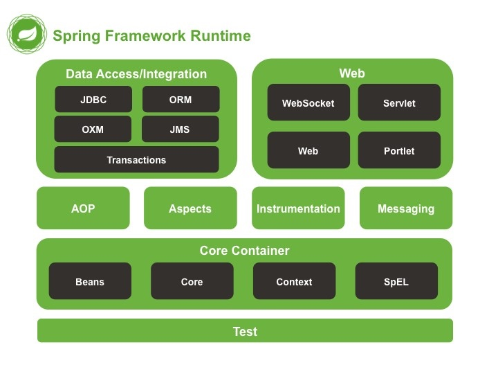

本章简要介绍一下Spring的核心模块：依赖注入、切面。并介绍一下Spring的模块组件，对Spring有一个简要的了解。在后续章节将详细学习Spring的DI、AOP等核心组件。
## 1.依赖注入（DI）
传统的代码编写方式，例如一个Student类中创建了Arm、Leg、Body等对象，那么我们需要创建Student对象时，他就会按照类中写死的那样去创建固定类型的Arm（麒麟臂）、Leg（飞毛腿）、Body（大胸肌）这些对象，如果我们想动态的给这个Student换零件儿的话就要重写或新增一个其他类型的Student。但是有了**依赖注入**，我们可以在创建Student对象时动态的给他注入各种类型的子对象。这样就降低了**代码耦合度**，这也是依赖注入所带来的最大收益。

<!--more-->

```java
public class SmallArm
{
    public SmallArm()
    {
        System.out.println("细小的手臂被创建了...");
    }
}
```

```java
public class StudentObj
{
    private Object arm;


    public StudentObj()
    {
        this.arm = new SmallArm(); // 写死了手臂类型,对象之间紧密耦合
    }

    public void show()
    {
        System.out.println("我是一个小浪仔..");
    }
}

```

```java
public static void main(String[] args)
{
   StudentObj stu = new StudentObj();
}
```
输出
`细小的手臂被创建了...`

使用构造器依赖注入Arm
我们给Student新增一个带参数的构造器，以让Spring对其进行注入Arm。

```java
public StudentObj(Object arm)
{
   this.arm = arm;
}
```
通过Maven引入Spring相关jar，或直接往项目里导入jar。就不写了。

创建Spring配置文件

```xml
<?xml version="1.0" encoding="UTF-8"?>
<beans xmlns="http://www.springframework.org/schema/beans"
       xmlns:xsi="http://www.w3.org/2001/XMLSchema-instance"
       xsi:schemaLocation="http://www.springframework.org/schema/beans
http://www.springframework.org/schema/beans/spring-beans-3.2.xsd">


    <bean id="student" class="cn.edu.ncut.pojo.StudentObj">
        <constructor-arg ref="arm"/>
    </bean>

    <bean id="arm" class="cn.edu.ncut.pojo.SuperArm">

    </bean>


</beans>

```
读取Spring配置文件并获取Student对象

```java
public static void main(String[] args)
{
   ClassPathXmlApplicationContext ctx = new ClassPathXmlApplicationContext("classpath:spring/applicationContext.xml");
   ctx.getBean(StudentObj.class);
}
```
输出
`麒麟臂被创建了...`

就此最简单的依赖注入Demo就完成了，简单吧。**记住依赖注入最大的收益：让相互协作的组件保持松散耦合。**
## 2.切面（AOP）
**切面有什么用呢？**
加入我们有一个一一大堆查询、插入、修改等函数，需求是需要在所有插入方法执行前先记录日志，传统的方法时在每一个insert函数的第一行去写这样的日志存储，就算聪明的你写一个工具类，最终在insert函数中以一行代码的方式完成了这个任务，但当这个工具方法还是会重复出现在各个inser函数中，很low好不好？
而且类似日志记录、公共逻辑校验这样与业务无关的代码会让函数变得会乱，我们要做的就是在业务函数中只关心业务代码，其余的这些什么日志操作，别来烦老子。我们就用Spring的AOP来解决这个问题。
**传统的LowB案例**
建立一个公共方法类

```java
public class CommonUtils
{
    public static void beforeInsert()
    {
        System.out.println("我是公共方法,我要在所有的插入操作前调用...");
    }
    public static void afterInsert()
    {
        System.out.println("我是公共方法,我要在所有的插入操作后调用...");
    }
}
```

Student类中新增这些方法，我们能完成任务了。
很累啊有木有

```java
public void insertA()
{
   CommonUtils.beforeInsert();
   System.out.println("我是Student.insertA()");
   CommonUtils.afterInsert();
}
public void insertB()
{
   CommonUtils.beforeInsert();
   System.out.println("我是Student.insertB()");
   CommonUtils.afterInsert();
}

```
主函数

```java
public static void main(String[] args)
{
   ClassPathXmlApplicationContext ctx = new ClassPathXmlApplicationContext("classpath:spring/applicationContext.xml");
   StudentObj student = ctx.getBean(StudentObj.class);
   student.insertA();
   student.insertB();

}
```
输出
`
麒麟臂被创建了...
我是公共方法,我要在所有的插入操作前调用...
我是Student.insertA()
我是公共方法,我要在所有的插入操作后调用...
我是公共方法,我要在所有的插入操作前调用...
我是Student.insertB()
我是公共方法,我要在所有的插入操作后调用...
`

**AOP最简单的例子**
Spring配置文件


```xml
<!--依赖注入-->
<bean id="student" class="cn.edu.ncut.pojo.StudentObj">
   <constructor-arg ref="arm"/>
</bean>
<bean id="arm" class="cn.edu.ncut.pojo.SuperArm"/>
<bean id="commonUtils" class="cn.edu.ncut.pojo.CommonUtils"/>

<!--AOP-->
<aop:config>
   <aop:aspect ref="commonUtils">
       <!--定义切点-->
       <aop:pointcut id="showSomething" expression="execution(* *.insert*(..))" />
       <!--定义前置通知-->
       <aop:before pointcut-ref="showSomething" method="beforeInsert"/>
       <!--定义后置通知-->
       <aop:after pointcut-ref="showSomething" method="afterInsert"/>
   </aop:aspect>
</aop:config>

```

Student的插入方法工具代码已经去掉了

```java
public void insertA()
{
   System.out.println("我是Student.insertA()");
}
public void insertB()
{
   System.out.println("我是Student.insertB()");
}
```

同样执行Main函数输出
`
麒麟臂被创建了...
我是公共方法,我要在所有的插入操作前调用...
我是Student.insertA()
我是公共方法,我要在所有的插入操作后调用...
我是公共方法,我要在所有的插入操作前调用...
我是Student.insertB()
我是公共方法,我要在所有的插入操作后调用...
`

## 3.Spring容器
### 3.1 应用上下文
Spring自带了多种类型的应用上下文，我们最常使用的应用上下文是ClassPathXmlApplicationContext，它将从应用的类路径下加载上下文，以初始化Spring容器。

```java
ClassPathXmlApplicationContext ctx = new ClassPathXmlApplicationContext("classpath:spring/applicationContext.xml");
```

### 3.2 bean的生命周期
传统的Java应用，我们创建对象使用new关键字，不用了以后由JVM的GC机制自动回收对象。简单的一匹。
但是在Spring中，对象的生命周期就复杂很多了，如以下步骤：

- 1.Spring实例化bean
- 2.Spring将bean的引用注入到bean对应的属性中
- 3.如果bean实现了BeanNameAware接口，Spring将bean的ID传递给setBeanName()方法
- 4.如果bean实现了BeanFactoryAware接口，Spring将调用setBeanFactory()方法，将BeanFactory容器实例传入
- 5.如果bean...ApplicationContextAware...setApplicationContext
- 6....BeanPostProcessor...postProcessBeforeInitialization()...
- 7....InitializingBean...afterPropertiesSet()...
- 8....BeanPostProcessor...postProcessAfterInitialization()
- 9.此时bean已经准备就绪，可以被应用程序使用了，bean将一直存在应用上下文中，直到该应用上线文被销毁。
- 10....DisposableBean...destroy()...destroy-method()...
- 
## 4.Spring模块
Spring4.0的框架发布版本包括了20个不同的模块，每个模块会有3个JAR（二进制类库、源码的Jar、JavaDoc的Jar）
这些模块一句其所属的功能可以划分为6类不同的功能。



**Spring核心容器**
容器是Spring框架最核心的部分，管理Spring应用中bean的创建、配置、管理。SpringBean工厂、DI、E-mail、JNDI、EJB都与之相关。

**SpringAOP模块**
面向切面开发的基础。

**数据访问与集成**
抽象JDBC的样板化代码->JdbcTelmplate。
构建数据库服务的错误信息为一个异常层。
集成ORM框架->Hiberna、JPA、JDO、iBatis。
基于JMS（JavaMessageService）的抽象层。
使用AOP模块为Spring应用中的对象提供事务管理服务。

**Web与远程调用**
MVC的基础。
集成RMI（RemoteMethodInvocation）、Hessian、Burlap、JAX-WS。REST-API。

## 5.小结
本章知识对Spring的内容有一个初步的认识，第二章将深入学习Spring装备Bean的内容。


