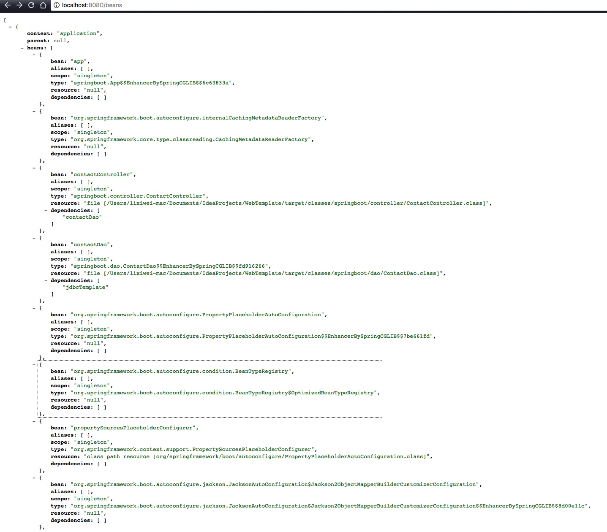

## 1 最简单的一个SpringBoot应用程序
### 1.1 导入依赖


```xml
<dependency>
  <groupId>org.springframework.boot</groupId>
  <artifactId>spring-boot-starter-web</artifactId>
  <version>1.4.1.RELEASE</version>
</dependency>
```
<!--more-->


### 1.2 编写控制器


```java
package springboot.controller;

import org.springframework.web.bind.annotation.RequestMapping;
import org.springframework.web.bind.annotation.RestController;

/**
 * @author NikoBelic
 * @create 31/01/2017 00:48
 */
@RestController
public class Hi
{
    @RequestMapping("/")
    String Hi()
    {
        return "Hello SpringBoot";
    }
}

```

### 1.3 编写SpringBoot启动函数


```java
package springboot;

import org.springframework.boot.SpringApplication;
import org.springframework.boot.autoconfigure.EnableAutoConfiguration;
import org.springframework.context.annotation.ComponentScan;

/**
 * @author NikoBelic
 * @create 31/01/2017 00:51
 */
@ComponentScan
@EnableAutoConfiguration
public class App
{
    public static void main(String[] args) throws InterruptedException
    {
        SpringApplication.run(App.class,args);
    }
}

```

### 1.4 运行结果

控制台输出中可以看到相关的默认配置


```commandline
  .   ____          _            __ _ _
 /\\ / ___'_ __ _ _(_)_ __  __ _ \ \ \ \
( ( )\___ | '_ | '_| | '_ \/ _` | \ \ \ \
 \\/  ___)| |_)| | | | | || (_| |  ) ) ) )
  '  |____| .__|_| |_|_| |_\__, | / / / /
 =========|_|==============|___/=/_/_/_/
 :: Spring Boot ::        (v1.4.1.RELEASE)

2017-01-31 00:56:37.331  INFO 79397 --- [           main] springboot.App                           : Starting App on localhost with PID 79397 (/Users/lixiwei-mac/Documents/IdeaProjects/WebTemplate/target/classes started by NikoBelic in /Users/lixiwei-mac/Documents/IdeaProjects/WebTemplate)
2017-01-31 00:56:37.334  INFO 79397 --- [           main] springboot.App                           : No active profile set, falling back to default profiles: default
2017-01-31 00:56:37.485  INFO 79397 --- [           main] ationConfigEmbeddedWebApplicationContext : Refreshing org.springframework.boot.context.embedded.AnnotationConfigEmbeddedWebApplicationContext@635eaaf1: startup date [Tue Jan 31 00:56:37 CST 2017]; root of context hierarchy
2017-01-31 00:56:40.355  INFO 79397 --- [           main] s.b.c.e.t.TomcatEmbeddedServletContainer : Tomcat initialized with port(s): 8080 (http)
2017-01-31 00:56:40.372  INFO 79397 --- [           main] o.apache.catalina.core.StandardService   : Starting service Tomcat
2017-01-31 00:56:40.373  INFO 79397 --- [           main] org.apache.catalina.core.StandardEngine  : Starting Servlet Engine: Apache Tomcat/8.5.5
2017-01-31 00:56:40.496  INFO 79397 --- [ost-startStop-1] o.a.c.c.C.[Tomcat].[localhost].[/]       : Initializing Spring embedded WebApplicationContext
2017-01-31 00:56:40.496  INFO 79397 --- [ost-startStop-1] o.s.web.context.ContextLoader            : Root WebApplicationContext: initialization completed in 3024 ms
2017-01-31 00:56:40.797  INFO 79397 --- [ost-startStop-1] o.s.b.w.servlet.ServletRegistrationBean  : Mapping servlet: 'dispatcherServlet' to [/]
2017-01-31 00:56:40.809  INFO 79397 --- [ost-startStop-1] o.s.b.w.servlet.FilterRegistrationBean   : Mapping filter: 'characterEncodingFilter' to: [/*]
2017-01-31 00:56:40.817  INFO 79397 --- [ost-startStop-1] o.s.b.w.servlet.FilterRegistrationBean   : Mapping filter: 'hiddenHttpMethodFilter' to: [/*]
2017-01-31 00:56:40.818  INFO 79397 --- [ost-startStop-1] o.s.b.w.servlet.FilterRegistrationBean   : Mapping filter: 'httpPutFormContentFilter' to: [/*]
2017-01-31 00:56:40.818  INFO 79397 --- [ost-startStop-1] o.s.b.w.servlet.FilterRegistrationBean   : Mapping filter: 'requestContextFilter' to: [/*]
2017-01-31 00:56:41.400  INFO 79397 --- [           main] s.w.s.m.m.a.RequestMappingHandlerAdapter : Looking for @ControllerAdvice: org.springframework.boot.context.embedded.AnnotationConfigEmbeddedWebApplicationContext@635eaaf1: startup date [Tue Jan 31 00:56:37 CST 2017]; root of context hierarchy
2017-01-31 00:56:41.511  INFO 79397 --- [           main] s.w.s.m.m.a.RequestMappingHandlerMapping : Mapped "{[/]}" onto java.lang.String springboot.controller.Hi.Hi()
2017-01-31 00:56:41.515  INFO 79397 --- [           main] s.w.s.m.m.a.RequestMappingHandlerMapping : Mapped "{[/error]}" onto public org.springframework.http.ResponseEntity<java.util.Map<java.lang.String, java.lang.Object>> org.springframework.boot.autoconfigure.web.BasicErrorController.error(javax.servlet.http.HttpServletRequest)
2017-01-31 00:56:41.516  INFO 79397 --- [           main] s.w.s.m.m.a.RequestMappingHandlerMapping : Mapped "{[/error],produces=[text/html]}" onto public org.springframework.web.servlet.ModelAndView org.springframework.boot.autoconfigure.web.BasicErrorController.errorHtml(javax.servlet.http.HttpServletRequest,javax.servlet.http.HttpServletResponse)
2017-01-31 00:56:41.563  INFO 79397 --- [           main] o.s.w.s.handler.SimpleUrlHandlerMapping  : Mapped URL path [/webjars/**] onto handler of type [class org.springframework.web.servlet.resource.ResourceHttpRequestHandler]
2017-01-31 00:56:41.564  INFO 79397 --- [           main] o.s.w.s.handler.SimpleUrlHandlerMapping  : Mapped URL path [/**] onto handler of type [class org.springframework.web.servlet.resource.ResourceHttpRequestHandler]
2017-01-31 00:56:41.643  INFO 79397 --- [           main] o.s.w.s.handler.SimpleUrlHandlerMapping  : Mapped URL path [/**/favicon.ico] onto handler of type [class org.springframework.web.servlet.resource.ResourceHttpRequestHandler]
2017-01-31 00:56:41.831  INFO 79397 --- [           main] o.s.j.e.a.AnnotationMBeanExporter        : Registering beans for JMX exposure on startup
2017-01-31 00:56:41.936  INFO 79397 --- [           main] s.b.c.e.t.TomcatEmbeddedServletContainer : Tomcat started on port(s): 8080 (http)
2017-01-31 00:56:41.948  INFO 79397 --- [           main] springboot.App                           : Started App in 5.572 seconds (JVM running for 6.33)
2017-01-31 00:56:48.830  INFO 79397 --- [nio-8080-exec-1] o.a.c.c.C.[Tomcat].[localhost].[/]       : Initializing Spring FrameworkServlet 'dispatcherServlet'
2017-01-31 00:56:48.830  INFO 79397 --- [nio-8080-exec-1] o.s.web.servlet.DispatcherServlet        : FrameworkServlet 'dispatcherServlet': initialization started
2017-01-31 00:56:48.848  INFO 79397 --- [nio-8080-exec-1] o.s.web.servlet.DispatcherServlet        : FrameworkServlet 'dispatcherServlet': initialization completed in 18 ms

```

Web页面


**有没有一键装机的感觉？**

## 2 SpringBoot简介
SpringBoot提供了四个主要特性

- SpringBootStarter：将常用依赖分组进行了整合。即一次性添加所需依赖到项目中。
- 自动配置：合理的推测应用所需的bean并自动配置他们。
- 命令行接口（Command-line interface，CLI）：结合自动配置进一步简化开发
- Actuator：管理特性。

### 2.1 Starter依赖
比如1中的示例程序，只需要导入一个starter依赖即可自动导入web应用所需的全部依赖。其他类型的starter依赖包官网有详细介绍。

### 2.2 自动配置
之前构建SpringMVC应用程序时，需要配置视图解析器、处理器映射器、资源处理器，而现在全部由SpringBoot自动推测所需的配置完成自动配置。我们所需要做的只是将jsp等视图放到项目中并编写Controller，SpringBoot会自动嗅探到这些模板文件从而为我们配置相应的视图解析器，并自动配置支持SpringMVC的多个bean。

### 2.3 SpringBoot CLI
`spring run Hi.groovy`
目前不知道有啥用。。

### 2.4 Actuator

- 管理端点
- 合理的异常处理以及默认的"/error"映射端点
- 获取应用信息的"/info"端点
- 启用SpringSecurity时会有一个审计事件框架


## 3 使用SpringBoot构建应用
### 3.1 maven配置


```xml
<project xmlns="http://maven.apache.org/POM/4.0.0" xmlns:xsi="http://www.w3.org/2001/XMLSchema-instance"
         xsi:schemaLocation="http://maven.apache.org/POM/4.0.0 http://maven.apache.org/maven-v4_0_0.xsd">
    <modelVersion>4.0.0</modelVersion>
    <groupId>cn.edu.ncut</groupId>
    <artifactId>WebTemplate</artifactId>
    <packaging>jar</packaging>
    <version>1.0-SNAPSHOT</version>
    <name>WebTemplate Maven Webapp</name>
    <url>http://maven.apache.org</url>


    <!-- 配置parent以后,我们就不需要再管理其他依赖的版本号了,版本号会从parent中继承得到-->
    <parent>
        <groupId>org.springframework.boot</groupId>
        <artifactId>spring-boot-starter-parent</artifactId>
        <version>1.4.4.RELEASE</version>
    </parent>

    <!-- 包含了SpringMVC的依赖 -->
    <dependencies>

        <dependency>
            <groupId>org.springframework.boot</groupId>
            <artifactId>spring-boot-starter-web</artifactId>
        </dependency>

        <dependency>
            <groupId>org.springframework.boot</groupId>
            <artifactId>spring-boot-starter-jdbc</artifactId>
        </dependency>

        <!-- 数据持久化 -->
        <dependency>
            <groupId>mysql</groupId>
            <artifactId>mysql-connector-java</artifactId>
            <version>5.1.21</version>
            <scope>runtime</scope>
        </dependency>

        <!-- 日志 -->
        <dependency>
            <groupId>log4j</groupId>
            <artifactId>log4j</artifactId>
            <version>1.2.17</version>
        </dependency>

        <!-- 试图引擎 -->
        <dependency>
            <groupId>org.thymeleaf</groupId>
            <artifactId>thymeleaf-spring4</artifactId>
        </dependency>

    </dependencies>


    <build>
        <plugins>
            <!-- 这个Maven插件能够生成可执行的Jar文件 -->
            <plugin>
                <groupId>org.springframework.boot</groupId>
                <artifactId>spring-boot-maven-plugin</artifactId>
            </plugin>
            <plugin>
                <groupId>org.apache.maven.plugins</groupId>
                <artifactId>maven-compiler-plugin</artifactId>
                <configuration>
                    <source>1.8</source>
                    <target>1.8</target>
                </configuration>
            </plugin>
        </plugins>
    </build>

</project>

```

### 3.2 Model


```java
package springboot.model;

/**
 * @author NikoBelic
 * @create 31/01/2017 01:30
 */
public class Contact
{
    private Long id;
    private String firstName;
    private String lastName;
    private String phoneNumber;
    private String emailAddress;

    public Long getId() {
        return id;
    }

    public void setId(Long id) {
        this.id = id;
    }

    public String getFirstName() {
        return firstName;
    }

    public void setFirstName(String firstName) {
        this.firstName = firstName;
    }

    public String getLastName() {
        return lastName;
    }

    public void setLastName(String lastName) {
        this.lastName = lastName;
    }

    public String getPhoneNumber() {
        return phoneNumber;
    }

    public void setPhoneNumber(String phoneNumber) {
        this.phoneNumber = phoneNumber;
    }

    public String getEmailAddress() {
        return emailAddress;
    }

    public void setEmailAddress(String emailAddress) {
        this.emailAddress = emailAddress;
    }

    @Override
    public String toString() {
        return "Contact{" +
                "id=" + id +
                ", firstName='" + firstName + '\'' +
                ", lastName='" + lastName + '\'' +
                ", phoneNumber='" + phoneNumber + '\'' +
                ", emailAddress='" + emailAddress + '\'' +
                '}';
    }
}

```

### 3.3 Dao


```java
package springboot.dao;

import org.springframework.beans.factory.annotation.Autowired;
import org.springframework.jdbc.core.JdbcTemplate;
import org.springframework.stereotype.Repository;
import springboot.model.Contact;

import java.util.List;

/**
 * @author NikoBelic
 * @create 31/01/2017 01:32
 */
@Repository
public class ContactDao
{
    @Autowired
    private JdbcTemplate jdbcTemplate;

    public List<Contact> findAll()
    {
        return jdbcTemplate.query("select * from tb_contact", (rs, rowNum) -> {
            Contact contact = new Contact();
            contact.setId(rs.getLong(1));
            contact.setFirstName(rs.getString(2));
            contact.setLastName(rs.getString(3));
            contact.setPhoneNumber(rs.getString(4));
            contact.setEmailAddress(rs.getString(5));
            return contact;
        });
    }

    public void save(Contact contact)
    {
        jdbcTemplate.update("insert into tb_contact(firstName,lastName,phoneNumber,emailAddress) values(?,?,?,?)",
                contact.getFirstName(), contact.getLastName(), contact.getPhoneNumber(), contact.getEmailAddress());
    }

}

```

### 3.4 Controller


```java
package springboot.controller;

import org.springframework.beans.factory.annotation.Autowired;
import org.springframework.stereotype.Controller;
import org.springframework.web.bind.annotation.RequestMapping;
import org.springframework.web.bind.annotation.RequestMethod;
import springboot.dao.ContactDao;
import springboot.model.Contact;

import java.util.List;
import java.util.Map;

/**
 * @author NikoBelic
 * @create 31/01/2017 01:31
 */
@Controller
@RequestMapping(value = "/contact")
public class ContactController
{
    @Autowired
    private ContactDao contactDao;

    /**
     * 联系人主页面,Get处理/contact/,映射到home视图
     * @Author NikoBelic
     * @Date 31/01/2017 01:36
     */
    @RequestMapping(method = RequestMethod.GET)
    public String home(Map<String,Object> model)
    {
        List<Contact> contacts = contactDao.findAll();
        model.put("contacts",contacts);
        return "home";
    }

    /**
     * 添加联系人后跳转到主页
     * @Author NikoBelic
     * @Date 31/01/2017 01:39
     */
    @RequestMapping(method = RequestMethod.POST)
    public String submit(Contact contact)
    {
        contactDao.save(contact);
        return "redirect:/contact";
    }
}

```


### 3.5 Thymeleaf视图
SpringBoot官方不建议使用jsp

```xml
<!DOCTYPE html>
<html xmlns:th="http://www.thymeleaf.org">
  <head>
    <title>Spring Boot Contacts</title>
    <link rel="stylesheet" th:href="@{/style.css}" />
  </head>

  <body>
    <h2>Spring Boot Contacts</h2>
    <form method="POST">
      <label for="firstName">First Name:</label>
      <input type="text" name="firstName"></input><br/>
      <label for="lastName">Last Name:</label>
      <input type="text" name="lastName"></input><br/>
      <label for="phoneNumber">Phone #:</label>
      <input type="text" name="phoneNumber"></input><br/>
      <label for="emailAddress">Email:</label>
      <input type="text" name="emailAddress"></input><br/>
      <input type="submit"></input>
    </form>

    <ul th:each="contact : ${contacts}">
      <li>
        <span th:text="${contact.firstName}">First</span>
        <span th:text="${contact.lastName}">Last</span> :
        <span th:text="${contact.phoneNumber}">phoneNumber</span>,
        <span th:text="${contact.emailAddress}">emailAddress</span>
      </li>
    </ul>
  </body>
</html>

```

### 3.6 测试


### 3.7 目录结构


### 4 启动Actuator了解应用内部状况


```xml
     <dependency>
            <groupId>org.springframework.boot</groupId>
            <artifactId>spring-boot-actuator</artifactId>
        </dependency>
```

添加依赖后，Get访问 /autoconfig 来查看使用自动配置时锁做出的决策；访问/beans查看应用所配置的bean等等。



