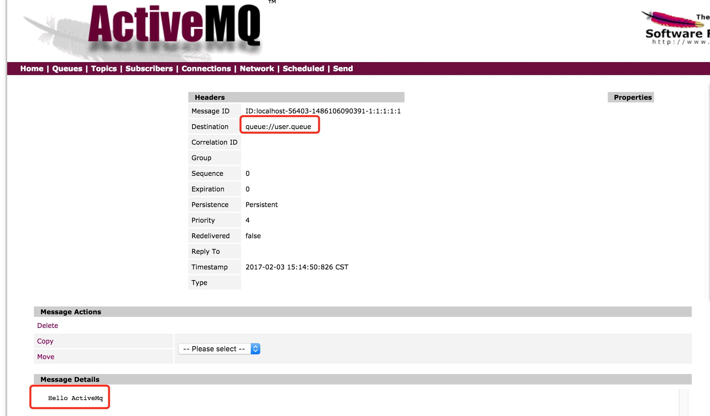
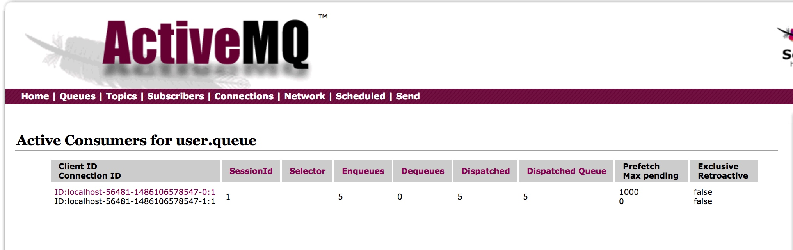
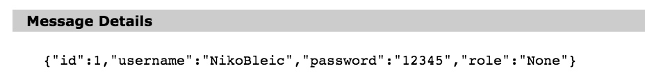

## 1 maven配置

```xml
<!--Spring ActiveMQ-->
<spring-activemq.version>5.14.3</spring-activemq.version>
<activemq.version>5.14.3</activemq.version>

<dependency>
  <groupId>org.springframework</groupId>
  <artifactId>spring-jms</artifactId>
  <version>${spring.version}</version>
</dependency>

<dependency>
  <groupId>org.apache.activemq</groupId>
  <artifactId>activemq-all</artifactId>
  <version>${activemq.version}</version>
</dependency>
```
<!--more-->


## 2 spring整合jms


```xml
<?xml version="1.0" encoding="UTF-8"?>
<beans xmlns="http://www.springframework.org/schema/beans"
       xmlns:xsi="http://www.w3.org/2001/XMLSchema-instance"
       xmlns:jms="http://www.springframework.org/schema/jms"
       xsi:schemaLocation="http://www.springframework.org/schema/beans
http://www.springframework.org/schema/beans/spring-beans-3.2.xsd     http://www.springframework.org/schema/jms http://www.springframework.org/schema/jms/spring-jms.xsd">

    <!--JMS连接工厂-->
    <bean id="connectionFactory" class="org.apache.activemq.spring.ActiveMQConnectionFactory">
        <property name="brokerURL" value="tcp://localhost:61616"/>
        <property name="trustAllPackages" value="true"/>
    </bean>

    <!--消息转换器-->
    <bean id="messageConverter" class="org.springframework.jms.support.converter.SimpleMessageConverter"/>

    <!--消息队列源-->
    <bean id="queue" class="org.apache.activemq.command.ActiveMQQueue">
        <constructor-arg name="name" value="user.queue"/>
    </bean>

    <!--JMS操作模板-->
    <bean id="jmsTemplate" class="org.springframework.jms.core.JmsTemplate">
        <constructor-arg name="connectionFactory" ref="connectionFactory"/>
        <property name="messageConverter" ref="messageConverter"/>
        <property name="defaultDestination" ref="queue"/>
    </bean>

    <!--异步消息处理器-->
    <bean id="userHandler" class="data_persistent.jms.UserHandler"/>

    <!--JMS异步监听器-->
    <jms:listener-container connection-factory="connectionFactory">
        <jms:listener destination="user.queue" ref="userHandler" method="handleUserAlert"/>
    </jms:listener-container>

</beans>

```

## 3 发送消息、获取消息测试


```java
@RunWith(SpringJUnit4ClassRunner.class)
//@ContextConfiguration(classes = {JMSConfig.class})
@ContextConfiguration(value = "classpath*:spring/applicationContext-jms.xml")
public class JMSTest
{
    @Autowired
    JmsTemplate jmsTemplate;
    @Autowired
    ActiveMQQueue queue;
    /**
     * 原生JMS发送消息
     * @Author NikoBelic
     * @Date 03/02/2017 16:10
     */
    @Test
    public void sendMsg()
    {
        ConnectionFactory cf = new ActiveMQConnectionFactory("tcp://localhost:61616");
        Connection conn = null;
        Session session = null;
        try
        {
            conn = cf.createConnection();
            session = conn.createSession(false, Session.AUTO_ACKNOWLEDGE);
            Destination destination = new ActiveMQQueue("user.queue");

            MessageProducer producer = session.createProducer(destination);
            TextMessage message = session.createTextMessage();
            message.setText("Hello ActiveMq");
            producer.send(message);
        } catch (JMSException e)
        {
            e.printStackTrace();
        } finally
        {
            try
            {
                if (session != null)
                    session.close();
                if (conn != null)
                    conn.close();
            } catch (JMSException e)
            {
                e.printStackTrace();
            }
        }
    }

    /**
     * 原生JMS接收消息
     * @Author NikoBelic
     * @Date 03/02/2017 16:10
     */
    @Test
    public void getMsg()
    {
        ConnectionFactory cf = new ActiveMQConnectionFactory("tcp://localhost:61616");
        Connection conn = null;
        Session session = null;
        try
        {
            conn = cf.createConnection();
            session = conn.createSession(false, Session.AUTO_ACKNOWLEDGE);
            Destination destination = new ActiveMQQueue("user.queue");

            MessageConsumer consumer = session.createConsumer(destination);
            Message message = consumer.receive();
            TextMessage textMessage = (TextMessage) message;
            System.out.println("Got a message: " + textMessage.getText());
            conn.start();
        } catch (JMSException e)
        {
            e.printStackTrace();
        } finally
        {
            try
            {
                if (session != null)
                    session.close();
                if (conn != null)
                    conn.close();
            } catch (JMSException e)
            {
                e.printStackTrace();
            }
        }
    }

    // ----------------------华丽的分割线----------------------
    /**
     * 异步发送消息
     * @Author NikoBelic
     * @Date 03/02/2017 18:13
     */
    @Test
    public void easySendMsg()
    {
        UserObj userObj = new UserObj(1, "NikoBleic", "12345", "None");
        // 方法一
        //jmsTemplate.send(queue, session -> {
        //    return session.createTextMessage(userObj.toString());
        //});
        // 方法二
        jmsTemplate.convertAndSend(userObj);
    }

    /**
     * 同步接收消息
     * @Author NikoBelic
     * @Date 03/02/2017 18:14
     */
    @Test
    public void easyGetMsg() throws JMSException
    {
        while (true)
        {
            try
            {
                //TextMessage message = (TextMessage) jmsTemplate.receive();
                //System.out.println(message.getText());
                Message message = jmsTemplate.receive();
                if (message instanceof ObjectMessage)
                {
                    System.out.println("ObjectMsg Type");
                    System.out.println(((ObjectMessage) message).getObject());
                }
                else
                {
                    System.out.println("Other Type..." + message.getJMSType());
                }

            }catch (Exception e)
            {
                System.out.println(e.getMessage());
            }

        }
    }

}

```

```commandline
异步消息监听器收到了一条消息:UserObj{id=1, username='NikoBleic', password='12345', role='None'}
```
由于配置了异步消息监听器，使用测试方法时，jmsTemplate.receive()将会与异步消息监听器争抢消息，谁抢到不一定。看下面示例


```java
    @Test
    public void easyGetMsg() throws JMSException
    {
        while (true)
        {
            try
            {
                //TextMessage message = (TextMessage) jmsTemplate.receive();
                //System.out.println(message.getText());
                Message message = jmsTemplate.receive();
                if (message instanceof ObjectMessage)
                {
                    System.out.println("JMS模板接收到了消息:" + ((ObjectMessage) message).getObject());
                    System.out.println("");
                }
                else
                {
                    System.out.println("Other Type..." + message.getJMSType());
                }

            }catch (Exception e)
            {
                System.out.println(e.getMessage());
            }

        }
    }
```
执行后什么都不会输出，记控制台输出窗口为ConsoleA


```java
 @Test
    public void easySendMsg()
    {
        for (int i = 0; i < 100; i++)
        {
            // 方法二
            UserObj userObj = new UserObj(i, "NikoBleic", "12345", "None");
            jmsTemplate.convertAndSend(userObj);
        }

        // 方法一
        //jmsTemplate.send(queue, session -> {
        //    return session.createTextMessage(userObj.toString());
        //});

    }
```
执行以后ConsoleA会输出如下，可以看到异步消息监听器与template.receive发生了争抢，但是以下显示的不是全部数据，因为执行发送程序的时候，发送端也会初始化项目中的异步消息监听器，导致总共有2个异步消息监听器和1个template一起争抢消息

```commandline

异步消息监听器收到了一条消息:UserObj{id=0, username='NikoBleic', password='12345', role='None'}
JMS模板接收到了消息:UserObj{id=1, username='NikoBleic', password='12345', role='None'}

异步消息监听器收到了一条消息:UserObj{id=3, username='NikoBleic', password='12345', role='None'}
JMS模板接收到了消息:UserObj{id=4, username='NikoBleic', password='12345', role='None'}

异步消息监听器收到了一条消息:UserObj{id=6, username='NikoBleic', password='12345', role='None'}
JMS模板接收到了消息:UserObj{id=7, username='NikoBleic', password='12345', role='None'}

异步消息监听器收到了一条消息:UserObj{id=9, username='NikoBleic', password='12345', role='None'}
JMS模板接收到了消息:UserObj{id=10, username='NikoBleic', password='12345', role='None'}

异步消息监听器收到了一条消息:UserObj{id=12, username='NikoBleic', password='12345', role='None'}
JMS模板接收到了消息:UserObj{id=13, username='NikoBleic', password='12345', role='None'}

异步消息监听器收到了一条消息:UserObj{id=15, username='NikoBleic', password='12345', role='None'}
JMS模板接收到了消息:UserObj{id=16, username='NikoBleic', password='12345', role='None'}

异步消息监听器收到了一条消息:UserObj{id=18, username='NikoBleic', password='12345', role='None'}
JMS模板接收到了消息:UserObj{id=19, username='NikoBleic', password='12345', role='None'}

异步消息监听器收到了一条消息:UserObj{id=21, username='NikoBleic', password='12345', role='None'}
JMS模板接收到了消息:UserObj{id=22, username='NikoBleic', password='12345', role='None'}

异步消息监听器收到了一条消息:UserObj{id=24, username='NikoBleic', password='12345', role='None'}
JMS模板接收到了消息:UserObj{id=25, username='NikoBleic', password='12345', role='None'}

异步消息监听器收到了一条消息:UserObj{id=27, username='NikoBleic', password='12345', role='None'}
JMS模板接收到了消息:UserObj{id=28, username='NikoBleic', password='12345', role='None'}

异步消息监听器收到了一条消息:UserObj{id=30, username='NikoBleic', password='12345', role='None'}
JMS模板接收到了消息:UserObj{id=31, username='NikoBleic', password='12345', role='None'}

异步消息监听器收到了一条消息:UserObj{id=33, username='NikoBleic', password='12345', role='None'}
JMS模板接收到了消息:UserObj{id=34, username='NikoBleic', password='12345', role='None'}

异步消息监听器收到了一条消息:UserObj{id=36, username='NikoBleic', password='12345', role='None'}
JMS模板接收到了消息:UserObj{id=37, username='NikoBleic', password='12345', role='None'}

异步消息监听器收到了一条消息:UserObj{id=39, username='NikoBleic', password='12345', role='None'}
异步消息监听器收到了一条消息:UserObj{id=42, username='NikoBleic', password='12345', role='None'}
JMS模板接收到了消息:UserObj{id=40, username='NikoBleic', password='12345', role='None'}

异步消息监听器收到了一条消息:UserObj{id=44, username='NikoBleic', password='12345', role='None'}
JMS模板接收到了消息:UserObj{id=46, username='NikoBleic', password='12345', role='None'}

异步消息监听器收到了一条消息:UserObj{id=47, username='NikoBleic', password='12345', role='None'}
JMS模板接收到了消息:UserObj{id=49, username='NikoBleic', password='12345', role='None'}

异步消息监听器收到了一条消息:UserObj{id=50, username='NikoBleic', password='12345', role='None'}
JMS模板接收到了消息:UserObj{id=52, username='NikoBleic', password='12345', role='None'}

异步消息监听器收到了一条消息:UserObj{id=53, username='NikoBleic', password='12345', role='None'}
JMS模板接收到了消息:UserObj{id=55, username='NikoBleic', password='12345', role='None'}

异步消息监听器收到了一条消息:UserObj{id=56, username='NikoBleic', password='12345', role='None'}
异步消息监听器收到了一条消息:UserObj{id=58, username='NikoBleic', password='12345', role='None'}
JMS模板接收到了消息:UserObj{id=59, username='NikoBleic', password='12345', role='None'}

异步消息监听器收到了一条消息:UserObj{id=61, username='NikoBleic', password='12345', role='None'}
JMS模板接收到了消息:UserObj{id=62, username='NikoBleic', password='12345', role='None'}

异步消息监听器收到了一条消息:UserObj{id=64, username='NikoBleic', password='12345', role='None'}
JMS模板接收到了消息:UserObj{id=65, username='NikoBleic', password='12345', role='None'}

异步消息监听器收到了一条消息:UserObj{id=67, username='NikoBleic', password='12345', role='None'}
JMS模板接收到了消息:UserObj{id=68, username='NikoBleic', password='12345', role='None'}

异步消息监听器收到了一条消息:UserObj{id=70, username='NikoBleic', password='12345', role='None'}
JMS模板接收到了消息:UserObj{id=71, username='NikoBleic', password='12345', role='None'}

异步消息监听器收到了一条消息:UserObj{id=73, username='NikoBleic', password='12345', role='None'}
JMS模板接收到了消息:UserObj{id=74, username='NikoBleic', password='12345', role='None'}

异步消息监听器收到了一条消息:UserObj{id=76, username='NikoBleic', password='12345', role='None'}
JMS模板接收到了消息:UserObj{id=78, username='NikoBleic', password='12345', role='None'}

异步消息监听器收到了一条消息:UserObj{id=79, username='NikoBleic', password='12345', role='None'}
JMS模板接收到了消息:UserObj{id=81, username='NikoBleic', password='12345', role='None'}

异步消息监听器收到了一条消息:UserObj{id=82, username='NikoBleic', password='12345', role='None'}
JMS模板接收到了消息:UserObj{id=84, username='NikoBleic', password='12345', role='None'}

异步消息监听器收到了一条消息:UserObj{id=85, username='NikoBleic', password='12345', role='None'}
JMS模板接收到了消息:UserObj{id=87, username='NikoBleic', password='12345', role='None'}

异步消息监听器收到了一条消息:UserObj{id=88, username='NikoBleic', password='12345', role='None'}
JMS模板接收到了消息:UserObj{id=90, username='NikoBleic', password='12345', role='None'}

异步消息监听器收到了一条消息:UserObj{id=91, username='NikoBleic', password='12345', role='None'}
JMS模板接收到了消息:UserObj{id=93, username='NikoBleic', password='12345', role='None'}

异步消息监听器收到了一条消息:UserObj{id=94, username='NikoBleic', password='12345', role='None'}
JMS模板接收到了消息:UserObj{id=96, username='NikoBleic', password='12345', role='None'}

异步消息监听器收到了一条消息:UserObj{id=97, username='NikoBleic', password='12345', role='None'}
JMS模板接收到了消息:UserObj{id=99, username='NikoBleic', password='12345', role='None'}

```
当前窗口会输出如下

```commandline
异步消息监听器收到了一条消息:UserObj{id=2, username='NikoBleic', password='12345', role='None'}
异步消息监听器收到了一条消息:UserObj{id=5, username='NikoBleic', password='12345', role='None'}
异步消息监听器收到了一条消息:UserObj{id=8, username='NikoBleic', password='12345', role='None'}
异步消息监听器收到了一条消息:UserObj{id=11, username='NikoBleic', password='12345', role='None'}
异步消息监听器收到了一条消息:UserObj{id=14, username='NikoBleic', password='12345', role='None'}
异步消息监听器收到了一条消息:UserObj{id=17, username='NikoBleic', password='12345', role='None'}
异步消息监听器收到了一条消息:UserObj{id=20, username='NikoBleic', password='12345', role='None'}
异步消息监听器收到了一条消息:UserObj{id=23, username='NikoBleic', password='12345', role='None'}
异步消息监听器收到了一条消息:UserObj{id=26, username='NikoBleic', password='12345', role='None'}
异步消息监听器收到了一条消息:UserObj{id=29, username='NikoBleic', password='12345', role='None'}
异步消息监听器收到了一条消息:UserObj{id=32, username='NikoBleic', password='12345', role='None'}
异步消息监听器收到了一条消息:UserObj{id=35, username='NikoBleic', password='12345', role='None'}
异步消息监听器收到了一条消息:UserObj{id=38, username='NikoBleic', password='12345', role='None'}
异步消息监听器收到了一条消息:UserObj{id=41, username='NikoBleic', password='12345', role='None'}
异步消息监听器收到了一条消息:UserObj{id=43, username='NikoBleic', password='12345', role='None'}
异步消息监听器收到了一条消息:UserObj{id=45, username='NikoBleic', password='12345', role='None'}
异步消息监听器收到了一条消息:UserObj{id=48, username='NikoBleic', password='12345', role='None'}
异步消息监听器收到了一条消息:UserObj{id=51, username='NikoBleic', password='12345', role='None'}
异步消息监听器收到了一条消息:UserObj{id=54, username='NikoBleic', password='12345', role='None'}
异步消息监听器收到了一条消息:UserObj{id=57, username='NikoBleic', password='12345', role='None'}
异步消息监听器收到了一条消息:UserObj{id=60, username='NikoBleic', password='12345', role='None'}
异步消息监听器收到了一条消息:UserObj{id=63, username='NikoBleic', password='12345', role='None'}
异步消息监听器收到了一条消息:UserObj{id=66, username='NikoBleic', password='12345', role='None'}
异步消息监听器收到了一条消息:UserObj{id=69, username='NikoBleic', password='12345', role='None'}
异步消息监听器收到了一条消息:UserObj{id=72, username='NikoBleic', password='12345', role='None'}
异步消息监听器收到了一条消息:UserObj{id=75, username='NikoBleic', password='12345', role='None'}
异步消息监听器收到了一条消息:UserObj{id=77, username='NikoBleic', password='12345', role='None'}
异步消息监听器收到了一条消息:UserObj{id=80, username='NikoBleic', password='12345', role='None'}
异步消息监听器收到了一条消息:UserObj{id=83, username='NikoBleic', password='12345', role='None'}
异步消息监听器收到了一条消息:UserObj{id=86, username='NikoBleic', password='12345', role='None'}
异步消息监听器收到了一条消息:UserObj{id=89, username='NikoBleic', password='12345', role='None'}
异步消息监听器收到了一条消息:UserObj{id=92, username='NikoBleic', password='12345', role='None'}
异步消息监听器收到了一条消息:UserObj{id=95, username='NikoBleic', password='12345', role='None'}
异步消息监听器收到了一条消息:UserObj{id=98, username='NikoBleic', password='12345', role='None'}
```
## 4 监控界面
字符串消息



消息队列


对象序列化为json字符串



