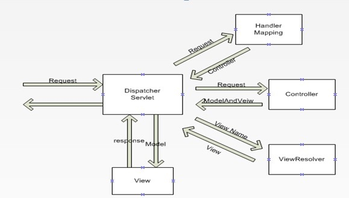
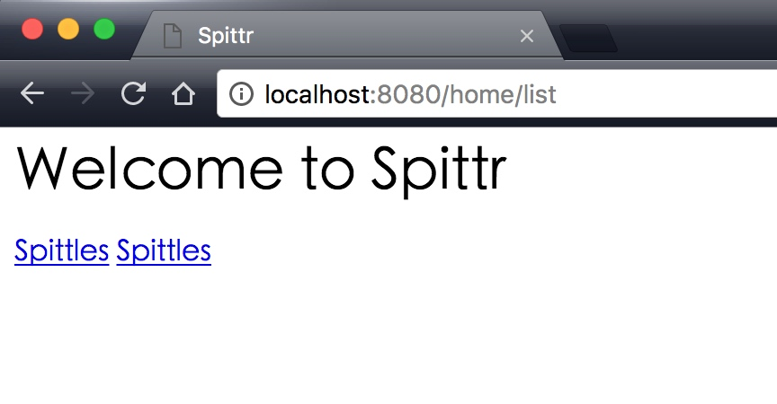
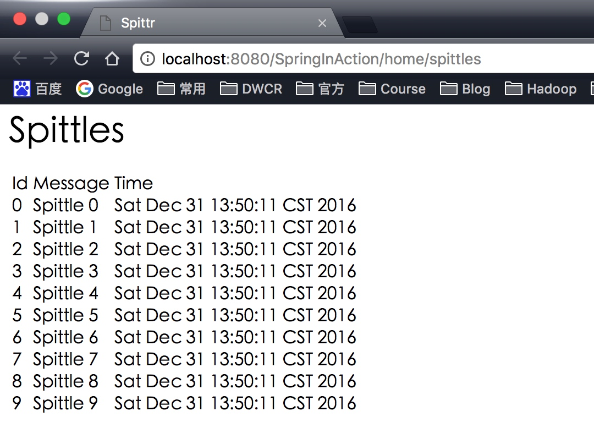
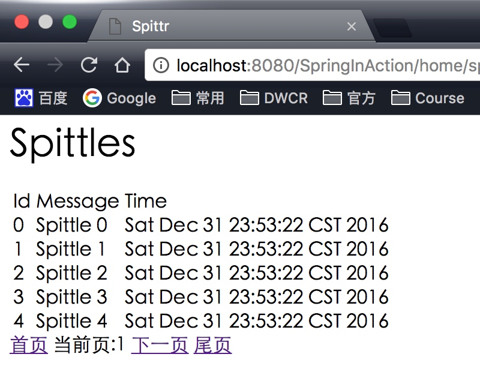
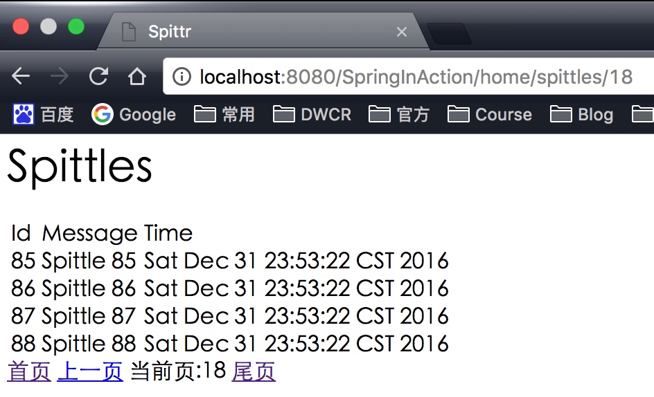

##5.1 请求在SpringMVC组件之间的流转



1. 请求发送
2. DispatcherServlet查询一个或多个HandlerMapping来确定请求的下一站。
3. 按照HM查询结果，将请求转发到指定的Controller。
4. Controller返回ModelAndView给DispatcherServlet。
5. DispatcherServlet使用视图解析器ViewResolver将逻辑试图名匹配为一个特定的视图实现（一般是JSP）。
6. 将Model传出给视图实现，渲染试图。
7. 将渲染结果通过响应对象（Response）传递给客户端。

<!--more-->

##5.2 使用Java类来搭建SpringMVC
传统配置SpringMVC是用web.xml+Spring配置文件结合的方式。
但是如果你的容器支持Servlet3.0（Tomcat7及以上）

```java
package chapter05;

import org.springframework.web.servlet.support.AbstractAnnotationConfigDispatcherServletInitializer;

/**
 * 配置DispatcherServlet
 * @author NikoBelic
 * @create 30/12/2016 10:43
 */
public class SpittrWebInitializer extends AbstractAnnotationConfigDispatcherServletInitializer
{
    /**
     * 指定ContextLoaderListener配置类
     * @Author NikoBelic
     * @Date 30/12/2016 10:48
     */
    @Override
    protected Class<?>[] getRootConfigClasses()
    {
        return new Class<?>[]{RootConfig.class};
    }


    /**
     * 指定SpringMVC配置类
     * @Author NikoBelic
     * @Date 30/12/2016 10:49
     */
    @Override
    protected Class<?>[] getServletConfigClasses()
    {
        return new Class<?>[]{WebConfig.class};
    }

    /**
     * 将DispatcherServlet映射到 "/"
     * @Author
     * @Date 30/12/2016 10:44
     */
    @Override
    protected String[] getServletMappings() {
        return new String[]{"/"};
    }
}

```


```java
/**
 * 最小但可用的SpringMVC配置
 * @author NikoBelic
 * @create 30/12/2016 10:50
 */
@Configuration
@EnableWebMvc
@ComponentScan("chapter05")
public class WebConfig extends WebMvcConfigurerAdapter
{
    @Bean
    public ViewResolver viewResolver()
    {
        InternalResourceViewResolver resolver = new InternalResourceViewResolver();
        resolver.setPrefix("/WEB-INF/views/");
        resolver.setSuffix(".jsp");
        resolver.setExposeContextBeansAsAttributes(true);
        return resolver;
    }
    /**
     * 配置静态资源的处理
     * @Author NikoBelic
     * @Date 30/12/2016 12:15
     */
    @Override
    public void configureDefaultServletHandling(DefaultServletHandlerConfigurer configurer)
    {
        configurer.enable();
    }
}
```


```java

/**
 * 最小但可用的SpringMVC配置
 * @author NikoBelic
 * @create 30/12/2016 10:50
 */
@Configuration
@EnableWebMvc
@ComponentScan("chapter05")
public class WebConfig extends WebMvcConfigurerAdapter
{
    @Bean
    public ViewResolver viewResolver()
    {
        InternalResourceViewResolver resolver = new InternalResourceViewResolver();
        resolver.setPrefix("/WEB-INF/views/");
        resolver.setSuffix(".jsp");
        resolver.setExposeContextBeansAsAttributes(true);
        return resolver;
    }
    /**
     * 配置静态资源的处理
     * @Author NikoBelic
     * @Date 30/12/2016 12:15
     */
    @Override
    public void configureDefaultServletHandling(DefaultServletHandlerConfigurer configurer)
    {
        configurer.enable();
    }
}
```

Spring上下文的加载方式有两个，一个是使用SpringMVC的DispatcherServlet去加载（控制器、视图解析器、处理器映射器），另一个是用ContextLoaderListener加载（应用中的其他bean，例如Service、Dao）。
如果上程序所写，我们配置WebConfig类来加载SpringMVC需要的bean。配置RootConfig来加载剩余的bean。

##5.2 编写基本的控制器


@Controller其实是包含@Component注解的，二者的功能是相同的，但是为了更加清晰的区分不同的组件，使用@Controller来标识这是一个SpringMVC的组件。
@RequestMapping可以加载类上，也可以加载在方法上，有一下几种情况：
1. 类有注解，方法有注解，那么HTTP访问路径为 http://IP:Port/Project/ControllerMapping/MethodMapping
2. 类无注解，方法有注解  http://IP:Port/Project/MethodMapping
3. 类有注解，方法无注解，那么只允许该Controller中只有一个Method，否则启动报错

我们一般使用方法1

```java
@Controller
@RequestMapping("home")
public class HomeController
{
    @RequestMapping(value = "list",method = RequestMethod.GET)
    public String home()
    {
        return "home";
    }
}
```

创建一个jsp页面

```html
<%@ taglib prefix="c" uri="http://java.sun.com/jsp/jstl/core" %>
<%@ page contentType="text/html;charset=UTF-8" language="java" %>
<html>
<head>
    <title>Spittr</title>
</head>
<body>
<h1>Welcome to Spittr</h1>
<a href="<c:url value="/spittles"/>">Spittles</a>
<a href="<c:url value="/spitter/register"/>">Spittles</a>
</body>
</html>

```

使用Tomcat启动服务后，项目会根据SpittrWebInitializer配置的信息加载相关的配置文件。



以上构建了一个最简单的一个请求结果展示，那么如果我们需要给前台界面返回一些数据，怎么做？

**修改控制器**

```java
@Controller
@RequestMapping("home")
public class HomeController
{
    @RequestMapping(value = "list",method = RequestMethod.GET)
    public String home()
    {
        return "home";
    }

    @RequestMapping(value = "spittles",method = RequestMethod.GET)
    public ModelAndView getSpittles(ModelAndView mv)
    {
        List<Spittle> spittleList = createSpittleList(10);
        mv.setViewName("spittle");
        mv.addObject("spittleList",spittleList);
        return mv;
    }


    /**
     * 模拟从数据库获取数据
     * @Author NikoBelic
     * @Date 31/12/2016 13:15
     */
    private List<Spittle> createSpittleList(int count)
    {
        List<Spittle> spittles = new ArrayList<>();
        for (int i = 0; i < count; i++)
        {
            spittles.add(new Spittle(i,"Spittle " + i ,new Date(),null,null));
        }
        return spittles;
    }
}

```


**创建JSP页面**


```html
<%@ taglib prefix="c" uri="http://java.sun.com/jsp/jstl/core" %>
<%@ page isELIgnored="false" %>
<%@ page session="false" %>
<html>
<head>
    <title>Spittr</title>
</head>
<body>
<h1>Spittles</h1>
<table>
    <thead>
    <tr>
        <td>Id</td>
        <td>Message</td>
        <td>Time</td>
    </tr>
    </thead>
    <tbody>
    <c:forEach items="${spittleList}" var="spittle">
        <tr>
            <td>${spittle.id}</td>
            <td>${spittle.message}</td>
            <td>${spittle.time}</td>
        </tr>
    </c:forEach>
    </tbody>
</table>
</body>
</html>
```




##5.3 接受请求的输入
Controller中的方法接收参数的方式有很多
以分页请求为例。

Controller

```java
@Controller
@RequestMapping("home")
public class HomeController
{
    private static List<Spittle> spittleList;
    private static final int PAGE_SIZE = 5;

    static
    {
        spittleList = createSpittleList(Math.max(10, new Random().nextInt(100)));
        System.out.println("随机生成数据:" + spittleList.size());
    }

    @RequestMapping(value = "list", method = RequestMethod.GET)
    public String home()
    {
        return "home";
    }

    /**
     * 获取Spittles
     *
     * @Author NikoBelic
     * @Date 31/12/2016 22:22
     */
    @RequestMapping(value = "spittles/{page}", method = RequestMethod.GET)
    public ModelAndView getSpittles(@PathVariable int page, ModelAndView mv)
    {
        Map<String, Integer> pageInfo = getPageInfo(page, spittleList.size());
        List<Spittle> pageSpittleList = spittleList.subList(pageInfo.get("start"), pageInfo.get("end"));
        mv.setViewName("spittle");
        mv.addObject("spittleList", pageSpittleList);
        mv.addObject("totalPage", pageInfo.get("totalPage"));
        mv.addObject("page", page);
        return mv;
    }


    /**
     * 模拟从数据库获取数据
     *
     * @Author NikoBelic
     * @Date 31/12/2016 13:15
     */
    private static List<Spittle> createSpittleList(int count)
    {
        List<Spittle> spittles = new ArrayList<>();
        for (int i = 0; i < count; i++)
        {
            spittles.add(new Spittle(i, "Spittle " + i, new Date(), null, null));
        }
        return spittles;
    }


    /**
     * 分页工具
     *
     * @Author NikoBelic
     * @Date 31/12/2016 23:39
     */
    private Map<String, Integer> getPageInfo(int page, int totalRecord)
    {
        Map<String, Integer> pageInfo = new HashMap<>();
        int start = (page - 1) * PAGE_SIZE; // 当前页起始index
        int end;
        int totalPage = (int) Math.ceil(totalRecord / (float) PAGE_SIZE);
        if (page != totalPage)
            end = start + PAGE_SIZE;
        else
        {
            if (totalRecord % PAGE_SIZE != 0)
                end = (totalPage - 1) * PAGE_SIZE + totalRecord % PAGE_SIZE;
            else
                end = start + PAGE_SIZE;
        }
        pageInfo.put("start", start);
        pageInfo.put("end", end);
        pageInfo.put("page", page);
        pageInfo.put("totalPage", totalPage);
        System.out.println("起始:" + start + ",结束:" + end + ",当前页:" + page + ",总页数:" + totalPage + ",总数据:" + totalRecord);
        return pageInfo;
    }
}

```

JSP


```html
<%@ taglib prefix="c" uri="http://java.sun.com/jsp/jstl/core" %>
<%@ page isELIgnored="false" %>
<%@ page session="false" %>
<%@ page contentType="text/html;charset=UTF-8" language="java" %>
<html>
<head>
    <title>Spittr</title>
</head>
<body>
<h1>Spittles</h1>
<table>
    <thead>
    <tr>
        <td>Id</td>
        <td>Message</td>
        <td>Time</td>
    </tr>
    </thead>
    <tbody>
    <c:forEach items="${spittleList}" var="spittle">
        <tr>
            <td>${spittle.id}</td>
            <td>${spittle.message}</td>
            <td>${spittle.time}</td>
        </tr>
    </c:forEach>
    </tbody>
</table>
<span><a href="${pageContext.request.contextPath}/home/spittles/1">首页</a></span>
<span><a href="${pageContext.request.contextPath}/home/spittles/<c:out value='${page-1}'/>"
        <c:if test="${page <= 1}">
            hidden="hidden"
        </c:if>
>上一页</a></span>
<span>当前页:${page}</span>
<span><a href="${pageContext.request.contextPath}/home/spittles/<c:out value='${page+1}'/>"
        <c:if test="${page >= totalPage}">
            hidden="hidden"
        </c:if>
>下一页</a></span>

<span><a href="${pageContext.request.contextPath}/home/spittles/${totalPage}">尾页</a></span>
</body>
</html>
```




##5.4 处理表单
我们模拟一个用户注册情景
用户通过浏览器请求得到一个注册页面，通过注册页面完成注册后自动跳转到个人信息页面。
Controller


```java
@Controller
@RequestMapping("spitter")
public class SpitterController
{
    @Autowired
    private SpitterDao spitterDao;

    @RequestMapping(value = "register",method = RequestMethod.GET)
    public String showRegisterForm()
    {
        return "register";
    }

    @RequestMapping(value ="register",method = RequestMethod.POST)
    public String processRegister(Spitter spitter)
    {
        spitterDao.save(spitter);
        return "redirect:/spitter/" + spitter.getUsername();
    }

    @RequestMapping(value ="{username}" ,method = RequestMethod.GET)
    public String showSpitterProfile(@PathVariable String username,Model model)
    {
        Spitter spitter = spitterDao.findSpitterByUsername(username);
        model.addAttribute("spitter",spitter);
        return "profile";
    }
}

```

注册表单信息

```html
<%@ taglib prefix="c" uri="http://java.sun.com/jsp/jstl/core" %>
<%@ page isELIgnored="false" %>
<%@ page session="false" %>
<%@ page contentType="text/html;charset=UTF-8" language="java" %>
<html>
<head>
    <title>RegisterForm</title>
</head>
<body>
<h1>Register</h1>
<%--这里Form表单没有设置action,因此他会将请求提交到与展现时相同的URL路径上--%>
<form method="post">
    Username:<input type="text" name="username"/><br/>
    Password:<input type="password" name="password"/><br/>
    FirstName:<input type="text" name="firstName"/><br/>
    LastName:<input type="text" name="lastName"/><br/>
    <input type="submit" value="Register"/>
</form>
</body>
</html>
```

个人信息


```html
<%@ taglib prefix="c" uri="http://java.sun.com/jsp/jstl/core" %>
<%@ page isELIgnored="false" %>
<%@ page session="false" %>
<%@ page contentType="text/html;charset=UTF-8" language="java" %>
<html>
<head>
    <title>Spittr</title>
</head>
<body>
<h1>Your Profile</h1>
${spitter.username}<br/>
${spitter.firstName} ${spitter.lastName}
</body>
</html>
```

Model

```java
public class Spitter
{
    String username;
    String firstName;
    String lastName;
    String password;

    public Spitter() {
    }

    public Spitter(String username, String firstName, String lastName, String password) {
        this.username = username;
        this.firstName = firstName;
        this.lastName = lastName;
        this.password = password;
    }

    public String getUsername() {
        return username;
    }

    public void setUsername(String username) {
        this.username = username;
    }

    public String getFirstName() {
        return firstName;
    }

    public void setFirstName(String firstName) {
        this.firstName = firstName;
    }

    public String getLastName() {
        return lastName;
    }

    public void setLastName(String lastName) {
        this.lastName = lastName;
    }

    public String getPassword() {
        return password;
    }

    public void setPassword(String password) {
        this.password = password;
    }
}

```

Dao


```java
@Repository
public class SpitterDao
{
    private List<Spitter> spitterList;

    public SpitterDao()
    {
        this.spitterList = new ArrayList<>();
        System.out.println(spitterList);
    }

    public void save(Spitter spitter)
    {
        spitterList.add(spitter);
    }

    public Spitter findSpitterByUsername(String username)
    {
        for (Spitter spitter : spitterList)
        {
            if (spitter.getUsername().equals(username))
                return spitter;
        }
        return null;
    }
}

```

**校验表单**

| 注解 | 描述 |
| --- | --- |
| @AssertFalse | 所注解的元素必须是Boolean型，并且值为false  |
| @AssertTrue | 所注解的元素必须是Boolean型，并且值为true |
| @DecimalMax | 必须是数字，且小于指定值 |
| @DecimalMin | 必须是数字，且大于指定值 |
| @Digits | 必须是数字，并且值必须有指定的位数 |
| @Future | 必须是将来的一个日期 |
| @Max | 必须是数字，且小于等于指定值 |
| @Min | 必须是数字，且大于等于指定值 |
| @NotNull | 值不能为null |
| @Null | 值必须为null |
| @Past | 必须是过去的一个日期 |
| @Pattern | 值必须匹配给定的正则表达式 |
| @Size | 值必须是String、集合、数组，并且长度必要符合给定的范围 |

