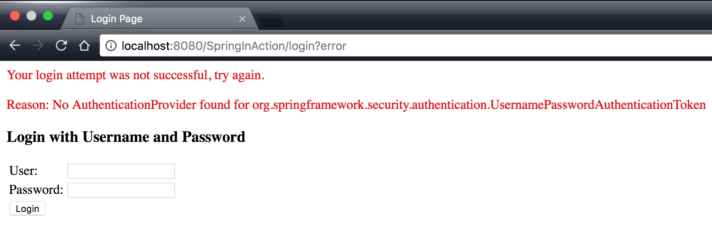
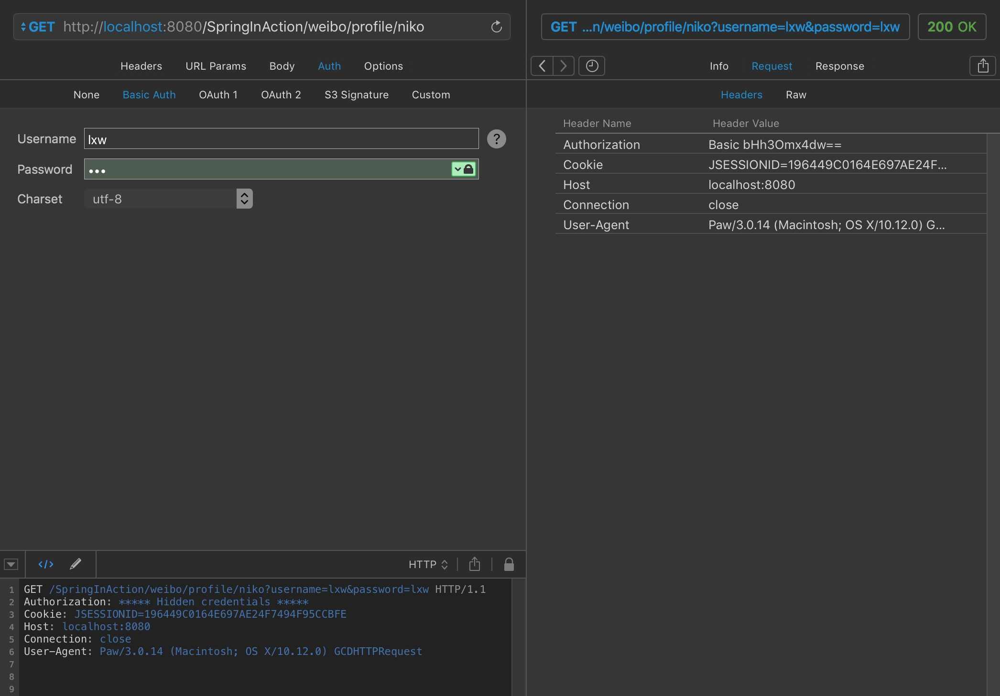

## 9.1 Spring Security简介
Spring Security 是为基于Spring的应用程序提供声明式安全保护的安全性框架。SpringSecurity充分利用了DI和AOP技术。本章将使用SpringSecurity保证Web安全性。

### 9.1.1 SpringSecurity模块
SpringSecurity被分成了11个模块 


| ACL | AccessControlList访问控制列表为域对象提供安全性 |
| --- | --- |
| 切面 | 当使用SpringSecurity注解时，会使用基于AspectJ的且米娜，而不是使用标准的SpringAOP |
| CAS客户端 | 提供与Jasig的中心认证服务（Central Authentication Service）进行集成的功能 |
| 配置 | 包含通过XML和Java配置SpringSecurity的功能支持 |
| 核心 | 提供SpringSecurity基本库 |
| 加密 | 提供了加密和密码编码的功能 |
| LDAP | 支持基于LDAP进行认证  |
| OpenID | 支持使用OpenID进行集中式认证 |
| Remoting | 提供了对SpringRemoting的支持 |
| 标签库 | SpringSecurity的JSP标签库 |
| Web | 提供了SpringSecurity基于Filter的Web安全性支持 |


<!--more-->

其中Core和Configuration模块必须包含在应用程序的类路径下。一般为了保护web应用我们还需要Web模块。

### 9.1.2 过滤Web请求
SpringSecurity借助一系列ServletFilter来提供各种安全性功能。
DelegatingFilterProxy是一个特殊的ServletFilter。它将工作委托给javax.servlet.Filter实现类，这个实现类作为一个<bean>注册在Spring应用上下文中。

在web.xml中配置过滤器（方法1）

```xml
<web-app>
  <display-name>Archetype Created Web Application</display-name>
  <filter>
    <filter-name>springSecurityFilterChain</filter-name>
    <filter-class>org.springframework.web.filter.DelegatingFilterProxy</filter-class>
  </filter>
</web-app>

```

在Java中配置（方法2）


```java

/**
 * SpringSecurity配置类
 * @author NikoBelic
 * @create 11/01/2017 14:00
 */
public class SecurityWebInitializer extends AbstractSecurityWebApplicationInitializer
{
    
}

```

不管我们使用web.xml配置还是AbstractSecurityWebApplicationInitializer得子类来配置DelegatingFilterProxy，它都会拦截发往应用中的请求，并将请求委托给ID为springSecurityFilterChain的bean。

配置Security安全细节


```java
/**
 * 配置Web安全的细节
 * @author NikoBelic
 * @create 11/01/2017 15:32
 */
@Configuration
@EnableWebSecurity
public class SecurityConfig extends WebSecurityConfigurerAdapter
{
    @Override
    protected void configure(HttpSecurity http) throws Exception {
        http.authorizeRequests().anyRequest().authenticated().and().formLogin().and().httpBasic();
    }
}
```

这个简单的默认配置指定了该如何保护HTTP请求，以及客户端认证用户的方案。通过调用authorizeRequest()和anyRequest().authenticated()就会要求所有进入应用的HTTP请求都要进行认证。他也配置SpringSecurity支持基于表单的登陆以及HTTPBasic方式的认证。
由于没有配置configure(AuthenticationManagerBuilder)方法，所以没有用户存储支撑认证过程。没有人能够登陆成功。

TODO：

- 配置用户存储
- 指定哪些请求需要认证，哪些请求不需要认证，以及所需要的权限
- 提供一个自定义的登陆界面，替代原来简单的默认登录页。
- 基于安全限制，有选择的在Web视图上显示特定的内容。

## 9.2 选择查询用户详细信息的服务
SpringSecurity能够基于各种数据存储来认证用户。它内置了多种常见的用户存储场景，如内存、关系型数据库以及LDAP。

### 9.2.1 使用基于内存的用户存储


```java

    /**
     * 基于内存的用户登陆权限配置
     * @Author NikoBelic
     * @Date 11/01/2017 17:43
     */
    @Override
    protected void configure(AuthenticationManagerBuilder auth) throws Exception {
        auth.inMemoryAuthentication().withUser("lxw").password("lxw").roles("USER").and()
                .withUser("admin").password("admin").roles("USER","ADMIN");
    }
    
```

### 9.2.2 基于数据库表进行认证
SpringSecurity会内置一些查询语句，当查找用户信息时会自动执行。
当然我们也可以自定义查询语句来获取用户信息。如下是相关java配置。
将默认的sql查询替换为自定义的设计时，要遵循查询的基本协议。

- 所有查询都将用户名作为唯一的参数
- 认证查询会选取用户名、密码以及启用状态信息。
- 权限查询会选取0行或多行包含该用户名以及其权限信息的数据。
- 群组权限查询会选取0行或多行数据，每行数据中都会包括群组ID、群组名称以及权限。

```java
/**
 * 配置Web安全的细节
 * @author NikoBelic
 * @create 11/01/2017 15:32
 */
@Configuration
@EnableWebSecurity
public class SecurityConfig extends WebSecurityConfigurerAdapter
{
    @Autowired
    DataSource dataSource;
    @Override
    protected void configure(HttpSecurity http) throws Exception {
        http.authorizeRequests().anyRequest().authenticated().and().formLogin().and().httpBasic();
    }

    /**
     * 用户登陆权限配置
     * @Author NikoBelic
     * @Date 11/01/2017 17:43
     */
    @Override
    protected void configure(AuthenticationManagerBuilder auth) throws Exception {
        // 基于内存的用户权限配置
        //auth.inMemoryAuthentication().withUser("lxw").password("lxw").roles("USER").and()
        //        .withUser("admin").password("admin").roles("USER","ADMIN");

        // 基于JDBC的用户权限配置

        auth.jdbcAuthentication().dataSource(dataSource).
                usersByUsernameQuery("select username,password,true from tb_user where username = ?").
                authoritiesByUsernameQuery("select username,'ROLE_USER' from tb_user where username = ?");
    }
}

```

其中datasource是通过自动装配注入的，因此我们需要在root中或者xml中先配置一下数据源。


```java
/**
 * Spring上下文配置类
 * 由ContextLoaderListener加载的bean
 * @author NikoBelic
 * @create 09/01/2017 20:30
 */
@Configuration
@ComponentScan(basePackages = "chapter07",excludeFilters = {@ComponentScan.Filter(type = FilterType.ANNOTATION,value = EnableWebMvc.class)})
public class RootConfig
{

    @Bean
    public DataSource dataSource()
    {
        DriverManagerDataSource ds = new DriverManagerDataSource();
        ds.setDriverClassName("com.mysql.jdbc.Driver");
        ds.setUrl("jdbc:mysql://localhost:3306/dmes?characterEncoding=UTF-8");
        ds.setUsername("root");
        ds.setPassword("*******");
        return ds;
    }
}

```

之后再访问web层就可以使用数据库中已经存储的用户去登陆SpringSecurity校验界面了。
补充：一般情况下数据库中的密码并不是明文存储的，因此我们需要一个密码转换方法将SpringSecurity从DB中获取到的密码进行解码。
举个栗子：DB中username=niko,password=niko_salt(这是密文哦,用户注册后系统加工后的处理结果)。
那么通过MyPasswordDecoder类处理后，我们通过SpringSecurity登录验证的输入为:niko,niko就能正常访问了。


```java
@Configuration
@EnableWebSecurity
public class SecurityConfig extends WebSecurityConfigurerAdapter
{
    @Autowired
    DataSource dataSource;

    @Override
    protected void configure(HttpSecurity http) throws Exception {
        http.authorizeRequests().anyRequest().authenticated().and().formLogin().and().httpBasic();
    }

    /**
     * 用户登陆权限配置
     *
     * @Author NikoBelic
     * @Date 11/01/2017 17:43
     */
    @Override
    protected void configure(AuthenticationManagerBuilder auth) throws Exception {
        // 基于内存的用户权限配置
        //auth.inMemoryAuthentication().withUser("lxw").password("lxw").roles("USER").and()
        //        .withUser("admin").password("admin").roles("USER","ADMIN");

        // 基于JDBC的用户权限配置

        auth.jdbcAuthentication().dataSource(dataSource).
                usersByUsernameQuery("select username,password,true from tb_user where username = ?").
                authoritiesByUsernameQuery("select username,'ROLE_USER' from tb_user where username = ?").
                passwordEncoder(new MyPasswordDecoder("_salt"));
    }
}

/**
 * 密码解码器
 * @Author NikoBelic
 * @Date 11/01/2017 19:26
 */
class MyPasswordDecoder implements PasswordEncoder
{
    private String salt;

    public MyPasswordDecoder(String salt)
    {
        this.salt = salt;
    }

    @Override
    public String encode(CharSequence charSequence) {
        return charSequence.toString() + salt;
    }

    @Override
    public boolean matches(CharSequence rawPassword, String encodePassword)
    {
        return (rawPassword + salt).equals(encodePassword);
    }
}
```


### 9.2.3 自定义查询用户服务


```java
/**
 * 自定义用户权限查询类
 * 可以配置为MongoDB、Redis等等
 * @Author NikoBelic
 * @Date 11/01/2017 19:38
 */
class MyUserService implements UserDetailsService
{
    @Override
    public UserDetails loadUserByUsername(String username) throws UsernameNotFoundException
    {
        if (username.equals("test"))
        {
            List<GrantedAuthority> authorities = new ArrayList<>();
            authorities.add(new SimpleGrantedAuthority("ROLE_SPITTER"));
            return new User("test", "test",authorities );
        }
        throw new UsernameNotFoundException("没有查询到该用户");
    }
}
```

## 9.3 拦截请求
针对不同的功能进行不同等级的安全认证是项目中经常会用到的。

```java
@Override
    protected void configure(HttpSecurity http) throws Exception {
        // 对全部web请求进行安全校验
        //http.authorizeRequests().anyRequest().authenticated().and().formLogin().and().httpBasic();

        // 按照URL路径设置安全校验
        http.authorizeRequests().antMatchers("/weibo/profile").authenticated()
                .antMatchers(HttpMethod.GET,"/weibo/testSecurity").authenticated()
                .anyRequest().permitAll();

    }
```

以上配置指定了部分url禁止访问，匹配url的字符串支持Ant风格(antMatchers)的通配符。也可以在一个matcher中指定多个url链接，用逗号隔开。url也支持正则表达式regexMachers和anyRequest。
`.regexMachers("spitters/.*").authenticated()`和`/spitters/**`所拦截的url是一样的。
用来定义如何保护路径的配制方法

| access(String) | 如果给定的SpEL表达式计算结果为true，就允许访问。 |
| --- | --- |
| anonymous() | 允许匿名用户访问 |
| authenticated() | 允许认证过的用户访问 |
| denyAll() | 无条件拒绝所有访问 |
| fullyAuthenticated() | 如果用户是完整认证的话（不是通过Remember-me功能认证的）就允许访问 |
| hasAnyAuthority(String...) | 如果用户具备给定全险种的某一个的话，就允许访问 |
| hasAnyRole(String...) | 如果用户具备给定角色中的某一个的话，就允许访问 |
| hasAuthority(String) | 如果用户具备给定权限的话，就允许访问 |
| hasIpAddress(String) | 如果请求来自给定IP地址的话，就允许访问。 |
| hasRole(String) | 如果用户具备给定角色的话，就允许访问 |
| not() | 对其他访问方法的结果求反 |
| permitAll() | 无条件允许访问 |
| rememberMe() | 如果哟过户是通过Remember-me功能认证的，就允许访问 |

我们可以将任意数量的antMachers、regexMatcgers、anyRequest连接起来，以满足web安应用安全规则的需要。这些规则按照给定的顺序发挥作用，所以必须将最具体（细粒度）的请求路径放在前面，而最不具体的路径（anyRequest）放在最后面。否则后面的路径配置将会被前面的覆盖。

### 9.3.1 使用Spring表达式进行安全保护
使用SpEL表达式可以使安全限制更加灵活强大，以上表格展示了所有限制方法，但是假如我们需要使用一些特殊的安全机制，那么可以使用SpEL表达式。
| authentication | 用户的认证对象 |
| --- | --- |
| denyAll | 结果始终为false |
| hasAnyRole(list of roles) | 如果用户被授予了列表中的人已制定角色，结果为true |
| hasRole(role) | 如果用户被授予了指定的角色，结果为true |
| hasIpAddress(IP) | 如果来自指定的IP，结果为true |
| isAnonymous() | 如果当前用户为匿名用户，结果为true |
| isAuthenticated() | 如果当前用户进行了认证，结果为true |
| isFullyuAuthenticated() | 如果当前用户进行了完整认证，结果为true |
| isRememberMe() | 如果当前用户是通过Remember-me自动认证的，结果为true |
| permitAll | 结果为true |
| principal | 用户的principal对象 |

.antMachers("/spitter/me").access("hasRole('ROLE_SPITTER') and hasIpAddress('192.168.1.2')")

### 9.3.2 强制通道的安全性

将访问路径强制转换为https

```java
http.authorizeRequests().antMatchers("/weibo/profile/*").hasRole("USER")
                .antMatchers(HttpMethod.GET,"/weibo/testSecurity").authenticated()
                .and()
                .requiresChannel()
                .anyRequest().requiresSecure();

```

### 9.3.3 防止跨站请求伪造
SpringSecurity会默认启动CSRF防护，因此我们无法向其他站点提交请求，以防止页面在被篡改的情况下站点被CSRF攻击。我们可以在jsp页面中的form表单中添加csrf隐藏域(后台传过来的)。

```html
<input type="hidden" name = "${__csrf。paramteterName}" value="${__csrf.token}"/>
```
或者在SpringSeccurity中禁用CSRF防护。

```html
http
    ...
    .csrf().disable()
```

### 9.4 认证用户
上面的安全配制方法，虽然配置了一些用户权限问题，但是没有设置登陆界面，所以你咋让我认证啊？
解决方案如下


```java
// 按照URL路径设置安全校验
        http.formLogin() // 启动默认的登陆表单
                .and()
                .authorizeRequests()// 授权通过以后
                .antMatchers("/weibo/profile/*").hasRole("USER") // 访问指定路径必须拥有USER角色权限
                .antMatchers(HttpMethod.GET,"/weibo/testSecurity").authenticated() // 指定url只允许GET请求
                .anyRequest().permitAll(); //其他请求均可通过
```


### 9.4.1 添加自定义的登陆页
自己造一个

```java
form['weibo/login' POST](input(username),input(password),submit())
```
注意表单提交位置、输入域名称就可以了，简单的一匹。


```java
http.csrf().disable().formLogin()
                .loginPage("/weibo/showLogin")// 登陆表单
                .and()
                .authorizeRequests()// 授权通过以后
                .antMatchers("/weibo/profile/*").hasRole("USER") // 访问指定路径必须拥有USER角色权限
                .antMatchers(HttpMethod.GET,"/weibo/testSecurity").authenticated() // 指定url只允许GET请求
                .anyRequest().permitAll(); //其他请求均可通过
```

Controller
```java
/**
     * 跳转登陆页面
     * @Author NikoBelic
     * @Date 12/01/2017 19:46
     */
    @RequestMapping(value = "/showLogin",method = RequestMethod.GET)
    public String showLogin()
    {
        return "/weibo/login";
    }
```


### 9.4.2 启用HTTP Basic认证
对于普通用户来说，展现一个login表单还可以，但是对于应用程序来说就需要另外一种验证方式了。
启用HTTP Basic认证的方式很简单。

```java
// 按照URL路径设置安全校验
        http.csrf().disable().formLogin()
                .loginPage("/weibo/showLogin")// 登陆表单
                .and()
                .httpBasic()
                .and()
                .authorizeRequests()// 授权通过以后
                .antMatchers("/weibo/profile/*").hasRole("USER") // 访问指定路径必须拥有USER角色权限
                .antMatchers(HttpMethod.GET,"/weibo/testSecurity").authenticated() // 指定url只允许GET请求
                .anyRequest().permitAll(); //其他请求均可通过
```
模拟Basic认证请求



### 9.4.3 RememberMe功能和注销功能


```java
http.csrf().disable().formLogin()
                .loginPage("/weibo/showLogin")// 登陆表单
                .and()
                .logout() // 注销  清楚remember-me的token
                .logoutSuccessUrl("/weibo/register")
                .and()
                .httpBasic()//启动服务器认证功能
                .and()
                .rememberMe() // 启动记住我功能
                .tokenValiditySeconds(10) // 只保存10s的token
                .key("weiboKey")
                .and()
                .authorizeRequests()// 授权通过以后
                .antMatchers("/weibo/profile/*").hasRole("USER") // 访问指定路径必须拥有USER角色权限
                .antMatchers(HttpMethod.GET,"/weibo/testSecurity").authenticated() // 指定url只允许GET请求
                .anyRequest().permitAll(); //其他请求均可通过
```

## 9.5 小结
Spring Security提供了一种简单、灵活且强大的机制来保护Web应用程序。借助一系列Servlet Filter能够控制对Web资源的访问，包括MVC控制器。借助于Java配置模型，能够简洁的声明Web安全性功能。
当认证用户是，可以使用基于内存用户库、关系型数据库、LDAP目录服务器来配置认证功能。

