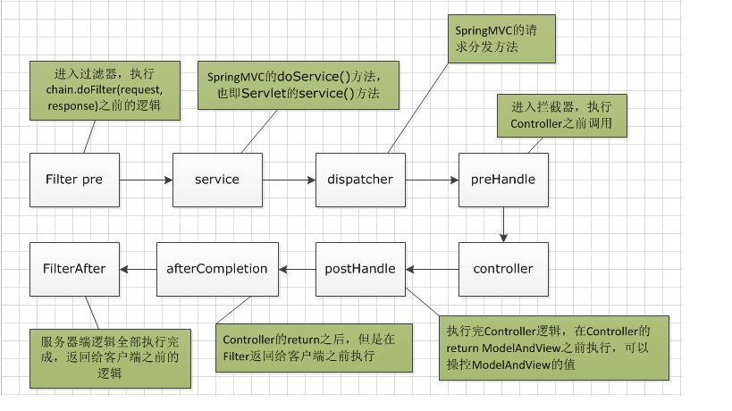

 
## 1 过滤器和拦截器的区别：

- ①拦截器是基于Java的反射机制的，而过滤器是基于函数回调。
- ②拦截器不依赖与servlet容器，过滤器依赖与servlet容器。
- ③拦截器只能对action请求起作用，而过滤器则可以对几乎所有的请求起作用。
- ④拦截器可以访问action上下文、值栈里的对象，而过滤器不能访问。
- ⑤在action的生命周期中，拦截器可以多次被调用，而过滤器只能在容器初始化时被调用一次。
- ⑥拦截器可以获取IOC容器中的各个bean，而过滤器就不行，这点很重要，在拦截器里注入一个service，可以调用业务逻辑。

<!--more-->
写了点测试代码，顺便整理一下思路，搞清楚这几者之间的顺序：

- 1.过滤器是JavaEE标准，采用函数回调的方式进行。是在请求进入容器之后，还未进入Servlet之前进行预处理，并且在请求结束返回给前端这之间进行后期处理。

```java
public class MyFilter implements Filter
{
    @Override
    public void init(FilterConfig filterConfig) throws ServletException {
        System.out.println("过滤器 - init ");
    }

    @Override
    public void doFilter(ServletRequest servletRequest, ServletResponse servletResponse, FilterChain filterChain) throws IOException, ServletException {
        System.out.println("过滤器 - doFilter ");
        filterChain.doFilter(servletRequest,servletResponse);
    }

    @Override
    public void destroy() {
        System.out.println("过滤器 - destroy ");
    }
}

``` 
chain.doFilter(request, response);这个方法的调用作为分水岭。事实上调用Servlet的doService()方法是在chain.doFilter(request, response);这个方法中进行的。

- 2.拦截器是被包裹在过滤器之中的。
    - preHandle()这个方法是在过滤器的chain.doFilter(request, response)方法的前一步执行，也就是在 [System.out.println("before...")][chain.doFilter(request, response)]之间执行。
    - postHandle()方法之后，在return ModelAndView之前进行，可以操控Controller的ModelAndView内容。
    - afterCompletion()方法是在过滤器返回给前端前一步执行，也就是在[chain.doFilter(request, response)][System.out.println("after...")]之间执行。 

```java
/**
 * Spring拦截器
 *
 * @author NikoBelic
 * @create 2017/4/11 18:01
 */
@Component
public class MyInterceptor implements HandlerInterceptor
{
    @Override
    public boolean preHandle(HttpServletRequest httpServletRequest, HttpServletResponse httpServletResponse, Object o) throws Exception {
        System.out.println("拦截器 - PreHandle - " + httpServletRequest.getRemoteAddr());
        return true;
    }

    @Override
    public void postHandle(HttpServletRequest httpServletRequest, HttpServletResponse httpServletResponse, Object o, ModelAndView modelAndView) throws Exception {
        System.out.println("拦截器 - postHandle - " + httpServletRequest.getRemoteAddr());
    }

    @Override
    public void afterCompletion(HttpServletRequest httpServletRequest, HttpServletResponse httpServletResponse, Object o, Exception e) throws Exception {
        System.out.println("拦截器 - afterCompletion - " + httpServletRequest.getRemoteAddr());

    }
}

```

**配置过滤器**
```java
public class SpitterWebInitializer extends AbstractAnnotationConfigDispatcherServletInitializer
{
    @Override
    protected Filter[] getServletFilters() {
        CharacterEncodingFilter characterEncodingFilter = new CharacterEncodingFilter();
        characterEncodingFilter.setEncoding("UTF-8");
        characterEncodingFilter.setForceEncoding(true);
        DelegatingFilterProxy testFilterChain = new DelegatingFilterProxy(new MyFilter());
        return new Filter[]{characterEncodingFilter, testFilterChain};
    }
}
```

**配置拦截器**
```java
@Configuration
@EnableWebMvc
@ComponentScan("mvc.controller")
public class WebConfig extends WebMvcConfigurerAdapter
{
    @Override
    public void addInterceptors(InterceptorRegistry registry) {
        registry.addInterceptor(new MyInterceptor()).addPathPatterns("/interceptor/*");
    }
}
```

**测试**
访问 `http://localhost:8080/SpringInAction/interceptor/dosomething`
Console输出
```
过滤器 - doFilter 
拦截器 - PreHandle - 0:0:0:0:0:0:0:1
I am doing something...
拦截器 - postHandle - 0:0:0:0:0:0:0:1
拦截器 - afterCompletion - 0:0:0:0:0:0:0:1

```

- 3.SpringMVC的机制是由同一个Servlet来分发请求给不同的Controller，其实这一步是在Servlet的service()方法中执行的。所以过滤器、拦截器、service()方法，dispatc()方法的执行顺序应该是这样的，大致画了个图：其实非常好测试，自己写一个过滤器，一个拦截器，然后在这些方法中都加个断点，一路F8下去就得出了结论。
　　


总结：拦截器功在对请求权限鉴定方面确实很有用处，在我所参与的这个项目之中，第三方的远程调用每个请求都需要参与鉴定，所以这样做非常方便，而且他是很独立的逻辑，这样做让业务逻辑代码很干净。和框架的其他功能一样，原理很简单，使用起来也很简单，大致看了下SpringMVC这一部分的源码，其实还是比较容易理解的。
我们项目中仅仅用到了preHandle这个方法，而未用其他的，框架提供了一个已经实现了拦截器接口的适配器类HandlerInterceptorAdapter，继承这个类然后重写一下需要用到的方法就行了，可以少几行代码，这种方式Java中很多地方都有体现。
大家还可以参考一下这个电子书的截图：

