# 1 Java内存模型

## 1.1 内存模型图解

Java虚拟机在执行Java程序的过程中，会把它所管理的内存划分为若干个不同的数据区。
这些区域有各自的用途，以及创建和销毁的时间，有的区域随着虚拟机进程的启动而存在，有的区域则依赖用户线程的启动和结束而建立和销毁，
我们可以将这些区域统称为Java运行时数据区域。

如下图是一个内存模型的关系图（详情见图：内存划分.png）：

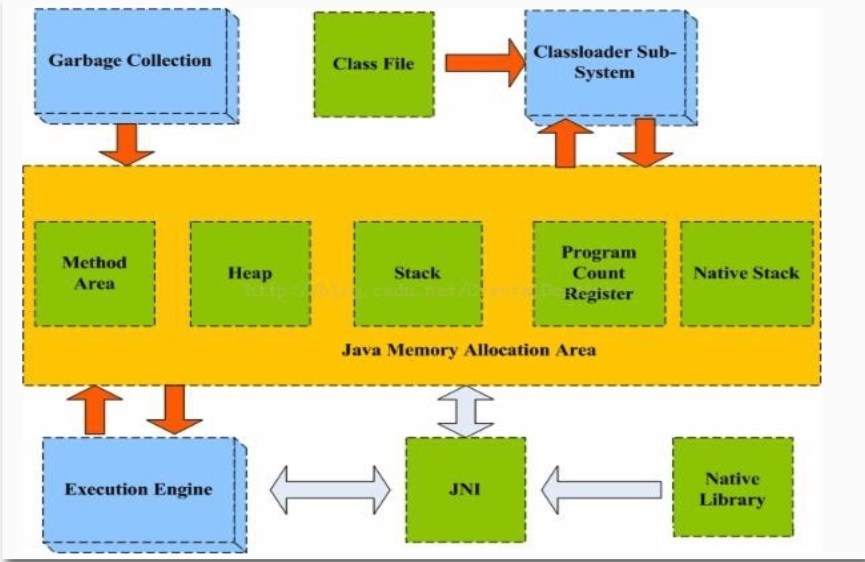

如上图所示，Java虚拟机运行时数据区域被分为五个区域：**堆(Heap)、栈(Stack)、本地方法栈(Native Stack)、方法区(Method Area)、程序计数器(Program Count Register)**。

<!--more-->

## 1.2 堆（Heap）

对于大多数应用来说，Java Heap是Java虚拟机管理的内存的最大一块，这块区域随着虚拟机的启动而创建。在实际的运用中，我们创建的**对象**和**数组**就是存放在堆里面。如果你听说线程安全的问题，就会很明确的知道Java Heap是一块共享的区域，操作共享区域的成员就有了锁和同步。
	与Java Heap相关的还有Java的垃圾回收机制（GC）,Java Heap是垃圾回收器管理的主要区域。程序猿所熟悉的新生代、老生代、永久代的概念就是在堆里面，现在大多数的GC基本都采用了分代收集算法。如果再细致一点，Java Heap还有Eden空间，From Survivor空间,To Survivor空间等。
	Java Heap可以处于物理上不连续的内存空间中，只要逻辑上是连续的即可。

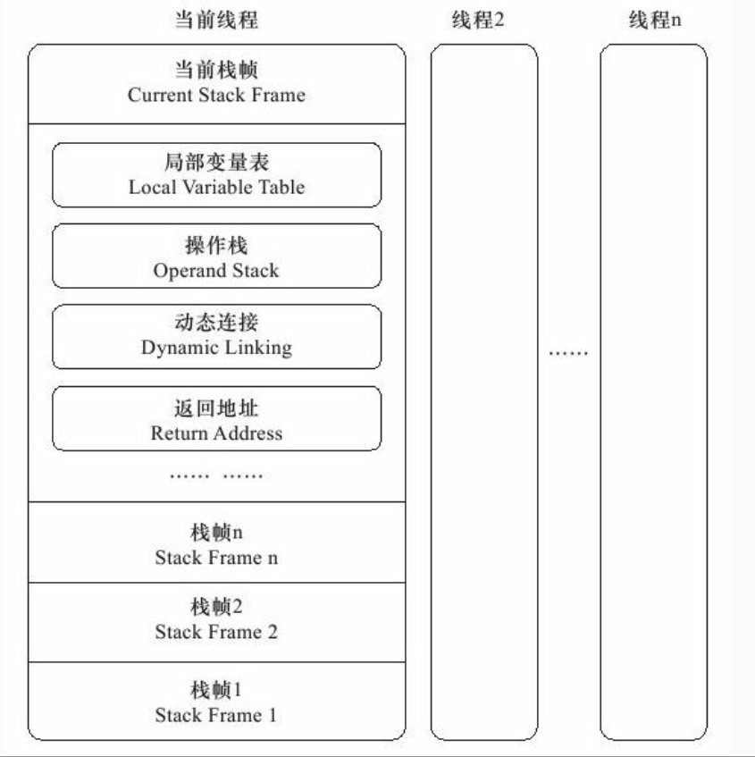

## 1.3 栈（Stack）

相对于Java Heap来讲，**Java Stack是线程私有的**，她的生命周期与线程相同。Java Stack描述的是Java方法执行时的内存模型，**每个方法执行时都会创建一个栈帧（Stack Frame）**用于存储**局部变量表、操作数栈、动态链接、方法出口**等信息。从下图从可以看到，每个线程在执行一个方法时，都意味着有一个栈帧在当前线程对应的栈帧中入栈和出栈。

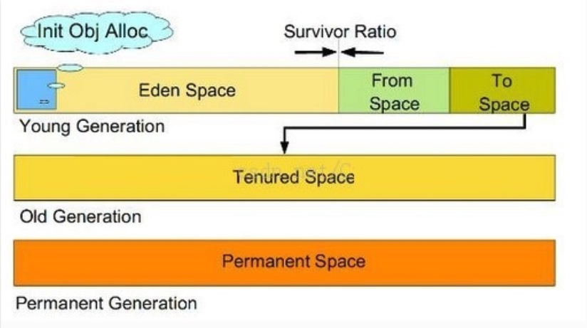

图中可以看到每一个栈帧中都有局部变量表。局部变量表存放了编译期间的各种基本数据类型，对象引用等信息。

## 1.4 本地方法栈（Native Stack）

本地方法栈（Native Stack）与Java虚拟机站（Java Stack）所发挥的作用非常相似，他们之间的区别在于虚拟机栈为虚拟机栈执行java方法（也就是字节码）服务，而本地方法栈则为使用到Native方法服务。

##  1.5 方法区（Method Area）

方法区（Method Area）与堆（Java Heap）一样，是**各个线程共享的内存区域**，它用于存储虚拟机加载的**类信息，常量，静态变量，即时编译器编译后的代码**等数据。虽然Java虚拟机规范把方法区描述为堆的一个逻辑部分，但是她却有一个别名叫做非堆（Non-Heap）。分析下Java虚拟机规范，之所以把方法区描述为堆的一个逻辑部分，应该觉得她们都是存储数据的角度出发的。一个存储对象数据（堆），一个存储静态信息(方法区)。

在上文中，我们看到堆中有新生代、老生代、永久代的描述。为什么我们将新生代、老生代、永久代三个概念一起说，那是因为HotSpot虚拟机的设计团队选择把GC分代收集扩展至方法区，或者说使用永久代来实现方法区而已。这样HotSpot的垃圾收集器就能想管理Java堆一样管理这部分内存。简单点说就是HotSpot虚拟机中内存模型的分代，其中新生代和老生代在堆中，永久代使用方法区实现。根据官方发布的路线图信息，现在也有放弃永久代并逐步采用Native Memory来实现方法区的规划，在JDK1.7的HotSpot中，已经把原本放在永久代的字符串常量池移出。

## 1.6 小结

- 线程私有的数据区域有：
    - Java虚拟机栈（Java Stack）
    - 本地方法栈（Native Stack）
- 线程共有的数据区域有：
    - 堆（Java Heap）
    - 方法区

# 2 GC算法

## 2.1 标记-清楚算法（Mark-Sweep）

1、标记出所有需要回收的对象，在标记完成后统一回收所有被标记的对象
2、在标记完成后统一回收所有被标记的对象
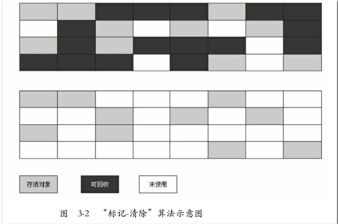

缺点：

- 一个是效率问题，标记和清除两个过程的**效率都不高**；
- 另一个是空间问题，标记清除之后会产生**大量不连续的内存碎片**，空间碎片太多可能会导致以后在程序运行过程中需要分配较大对象时，无法找到足够的连续内存而不得不提前触发另一次垃圾收集动作。

## 2.2 复制算法（Copying）

1、将可用内存按容量划分为大小相等的两块，每次只使用其中的一块。
2、当这一块的内存用完了，就将还存活着的对象复制到另外一块上面，然后再把已使用过的内存空间一次清理掉。
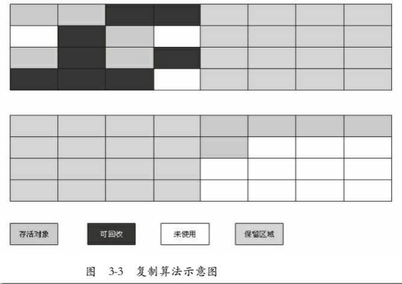

优点：

- 这样使得每次都是对整个半区进行内存回收，内存分配时也就不用考虑内存碎片等
- 复杂情况，只要移动堆顶指针，按顺序分配内存即可，实现简单，运行高效。只是这种算法的代价是将内存缩小为了原来的一半，未免太高了一点。
缺点：

- 复制收集算法在对象存活率较高时就要进行较多的复制操作，效率将会变低

## 2.3 标记整理算法（Mark-Compact）

1、标记
2、让所有存活的对象都向一端移动，然后直接清理掉端边界以外的内存
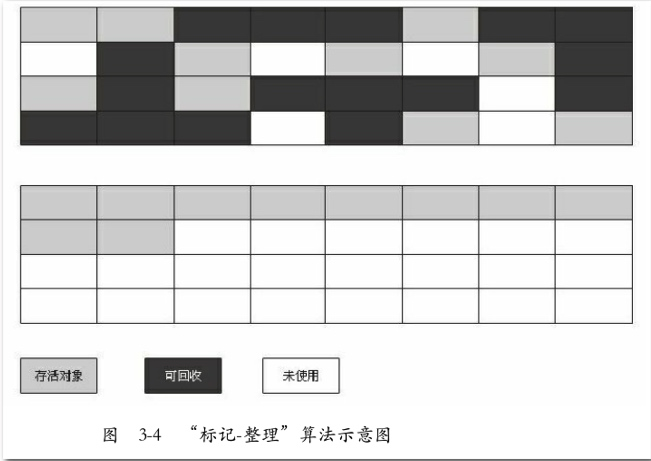

## 2.4 分代收集算法（Generational Collection）

1、根据对象存活周期的不同将内存划分为几块。
2、一般是把Java堆分为新生代和老年代，这样就可以根据各个年代的特点采用最适当的收集算法。
3、在新生代中，每次垃圾收集时都发现有大批对象死去，只有少量存活，那就选用复制算法，只需要付出少量存活对象的复制成本就可以完成收集。
4、老年代中因为对象存活率高、没有额外空间对它进行分配担保，就必须使用“标记—清理”或者“标记—整理”算法来进行回收。

# 3 垃圾收集器

## 3.1 Serial收集器

1、是一个单线程的收集器，“Stop The World”
2、对于运行在Client模式下的虚拟机来说是一个很好的选择
3、简单而高效
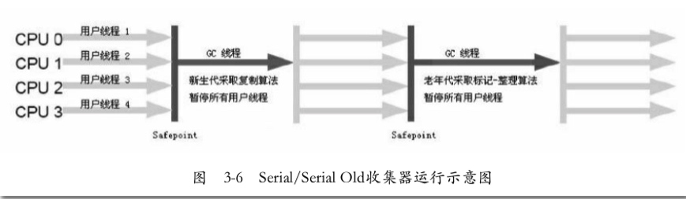

## 3.2 Serial Old收集器

1、Serial收集器的老年代版本，它同样是一个单线程收集器，使用“标记-整理”算法。
2、主要意义也是在于给Client模式下的虚拟机使用。
3、如果在Server模式下，那么它主要还有两大用途：
    一种用途是在JDK 1.5以及之前的版本中与Parallel Scavenge收集器搭配使用[1]，
    另一种用途就是作为CMS收集器的后备预案，在并发收集发生Concurrent Mode Failure时使用。
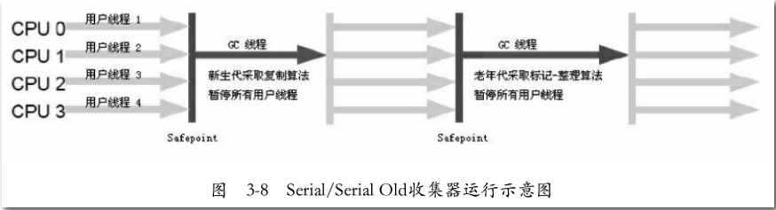

## 3.3 ParNew收集器

1、Serial收集器的多线程版本
2、单CPU不如Serial
3、Server模式下新生代首选,目前只有它能与CMS收集器配合工作
4、使用-XX：+UseConcMarkSweepGC选项后的默认新生代收集器，也可以使用-XX：+UseParNewGC选项来强制指定它。
5、-XX：ParallelGCThreads：限制垃圾收集的线程数。

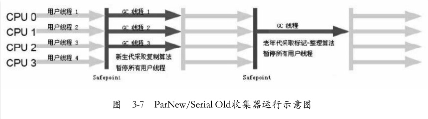

## 3.4 Parallel Scavenge收集器

1、吞吐量优先”收集器
2、新生代收集器，复制算法，并行的多线程收集器
3、目标是达到一个可控制的吞吐量（Throughput）。
4、吞吐量=运行用户代码时间/（运行用户代码时间+垃圾收集时间），虚拟机总共运行了100分钟，其中垃圾收集花掉1分钟，那吞吐量就是99%。
5、两个参数用于精确控制吞吐量:

- -XX：MaxGCPauseMillis是控制最大垃圾收集停顿时间
- -XX：GCTimeRatio直接设置吞吐量大小
- -XX：+UseAdaptiveSizePolicy:动态设置新生代大小、Eden与Survivor区的比例、晋升老年代对象年龄

6、并行（Parallel）：指多条垃圾收集线程并行工作，但此时用户线程仍然处于等待状态。
7、并发（Concurrent）：指用户线程与垃圾收集线程同时执行（但不一定是并行的，可能会交替执行），用户
程序在继续运行，而垃圾收集程序运行于另一个CPU上。

## 3.5 Parallel Old收集器

1、Parallel Scavenge收集器的老年代版本，使用多线程和“标记-整理”算法。
2、在注重吞吐量以及CPU资源敏感的场合，都可以优先考虑Parallel Scavenge加Parallel Old收集器。
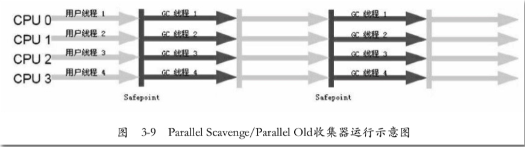

## 3.6 CMS收集器

1、以获取最短回收停顿时间为目标的收集器。
2、非常符合互联网站或者B/S系统的服务端上，重视服务的响应速度，希望系统停顿时间最短的应用
3、基于“标记—清除”算法实现的
4、CMS收集器的内存回收过程是与用户线程一起并发执行的
5、它的运作过程分为4个步骤，包括：
   
- 初始标记，“Stop The World”，只是标记一下GC Roots能直接关联到的对象，速度很快
- 并发标记，并发标记阶段就是进行GC RootsTracing的过程
- 重新标记，Stop The World”，是为了修正并发标记期间因用户程序继续运作而导致标记产生变动的那一部分对象的标记记录，但远比并发标记的时间短
        并发清除（CMS concurrent sweep）
6、优点：并发收集、低停顿
7、缺点：
- 对CPU资源非常敏感。
- 无法处理浮动垃圾，可能出现“Concurrent Mode Failure”失败而导致另一次Full GC的产生。
- 一款基于“标记—清除”算法实现的收集器

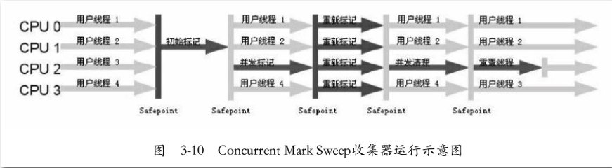

## 3.7 G1（Garbage-First）收集器
1、当今收集器技术发展的最前沿成果之一
2、G1是一款面向服务端应用的垃圾收集器。
3、优点：

- 并行与并发：充分利用多CPU、多核环境下的硬件优势
- 分代收集：不需要其他收集器配合就能独立管理整个GC堆
- 空间整合：“标记—整理”算法实现的收集器，局部上基于“复制”算法不会产生内存空间碎片            
- 可预测的停顿：能让使用者明确指定在一个长度为M毫秒的时间片段内，消耗在垃圾收集上的时间不得超过N毫秒

4、G1收集器的运作大致可划分为以下几个步骤：

- 初始标记：标记一下GC Roots能直接关联到的对象，需要停顿线程，但耗时很短
- 并发标记：是从GC Root开始对堆中对象进行可达性分析，找出存活的对象，这阶段耗时较长，但可与用户程序并发执行
- 最终标记：修正在并发标记期间因用户程序继续运作而导致标记产生变动的那一部分标记记录
- 筛选回收：对各个Region的回收价值和成本进行排序，根据用户所期望的GC停顿时间来制定回收计划

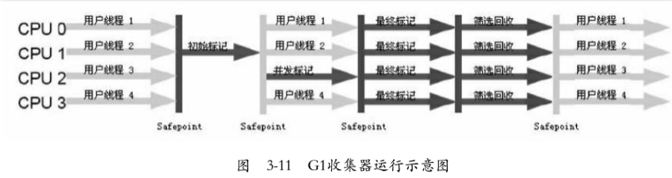

## 3.8 垃圾收集器参数总结

**收集器设置：**

- -XX:+UseSerialGC:年轻串行（Serial），老年串行（Serial Old）
- -XX:+UseParNewGC:年轻并行（ParNew），老年串行（Serial Old）
- -XX:+UseConcMarkSweepGC:年轻并行（ParNew），老年串行（CMS），备份（Serial Old）
- -XX:+UseParallelGC:年轻并行吞吐（Parallel Scavenge），老年串行（Serial Old）
- -XX:+UseParalledlOldGC:年轻并行吞吐（Parallel Scavenge），老年并行吞（Parallel Old）

**收集器参数：**

- -XX:ParallelGCThreads=n:设置并行收集器收集时使用的CPU数。并行收集线程数。
- -XX:MaxGCPauseMillis=n:设置并行收集最大暂停时间
- -XX:GCTimeRatio=n:设置垃圾回收时间占程序运行时间的百分比。公式为1/(1+n)
- -XX:+CMSIncrementalMode:设置为增量模式。适用于单CPU情况。
- -XX:ParallelGCThreads=n:设置并发收集器年轻代收集方式为并行收集时，使用的CPU数。并行收集线程数。

# 4 JVM参数列表

>java -Xmx3550m -Xms3550m -Xmn2g -Xss128k -XX:NewRatio=4 -XX:SurvivorRatio=4 -XX:MaxPermSize=16m  -XX:MaxTenuringThreshold=0

- -Xmx3550m：最大堆内存为3550M。
- -Xms3550m：初始堆内存为3550m。
    - 此值可以设置与-Xmx相同，以避免每次垃圾回收完成后JVM重新分配内存。
- -Xmn2g：设置年轻代大小为2G。
    - 整个堆大小=年轻代大小 + 年老代大小 + 持久代大小。持久代一般固定大小为64m，所以增大年轻代后，将会减小年老代大小。此值对系统性能影响较大，Sun官方推荐配置为整个堆的3/8。
- -Xss128k：设置每个线程的堆栈大小。
    - JDK5.0以后每个线程堆栈大小为1M，在相同物理内存下，减小这个值能生成更多的线程。但是操作系统对一个进程内的线程数还是有限制的，不能无限生成，经验值在 3000~5000左右。 
- -XX:NewRatio=4:设置年轻代（包括Eden和两个Survivor区）与年老代的比值（除去持久代）。
    - 设置为4，则年轻代与年老代所占比值为1：4，年轻代占整个堆栈的1/5
- -XX:SurvivorRatio=4：设置年轻代中Eden区与Survivor区的大小比值。
    - 设置为4，则两个Survivor区与一个Eden区的比值为2:4，一个Survivor区占整个年轻代的1/6
- -XX:MaxPermSize=16m:设置持久代大小为16m。
- -XX:MaxTenuringThreshold=15：设置垃圾最大年龄。
    - 如果设置为0的话，则年轻代对象不经过Survivor区，直 接进入年老代。对于年老代比较多的应用，可以提高效率。如果将此值设置为一个较大值，则年轻代对象会在Survivor区进行多次复制，这样可以增加对象 再年轻代的存活时间，增加在年轻代即被回收的概论。

**收集器设置**

- -XX:+UseSerialGC:设置串行收集器
- -XX:+UseParallelGC:设置并行收集器
- -XX:+UseParalledlOldGC:设置并行年老代收集器
- -XX:+UseConcMarkSweepGC:设置并发收集器

**垃圾回收统计信息**

- -XX:+PrintGC
- -XX:+PrintGCDetails
- -XX:+PrintGCTimeStamps
- -Xloggc:filename

**并行收集器设置**

- -XX:ParallelGCThreads=n:设置并行收集器收集时使用的CPU数。并行收集线程数。
- -XX:MaxGCPauseMillis=n:设置并行收集最大暂停时间
- -XX:GCTimeRatio=n:设置垃圾回收时间占程序运行时间的百分比。公式为1/(1+n)

**并发收集器设置**

- -XX:+CMSIncrementalMode:设置为增量模式。适用于单CPU情况。
- -XX:ParallelGCThreads=n:设置并发收集器年轻代收集方式为并行收集时，使用的CPU数。并行收集线程数。

# 5 JVM监控工具

## 5.1 jconsole

jconsole是一种集成了上面所有命令功能的可视化工具，可以分析jvm的内存使用情况和线程等信息。

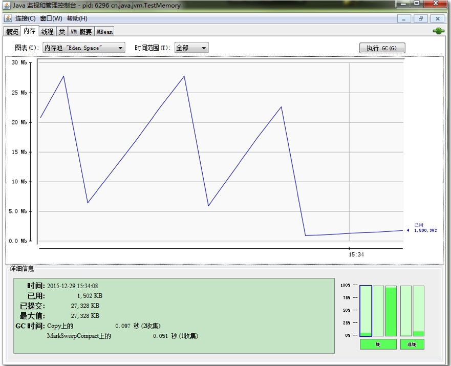

## 5.2 jvisualvm

提供了和jconsole的功能类似，提供了一大堆的插件。
插件中，Visual GC（可视化GC）还是比较好用的，可视化GC可以看到内存的具体使用情况。
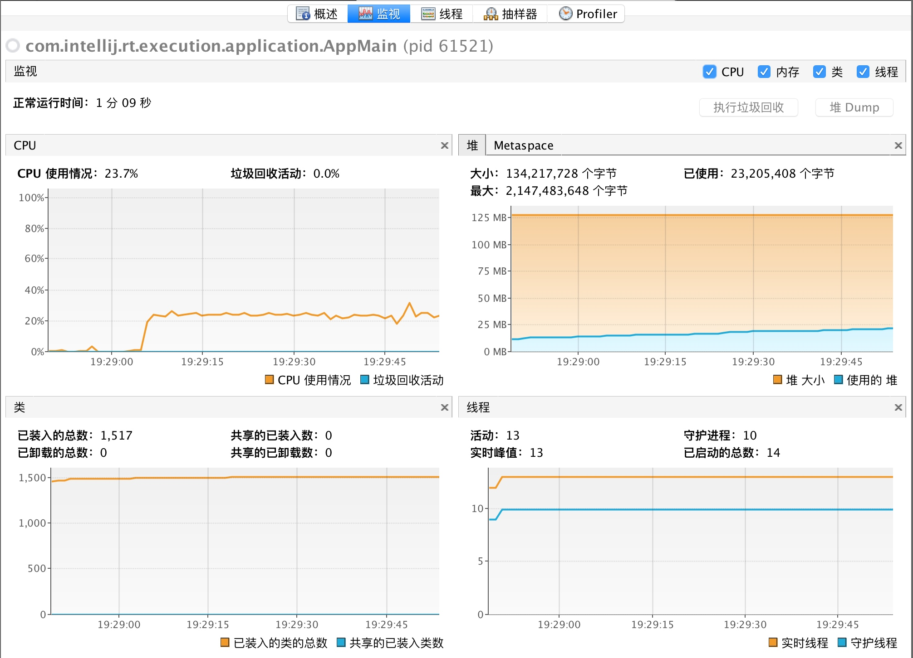

