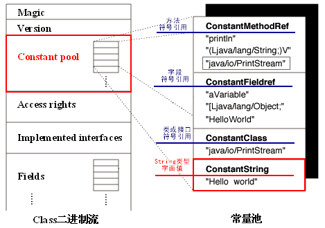

>众所周知，String是由字符组成的串，在程序中使用频率很高。Java中的String是一个类，而并非基本数据类型。 不过她却不是普通的类哦！！！

## 1 String对象的创建

- 关于类对象的创建，很普通的一种方式就是利用构造器，String类也不例外：
  `String s=new String("Hello world"); `
  问题是参数"Hello world"是什么东西，也是字符串对象吗?莫非用字符串对象创建一个字符串对象?
- 当然，String类对象还有一种大家都很喜欢的创建方式：
  `String s="Hello world";`
  但是有点怪呀，怎么与基本数据类型的赋值操作（int i=1）很像呀?
  
<!--more-->
 
**在开始解释这些问题之前，我们先引入一些必要的知识**

### 1.1 Java class文件结构 和常量池 

我们都知道，Java程序要运行，首先需要编译器将源代码文件编译成字节码文件(也就是.class文件)。然后在由JVM解释执行。

class文件是8位字节的二进制流 。这些二进制流的涵义由一些紧凑的有意义的项 组成。比如class字节流中最开始的4个字节组成的项叫做魔数 (magic)，
其意义在于分辨class文件(值为0xCAFEBABE)与非class文件。class字节流大致结构如下图左侧。



其中，在class文件中有一个非常重要的项——**常量池**。
这个常量池专门放置源代码中的符号信息(并且不同的符号信息放置在不同标志的常量表中)。
如上图右侧是HelloWorld代码中的常量表（HelloWorld代码如下），
其中有四个不同类型的常量表(四个不同的常量池入口)。
关于常量池的具体细节，请参照我的博客[《Class文件内容及常量池 》](http://hxraid.iteye.com/blog/687660)

```java
public class HelloWorld{  
    void hello(){  
        System.out.println("Hello world");  
    }  
}  
```

通过上图可见，代码中的"Hello world"字符串字面值被编译之后，
可以清楚的看到存放在了class常量池中的字符串常量表中(上图右侧红框区域)。

### 1.2 JVM运行class文件

源代码编译成class文件之后，JVM就要运行这个class文件。它首先会用类装载器加载进class文件。
然后需要创建许多内存数据结构来存放class文件中的字节数据。
比如class文件对应的类信息数据、常量池结构、方法中的二进制指令序列、类方法与字段的描述信息等等。
当然，在运行的时候，还需要为方法创建栈帧等。这么多的内存结构当然需要管理，JVM会把这些东西都组织到几个**“运行时数据区”**中。这里面就有我们经常说的“方法区”、“堆”、“Java栈”等。
详细请参见我的博客[《Java 虚拟机体系结构》](http://hxraid.iteye.com/blog/676235)。


上面我们提到了，在Java源代码中的每一个字面值字符串，都会在编译成class文件阶段，形成标志号 为8(CONSTANT_String_info)的常量表 。
当JVM加载 class文件的时候，会为对应的常量池建立一个内存数据结构，并存放在方法区中。同时JVM会自动为CONSTANT_String_info常量表中 的字符串常量字面值 在堆中 创建 新的String对象(intern字符串 对象 ，又叫拘留字符串对象)。
然后把CONSTANT_String_info常量表的入口地址转变成这个堆中String对象的直接地址(常量池解 析)。 


这里很关键的就是这个拘留字符串对象 。源代码中所有相同字面值的字符串常量只可能建立唯一一个拘留字符串对象。 
实际上JVM是通过一个记录了拘留字符串引用的内部数据结构来维持这一特性的。
在Java程序中，可以调用String的intern()方法来使得一个常规字符串对象成为拘留字符串对象。我们会在后面介绍这个方法的。

### 1.3 操作码助忆符指令 

有了上面阐述的两个知识前提，下面我们将根据二进制指令来区别两种字符串对象的创建方式：  
(1) String s=new String("Hello world");编译成class文件后的指令
```
0  new java.lang.String [15]  //在堆中分配一个String类对象的空间，并将该对象的地址堆入操作数栈。  
3  dup //复制操作数栈顶数据，并压入操作数栈。该指令使得操作数栈中有两个String对象的引用值。  
4  ldc <String "Hello world"> [17] //将常量池中的字符串常量"Hello world"指向的堆中拘留String对象的地址压入操作数栈  
6  invokespecial java.lang.String(java.lang.String) [19] //调用String的初始化方法，弹出操作数栈栈顶的两个对象地址，用拘留String对象的值初始化new指令创建的String对象，然后将这个对象的引用压入操作数栈  
9  astore_1 [s] // 弹出操作数栈顶数据存放在局部变量区的第一个位置上。此时存放的是new指令创建出的，已经被初始化的String对象的地址。  
```

事实上，在运行这段指令之前，JVM就已经为"Hello world"在堆中创建了一个拘留字符串( 值得注意的是：如果源程序中还有一个"Hello world"字符串常量，那么他们都对应了同一个堆中的拘留字符串)。
然后用这个拘留字符串的值来初始化堆中用new指令创建出来的新的String对象，局部变量s实际上存储的是new出来的堆对象地址。 
大家注意了，此时在JVM管理的堆中，有两个相同字符串值的String对象：一个是拘留字符串对象，一个是new新建的字符串对象。
如果还有一条创建语句String s1=new String("Hello world")；堆中有几个值为"Hello world"的字符串呢? 答案是3个，大家好好想想为什么吧！


(2)将String s="Hello world";编译成class文件后的指令:

```commandline
0  ldc <String "Hello world"> [15]//将常量池中的字符串常量"Hello world"指向的堆中拘留String对象的地址压入操作数栈  
2  astore_1 [str] // 弹出操作数栈顶数据存放在局部变量区的第一个位置上。此时存放的是拘留字符串对象在堆中的地址 
```

和上面的创建指令有很大的不同，局部变量s存储的是早已创建好的拘留字符串的堆地址。 
大家好好想想，如果还有一条穿件语句String s1="Hello word"；此时堆中有几个值为"Hello world"的字符串呢?答案是1个。
那么局部变量s与s1存储的地址是否相同呢？  呵呵, 这个你应该知道了吧。

### 1.4 小结

1. String类型脱光了其实也很普通。真正让她神秘的原因就在于**CONSTANT_String_info常量表** 和 **拘留字符串对象** 的存在。现在我们可以解决江湖上的许多纷争了。

**【 纷争1】关于字符串相等关系的争论**

```
//代码1  
String sa=new String("Hello world");            
String sb=new String("Hello world");      
System.out.println(sa==sb);  // false       
//代码2    
String sc="Hello world";    
String sd="Hello world";  
System.out.println(sc==sd);  // true   
```

代码1中局部变量sa,sb中存储的是JVM在堆中new出来的两个String对象的内存地址。
虽然这两个String对象的值(char[]存放的字符序列)都是"Hello world"。 
因此"=="比较的是两个不同的堆地址。代码2中局部变量sc,sd中存储的也是地址，但却都是常量池中"Hello world"指向的堆的唯一的那个拘留字符串对象的地址 。自然相等了。


**【纷争2】 字符串“+”操作的内幕**
```commandline
//代码1  
String sa = "ab";                                          
String sb = "cd";                                       
String sab=sa+sb;                                      
String s="abcd";  
System.out.println(sab==s); // false  
//代码2  
String sc="ab"+"cd";  
String sd="abcd";  
System.out.println(sc==sd); //true  
```

代码1中局部变量sa,sb存储的是堆中两个拘留字符串对象的地址。而当执行sa+sb时，JVM首先会在堆中创建一个StringBuilder类，
同时用sa指向的拘留字符串对象完成初始化，然后调用append方法完成对sb所指向的拘留字符串的合并操作，
接着调用StringBuilder的toString()方法在堆中创建一个String对象，最后将刚生成的String对象的堆地址存放在局部变量sab中。
而局部变量s存储的是常量池中"abcd"所对应的拘留字符串对象的地址。 sab与s地址当然不一样了。这里要注意了，
代码1的堆中实际上有五个字符串对象：三个拘留字符串对象、一个String对象和一个StringBuilder对象。
代码2中"ab"+"cd"会直接在编译期就合并成常量"abcd"， 因此相同字面值常量"abcd"所对应的是同一个拘留字符串对象，自然地址也就相同。


## 2 String三姐妹(String,StringBuffer,StringBuilder)

String扒的差不多了。但他还有两个妹妹StringBuffer,StringBuilder长的也不错哦！我们也要下手了：

- String(大姐，出生于JDK1.0时代)          不可变字符序列
- StringBuffer(二姐，出生于JDK1.0时代)    线程安全的可变字符序列
- StringBuilder(小妹，出生于JDK1.5时代)   非线程安全的可变字符序列 
 
### 2.1 StringBuffer与String的可变性问题

我们先看看这两个类的部分源代码：

```java
//String   
public final class String  
{  
        private final char value[];  
  
         public String(String original) {  
              // 把原字符串original切分成字符数组并赋给value[];  
         }  
}  
  
//StringBuffer   
public final class StringBuffer extends AbstractStringBuilder  
{  
         char value[]; //继承了父类AbstractStringBuilder中的value[]  
         public StringBuffer(String str) {  
                 super(str.length() + 16); //继承父类的构造器，并创建一个大小为str.length()+16的value[]数组  
                 append(str); //将str切分成字符序列并加入到value[]中  
        }  
}  
```

很显然，String和StringBuffer中的value[]都用于存储字符序列。但是,

(1) String中的是常量(final)数组，只能被赋值一次。 
比如：new String("abc")使得value[]={'a','b','c'}，之后这个String对象中的value[]再也不能改变了。这也正是大家常说的，String是不可变的原因 。    

注意：这个对初学者来说有个误区，有人说String str1=new String("abc"); str1=new String("cba");不是改变了字符串str1吗？那么你有必要先搞懂对象引用和对象本身的区别。这里我简单的说明一下，对象本身指的是存放在堆空间中的该对象的实例数据(非静态非常量字段)。而对象引用指的是堆中对象本身所存放的地址，一般方法区和Java栈中存储的都是对象引用，而非对象本身的数据。

(2) StringBuffer中的value[]就是一个很普通的数组，而且可以通过append()方法将新字符串加入value[]末尾。这样也就改变了value[]的内容和大小了。
比如：new StringBuffer("abc")使得value[]={'a','b','c','',''...}(注意构造的长度是str.length()+16)。如果再将这个对象append("abc")，那么这个对象中的value[]={'a','b','c','a','b','c',''....}。这也就是为什么大家说 StringBuffer是可变字符串 的涵义了。从这一点也可以看出，StringBuffer中的value[]完全可以作为字符串的缓冲区功能。其累加性能是很不错的，在后面我们会进行比较。

**总结，讨论String和StringBuffer可不可变。本质上是指对象中的value[]字符数组可不可变，而不是对象引用可不可变。** 


### 2.2 StringBuffer与StringBuilder的线程安全性问题
 
StringBuffer和StringBuilder可以算是双胞胎了，这两者的方法没有很大区别。但在线程安全性方面，StringBuffer允许多线程进行字符操作。这是因为在源代码中StringBuffer的很多方法都被关键字synchronized 修饰了，而StringBuilder没有。

有多线程编程经验的程序员应该知道synchronized。这个关键字是为线程同步机制 设定的。我简要阐述一下synchronized的含义：

>每一个类对象都对应一把锁，当某个线程A调用类对象O中的synchronized方法M时，必须获得对象O的锁才能够执行M方法，否则线程A阻塞。一旦线程A开始执行M方法，将独占对象O的锁。使得其它需要调用O对象的M方法的线程阻塞。只有线程A执行完毕，释放锁后。那些阻塞线程才有机会重新调用M方法。这就是解决线程同步问题的锁机制。 

了解了synchronized的含义以后，大家可能都会有这个感觉。多线程编程中StringBuffer比StringBuilder要安全多了 ，事实确实如此。如果有多个线程需要对同一个字符串缓冲区进行操作的时候，StringBuffer应该是不二选择。

注意：是不是String也不安全呢？事实上不存在这个问题，String是不可变的。线程对于堆中指定的一个String对象只能读取，无法修改。试问：还有什么不安全的呢？ 


### 2.3 String和StringBuffer的效率问题（这可是个热门话题呀!） 

首先说明一点：StringBuffer和StringBuilder可谓双胞胎，StringBuilder是1.5新引入的，其前身就是StringBuffer。StringBuilder的效率比StringBuffer稍高，如果不考虑线程安全，StringBuilder应该是首选。另外，JVM运行程序主要的时间耗费是在创建对象和回收对象上。

我们用下面的代码运行1W次字符串的连接操作，测试String,StringBuffer所运行的时间。

```java
//测试代码  
public class RunTime{  
    public static void main(String[] args){  
           //测试代码位置1  
          long beginTime=System.currentTimeMillis();  
          for(int i=0;i<10000;i++){  
           // 测试代码位置2  
          }  
          long endTime=System.currentTimeMillis();  
          System.out.println(endTime-beginTime);     
    }  
}  
```

#### 2.3.1 String常量与String变量的"+"操作比较 
▲测试①代码：     
                    
                 (测试代码位置1)  String str="";
                 (测试代码位置2)  str="Heart"+"Raid";
                 [耗时：  0ms]


▲测试②代码        
                 
                 (测试代码位置1)  String s1="Heart";
                                String s2="Raid";
                                String str="";
                 (测试代码位置2)  str=s1+s2;
                 [耗时：  15—16ms]

**结论：String常量的“+连接”  稍优于  String变量的“+连接”。**
 
 
原因：

- 测试①的"Heart"+"Raid"在编译阶段就已经连接起来，形成了一个字符串常量"HeartRaid"，并指向堆中的拘留字符串对象。运行时只需要将"HeartRaid"指向的拘留字符串对象地址取出1W次，存放在局部变量str中。这确实不需要什么时间。 
- 测试②中局部变量s1和s2存放的是两个不同的拘留字符串对象的地址。然后会通过下面三个步骤完成“+连接”：
    1. StringBuilder temp=new StringBuilder(s1)，
    2. temp.append(s2);
    3. str=temp.toString();
    
    
我们发现，虽然在中间的时候也用到了append()方法，但是在开始和结束的时候分别创建了StringBuilder和String对象。可想而知：调用1W次，是不是就创建了1W次这两种对象呢？不划算。

但是，String变量的"+连接"操作比String常量的"+连接"操作使用的更加广泛。 这一点是不言而喻的。


#### 2.3.2 String对象的"累+"连接操作与StringBuffer对象的append()累和连接操作比较。 

▲测试①代码：
                
                (代码位置1)  String s1="Heart";
                String s="";
                (代码位置2)  s=s+s1;
                [耗时：  4200—4500ms]


▲测试②代码        
                (代码位置1)  String s1="Heart";
                StringBuffer sb=new StringBuffer();
                (代码位置2) sb.append(s1);
                [耗时：  0ms(当循环100000次的时候，耗时大概16—31ms)]

**结论：大量字符串累加时，StringBuffer的append()效率远好于String对象的"累+"连接**
 
原因：

- 测试① 中的s=s+s1，JVM会利用首先创建一个StringBuilder，并利用append方法完成s和s1所指向的字符串对象值的合并操作，接着调用StringBuilder的 toString()方法在堆中创建一个新的String对象，其值为刚才字符串的合并结果。而局部变量s指向了新创建的String对象。
- 因为String对象中的value[]是不能改变的，每一次合并后字符串值都需要创建一个新的String对象来存放。循环1W次自然需要创建1W个String对象和1W个StringBuilder对象，效率低就可想而知了。
- 测试②中sb.append(s1);只需要将自己的value[]数组不停的扩大来存放s1即可。循环过程中无需在堆中创建任何新的对象。效率高就不足为奇了。
        
        
### 2.4 小结

- (1) 在编译阶段就能够确定的字符串常量，完全没有必要创建String或StringBuffer对象。直接使用字符串常量的"+"连接操作效率最高。
- (2) StringBuffer对象的append效率要高于String对象的"+"连接操作。
- (3) 不停的创建对象是程序低效的一个重要原因。那么相同的字符串值能否在堆中只创建一个String对象那。显然拘留字符串能够做到这一点，除了程序中的字符串常量会被JVM自动创建拘留字符串之外，调用String的intern()方法也能做到这一点。当调用intern()时，如果常量池中已经有了当前String的值，那么返回这个常量指向拘留对象的地址。如果没有，则将String值加入常量池中，并创建一个新的拘留字符串对象。

>转自：http://hxraid.iteye.com/blog/522167
附加一篇比较浅显易懂的http://blog.csdn.net/exterminator/article/details/6055297
再附加一篇更加浅显易懂的http://blog.csdn.net/zhangjg_blog/article/details/18319521