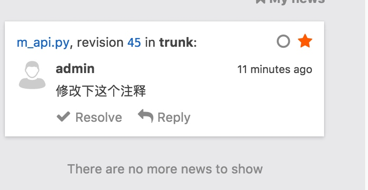
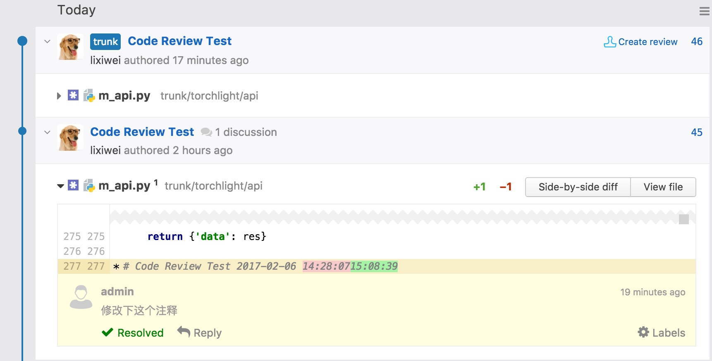

## 1 下载、安装、配置
### 1.1 官网主页下载zip包
`https://www.jetbrains.com/upsource/features/`
免费版可以创建10个用户，admin + guest + 8 user

<!--more-->

### 1.2 安装

- 配置要求：内存建议8G以上
- Linux系统配置/etc/security/limits.conffile:（可选操作）
    - 查看linux文件打开上限`ulimit -n`，`ulimit -n 9999999` 设置上限
    - maximum open files to 100000
    - memory locking and address space limit to unlimited
    - number of processes to 32768

    ``` 
    memlock unlimited
    nofile 100000
    nproc 32768
    as unlimited
    ```
unzip upsource-3.5.3616.zip

### 1.3 命令

- 启动
`./upsource.sh start`
- 关闭
`./upsource.sh stop`
- 重启
`./upsource.sh restart`

### 1.4 配置Upsource
**执行启动命令后，访问提示的地址进入WEB管理界面**

```
[root@sanjiao070 bin]# ./upsource.sh start
Starting Upsource...
* Configuring JetBrains Upsource 3.5 
* Made default base-url 'http://sanjiao070.cn:8080/' from hostname 'sanjiao070.cn' and listen port '8080' 
* JetBrains Upsource 3.5 runtime environment is successfully configured 
* Loading logging configuration from /opt/upsource-3.5.3616/lib/ext/log4j.xml 
* Redirecting JetBrains Upsource 3.5 logging to /opt/upsource-3.5.3616/logs/internal/services/bundleProcess 
* Configuring Service-Container[bundleProcess] 
* Configuring Bundle Backend Service 
* Configuring Configuration Wizard 
* Starting Service-Container[bundleProcess] 
* Starting Bundle Backend Service 
* Starting Configuration Wizard 
* JetBrains Upsource 3.5 Configuration Wizard will be available on [http://sanjiao070.cn:8080] after start 
Upsource is running
```
**基本配置**

上面的BaseUrl地址配错了，可以在**命令行中重新配置**（先关闭服务）
 
`./upsource.sh configure --listen-port 8000 --base-url http://10.10.0.70:8000`

配置用户认证中心，使用默认的build-in Hub


使用默认的免费license

Finish之后服务会重启，可以在服务器中查看日志
`tail -f logs/upsource-stdout.log`

## 2 UpSource关联版本控制工具（本文为SVN）
创建svn项目


创建用户、分配角色、分配用户组


将UpSource用户与svn用户关联。


## 3 测试

1.项目的CodeReviewer角色可以创建review信息
2.代码的提交者登陆后会看到关于自己代码被的查看的信息

解决问题以后标记Resolved


## 4 Idea整合UpSource
下载Idea+UpSource插件


重启Idea后在Tools中 找到UpSource并与服务端测试连接

点击TestConnection自动弹出授权Web页面，使用管理员账号登陆后点击Accept


授权成功


在Idea中也可以看到刚才的Review信息了


