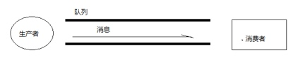
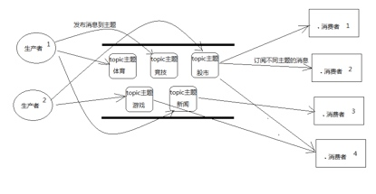

## 1 JMS
### 1.1 什么是JMS
>JMS即Java消息服务（Java Message Service）应用程序接口是一个Java平台中关于面向消息中间件（MOM）的API，用于在两个应用程序之间，或分布式系统中发送消息，进行异步通信。Java消息服务是一个与具体平台无关的API，绝大多数MOM提供商都对JMS提供支持。

<!--more-->

### 1.2 JMS体系结构
**JMS由以下元素组成。**
- JMS提供者provider：连接面向消息中间件的，JMS接口的一个实现。提供者可以是Java平台的JMS实现，也可以是非Java平台的面向消息中间件的适配器。
- JMS客户：生产或消费基于消息的Java的应用程序或对象。
- JMS生产者：创建并发送消息的JMS客户。
- JMS消费者：接收消息的JMS客户。
- JMS消息：包括可以在JMS客户之间传递的数据的对象
- JMS队列：一个容纳那些被发送的等待阅读的消息的区域。与队列名字所暗示的意思不同，消息的接受顺序并不一定要与消息的发送顺序相同。一旦一个消息被阅读，该消息将被从队列中移走。
- JMS主题：一种支持发送消息给多个订阅者的机制。

### 1.3 ActiveMQ安装
- 下载、解压缩ActiveMQ
- 查看配置文件 activemq.xml
- 启动 activemq.sh start 
- 登陆http://localhost:8161/admin 查看可视化界面

## 2 JMS应用程序结构支持两种模型

### 2.1 点对点或队列模型
在点对点或队列模型下，一个生产者向一个特定的队列发布消息，一个消费者从该队列中读取消息。这里，生产者知道消费者的队列，并直接将消息发送到消费者的队列。

这种模式被概括为：

- 只有一个消费者将获得消息
-  生产者不需要在接收者消费该消息期间处于运行状态，接收者也同样不需要在消息发送时处于运行状态。
-  每一个成功处理的消息都由接收者签收

### 2.2 发布者/订阅者模型
发布者/订阅者模型支持向一个特定的消息主题发布消息。0或多个订阅者可能对接收来自特定消息主题的消息感兴趣。在这种模型下，发布者和订阅者彼此不知道对方。这种模式好比是匿名公告板。

这种模式被概括为：

- 多个消费者可以获得消息
- 在发布者和订阅者之间存在时间依赖性。发布者需要建立一个订阅（subscription），以便客户能够订阅。订阅者必须保持持续的活动状态以接收消息，除非订阅者建立了持久的订阅。在那种情况下，在订阅者未连接时发布的消息将在订阅者重新连接时重新发布。

## 3 Java测试代码
[Spring整合JMS](https://seawaylee.github.io/2017/03/09/JavaWeb/Spring/Spring_13/) 

