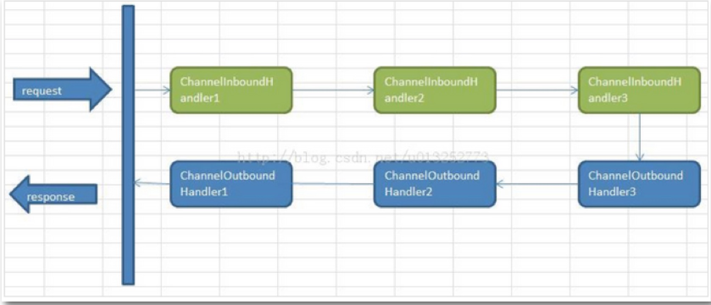
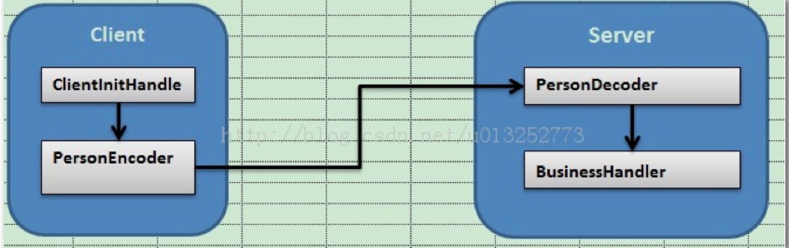

# 1 Netty简介

>Netty是基于Java NIO的网络应用框架.
     
>Netty是一个NIO client-server(客户端服务器)框架，使用Netty可以快速开发网络应用，例如服务器和客户端协议。Netty提供了一种新的方式来使开发网络应用程序，这种新的方式使得它很容易使用和有很强的扩展性。Netty的内部实现时很复杂的，但是Netty提供了简单易用的api从网络处理代码中解耦业务逻辑。Netty是完全基于NIO实现的，所以整个Netty都是异步的。
 
>网络应用程序通常需要有较高的可扩展性，无论是Netty还是其他的基于Java NIO的框架，都会提供可扩展性的解决方案。Netty中一个关键组成部分是它的异步特性.

<!--more-->

# 2 最简单的API用法

## 2.1 引入jar包

```xml
    <dependency>
        <groupId>io.netty</groupId>
        <artifactId>netty-all</artifactId>
        <version>4.1.9.Final</version>
    </dependency>
```

## 2.2 代码实现

**Netty客户端**

```java
/**
 * Netty客户端
 * @author NikoBelic
 * @create 2017/4/18 13:59
 */
public class EchoClient
{
    private final String host;
    private final int port;

    public EchoClient(String host, int port)
    {
        this.host = host;
        this.port = port;
    }

    public void start() throws InterruptedException
    {
        EventLoopGroup nioEventLoopGroup = null;
        try
        {
            // 创建Bootstrap对象用来引导启动客户端
            Bootstrap bootstrap = new Bootstrap();
            // 创建EventLoopGroup对象并设置到Bootstrap中，EventLoopGroup可以理解为是一个线程池，这个线程池用来处理连接、接受数据、发送数据
            nioEventLoopGroup = new NioEventLoopGroup();
            // 创建InetSocketAddress并设置到Bootstrap中，InetSocketAddress是指定连接的服务器地址
            bootstrap.group(nioEventLoopGroup).channel(NioSocketChannel.class).remoteAddress(new InetSocketAddress(host, port)).handler(new ChannelInitializer<SocketChannel>()
            {
                // 添加一个ChannelInitializer<SocketChannel>，客户端成功连接服务器后会被执行

                @Override
                protected void initChannel(SocketChannel socketChannel) throws Exception
                {
                    socketChannel.pipeline().addLast(new EchoClientHandler());
                }
            });
            // 调用Bootstrap.connect()来连接服务器
            ChannelFuture f = bootstrap.connect().sync();
            // 最后关闭EventLoopGroup来释放资源
            f.channel().closeFuture().sync();
        } catch (Exception e)
        {
            e.printStackTrace();
        } finally
        {
            nioEventLoopGroup.shutdownGracefully().sync();
        }
    }

    public static void main(String[] args) throws InterruptedException
    {
        new EchoClient("localhost", 20000).start();
    }
}

```

```java
/**
 * Netty客户端业务处理
 * @author NikoBelic
 * @create 2017/4/18 14:13
 */
public class EchoClientHandler extends SimpleChannelInboundHandler
{
    /**
     * 客户端连接服务器后被调用
     *
     * @Author SeawayLee
     * @Date 2017/04/18 14:15
     */
    @Override
    public void channelActive(ChannelHandlerContext ctx) throws Exception
    {
        System.out.println("客户端连接服务器，开始发送数据....");
        byte[] req = "Query Time Order".getBytes();
        ByteBuf firstMessage = Unpooled.buffer(req.length);
        firstMessage.writeBytes(req);
        ctx.writeAndFlush(firstMessage);
    }


    /**
     * 从服务端接收到数据后调用
     *
     * @Author SeawayLee
     * @Date 2017/04/18 14:18
     */
    @Override
    protected void channelRead0(ChannelHandlerContext channelHandlerContext, Object o) throws Exception
    {
        System.out.println("Client 读取 Server 数据...");
        // 服务端返回消息后

        ByteBuf buf = (ByteBuf) o;
        byte[] req = new byte[buf.readableBytes()];
        buf.readBytes(req);
        String body = new String(req, "UTF-8");
        System.out.println("服务端数据为：" + body);
    }

    /**
     * 发生异常时被调用
     *
     * @Author SeawayLee
     * @Date 2017/04/18 14:18
     */
    @Override
    public void exceptionCaught(ChannelHandlerContext ctx, Throwable cause) throws Exception
    {
        System.out.println("客户端发生异常...");
        cause.printStackTrace();
        ctx.close();
    }
}
```

**Netty服务端**

```java
/**
 * Netty服务端
 * @author NikoBelic
 * @create 2017/4/18 13:45
 */
public class EchoServer
{
    private final int port;

    public EchoServer(int port)
    {
        this.port = port;
    }

    public void start() throws InterruptedException
    {
        EventLoopGroup eventLoopGroup = null;
        try
        {
            // 创建ServerBootstrap实例来引导绑定和启动服务器
            ServerBootstrap serverBootstrap = new ServerBootstrap();
            // 创建NioEventLoopGroup对象来处理时间，如接受新连接、接受数据、写数据等等
            eventLoopGroup = new NioEventLoopGroup();
            // 指定通道类型为NIOServerSocketChannel，设置InetSocketAddress让服务器鉴定某个端口以等待客户连接
            serverBootstrap.group(eventLoopGroup).channel(NioServerSocketChannel.class).localAddress("localhost", port).childHandler(new ChannelInitializer<Channel>()
            {
                @Override
                protected void initChannel(Channel channel) throws Exception
                {
                    channel.pipeline().addLast(new EchoServerHandler());
                }
            });
            // 最后绑定服务器等待直到绑定完成，调用sync()方法会阻塞直到服务器完成绑定，然后服务器等待通道关闭，因为使用sync()，所以关闭操作也会被阻塞。
            ChannelFuture channelFuture = serverBootstrap.bind().sync();
            System.out.println("开始监听，端口为：" + channelFuture.channel().localAddress());
            channelFuture.channel().closeFuture().sync();
        } catch (InterruptedException e)
        {
            e.printStackTrace();
        } finally
        {
            eventLoopGroup.shutdownGracefully().sync();
        }
    }

    public static void main(String[] args) throws InterruptedException
    {
        new EchoServer(20000).start();
    }
}

```

```java
/**
 * Netty服务端业务处理
 * @author NikoBelic
 * @create 2017/4/18 13:54
 */
public class EchoServerHandler extends ChannelInboundHandlerAdapter
{
    @Override
    public void channelRead(ChannelHandlerContext ctx, Object msg) throws Exception
    {
        System.out.println("Server 正在读取数据...");
        // 读取数据
        ByteBuf buf = (ByteBuf) msg;
        byte[] req = new byte[buf.readableBytes()];
        buf.readBytes(req);
        String body = new String(req, "UTF-8");
        System.out.println("Server接收到客户端数据：" + body);
        // 向客户端写数据
        System.out.println("Server 向 Client发送数据");
        String currentTime = new Date(System.currentTimeMillis()).toString();
        ByteBuf resp = Unpooled.copiedBuffer(currentTime.getBytes());
        ctx.write(resp);
    }

    @Override
    public void channelReadComplete(ChannelHandlerContext ctx) throws Exception
    {
        System.out.println("Server 读取数据完毕");
        ctx.flush();// 刷新后才将数据发出到SocketChannel
    }

    @Override
    public void exceptionCaught(ChannelHandlerContext ctx, Throwable cause) throws Exception
    {
        cause.printStackTrace();
        ctx.close();
    }
}

```


- 启动服务端
- 启动客户端

**服务端显示**

```commandline
开始监听，端口为：/127.0.0.1:20000
Server 正在读取数据...
Server接收到客户端数据：Query Time Order
Server 向 Client发送数据
Server 读取数据完毕
```

**客户端显示**

```commandline
客户端连接服务器，开始发送数据....
Client 读取 Server 数据...
服务端数据为：Tue Apr 18 14:19:39 CST 2017
```
# 3 Netty中的Handler

## 3.1 简介

Handler在netty中，无疑占据着非常重要的地位。
Handler与Servlet中的filter很像，通过Handler可以完成通讯报文的解码编码、拦截指定的报文、统一对日志错误进行处理、统一对请求进行计数、控制Handler执行与否。

Netty中的所有handler都实现自ChannelHandler接口。按照输入输出来分，分为ChannelInboundHandler、ChannelOutboundHandler两大类。
ChannelInboundHandler对从客户端发往服务器的报文进行处理，一般用来执行解码、读取客户端数据、进行业务处理等；ChannelOutboundHandler对从服务器发往客户端的报文进行处理，一般用来进行编码、发送报文到客户端。

Netty中，可以注册多个handler。ChannelInboundHandler按照注册的先后顺序执行；ChannelOutboundHandler按照注册的先后顺序逆序执行，
如下图所示，按照注册的先后顺序对Handler进行排序，request进入Netty后的执行顺序为：



示例代码

```java
public class EchoServer {

	private final int port;

	public EchoServer(int port) {
		this.port = port;
	}

	public void start() throws Exception {
		EventLoopGroup eventLoopGroup = null;
		try {
			//server端引导类
			ServerBootstrap serverBootstrap = new ServerBootstrap();
			//连接池处理数据
			eventLoopGroup = new NioEventLoopGroup();
			serverBootstrap.group(eventLoopGroup)
			.channel(NioServerSocketChannel.class)//指定通道类型为NioServerSocketChannel，一种异步模式，OIO阻塞模式为OioServerSocketChannel
			.localAddress("localhost",port)//设置InetSocketAddress让服务器监听某个端口已等待客户端连接。
			.childHandler(new ChannelInitializer<Channel>() {//设置childHandler执行所有的连接请求
				@Override
				protected void initChannel(Channel ch) throws Exception {
					// 注册两个InboundHandler，执行顺序为注册顺序，所以应该是InboundHandler1 InboundHandler2
					// 注册两个OutboundHandler，执行顺序为注册顺序的逆序，所以应该是OutboundHandler2 OutboundHandler1
					ch.pipeline().addLast(new EchoInHandler1());
					ch.pipeline().addLast(new EchoInHandler2());
					ch.pipeline().addLast(new EchoOutHandler1());
					ch.pipeline().addLast(new EchoOutHandler2()); 
					
				}
					});
			// 最后绑定服务器等待直到绑定完成，调用sync()方法会阻塞直到服务器完成绑定,然后服务器等待通道关闭，因为使用sync()，所以关闭操作也会被阻塞。
			ChannelFuture channelFuture = serverBootstrap.bind().sync();
			System.out.println("开始监听，端口为：" + channelFuture.channel().localAddress());
			channelFuture.channel().closeFuture().sync();
		} finally {
			eventLoopGroup.shutdownGracefully().sync();
		}
	}

	public static void main(String[] args) throws Exception {
		new EchoServer(20000).start();
	}
}

```

```java
public class EchoInHandler1 extends ChannelInboundHandlerAdapter {

	@Override
	public void channelRead(ChannelHandlerContext ctx, Object msg)
			throws Exception {
		System.out.println("in1");
		 // 通知执行下一个InboundHandler
        ctx.fireChannelRead(msg);
	}

	@Override
	public void channelReadComplete(ChannelHandlerContext ctx) throws Exception {
        ctx.flush();//刷新后才将数据发出到SocketChannel
	}

	@Override
	public void exceptionCaught(ChannelHandlerContext ctx, Throwable cause)
			throws Exception {
		cause.printStackTrace();
		ctx.close();
	}

}
```

```java
public class EchoInHandler2 extends ChannelInboundHandlerAdapter {

	@Override
	public void channelRead(ChannelHandlerContext ctx, Object msg)
			throws Exception {
		System.out.println("in2");
        ByteBuf buf = (ByteBuf) msg;
        byte[] req = new byte[buf.readableBytes()];
        buf.readBytes(req);
        String body = new String(req, "UTF-8");
        System.out.println("接收客户端数据:" + body);
        //向客户端写数据
        System.out.println("server向client发送数据");
        String currentTime = new Date(System.currentTimeMillis()).toString();
        ByteBuf resp = Unpooled.copiedBuffer(currentTime.getBytes());
        ctx.write(resp);
        
	}

	@Override
	public void channelReadComplete(ChannelHandlerContext ctx) throws Exception {
        ctx.flush();//刷新后才将数据发出到SocketChannel
	}

	@Override
	public void exceptionCaught(ChannelHandlerContext ctx, Throwable cause)
			throws Exception {
		cause.printStackTrace();
		ctx.close();
	}

}

```

```java
public class EchoOutHandler2 extends ChannelOutboundHandlerAdapter {

	 @Override
	    public void write(ChannelHandlerContext ctx, Object msg, ChannelPromise promise) throws Exception {
	        System.out.println("out2");
	        // 执行下一个OutboundHandler
	        /*System.out.println("at first..msg = "+msg);
	        msg = "hi newed in out2";*/
	        super.write(ctx, msg, promise);
	    }

}

```

```java
public class EchoOutHandler1 extends ChannelOutboundHandlerAdapter {
	@Override
    // 向client发送消息
    public void write(ChannelHandlerContext ctx, Object msg, ChannelPromise promise) throws Exception {
        System.out.println("out1");
        /*System.out.println(msg);*/
        
        String currentTime = new Date(System.currentTimeMillis()).toString();
        ByteBuf resp = Unpooled.copiedBuffer(currentTime.getBytes());
        ctx.write(resp);
        ctx.flush();
       }
}

```
## 3.2 小结

在使用Handler的过程中，需要注意：

- 1、ChannelInboundHandler之间的传递，通过调用 ctx.fireChannelRead(msg) 实现；调用ctx.write(msg) 将传递到ChannelOutboundHandler。
- 2、ctx.write()方法执行后，需要调用flush()方法才能令它立即执行。
- 3、流水线pipeline中outhandler不能放在最后，否则不生效
- 4、Handler的消费处理放在最后一个处理。

# 4 Netty发送对象

Netty中，通讯的双方建立连接后，会把数据按照ByteBuf的方式进行传输，例如http协议中，就是通过HttpRequestDecoder对ByteBuf数据流进行处理，转换成http的对象。基于这个思路，我自定义一种通讯协议：Server和客户端直接传输java对象。

实现的原理是通过Encoder把java对象转换成ByteBuf流进行传输，通过Decoder把ByteBuf转换成java对象进行处理，处理逻辑如下图所示：



**客户端部分代码**

```
@Override
protected void initChannel(SocketChannel ch)
        throws Exception {
    // 注册编码的handler
    ch.pipeline().addLast(new PersonEncoder());  //out
    //注册处理消息的handler
    ch.pipeline().addLast(new EchoClientHandler());   //in
}
```
```java
public class EchoClientHandler extends SimpleChannelInboundHandler<ByteBuf> {
	// 客户端连接服务器后被调用
	@Override
	public void channelActive(ChannelHandlerContext ctx) throws Exception {
		 Person person = new Person();
	        person.setName("angelababy");
	        person.setSex("girl");
	        person.setAge(18);
	        ctx.write(person);
	        ctx.flush();
	}

	// • 从服务器接收到数据后调用
	@Override
	protected void channelRead0(ChannelHandlerContext ctx, ByteBuf msg)
			throws Exception {
		System.out.println("client 读取server数据..");
		// 服务端返回消息后
		ByteBuf buf = (ByteBuf) msg;
		byte[] req = new byte[buf.readableBytes()];
		buf.readBytes(req);
		String body = new String(req, "UTF-8");
		System.out.println("服务端数据为 :" + body);
	}

	// • 发生异常时被调用
	@Override
	public void exceptionCaught(ChannelHandlerContext ctx, Throwable cause)
			throws Exception {
		System.out.println("client exceptionCaught..");
		// 释放资源
		ctx.close();
	}
}
```

```java
/**
  * 序列化
  * 将object转换成Byte[]
  * @author wilson
  *
  */
public class PersonEncoder extends MessageToByteEncoder<Person> {
 
    @Override
    protected void encode(ChannelHandlerContext ctx, Person msg, ByteBuf out) throws Exception {
    	//工具类：将object转换为byte[]
        byte[] datas = ByteObjConverter.objectToByte(msg);
        out.writeBytes(datas);
        ctx.flush();
    }
}

```

**服务端部分代码**

```
@Override
protected void initChannel(Channel ch) throws Exception {
    //注册解码的handler
    ch.pipeline().addLast(new PersonDecoder());  //IN1  反序列化
    //添加一个入站的handler到ChannelPipeline  
    ch.pipeline().addLast(new EchoServerHandler());   //IN2
}
```

```java
public class EchoServerHandler extends ChannelInboundHandlerAdapter {

	@Override
	public void channelRead(ChannelHandlerContext ctx, Object msg)
			throws Exception {
		Person person = (Person) msg;
        System.out.println(person.getName());
        System.out.println(person.getAge());
        System.out.println(person.getSex());
	}

	@Override
	public void channelReadComplete(ChannelHandlerContext ctx) throws Exception {
		System.out.println("server 读取数据完毕..");
        ctx.flush();//刷新后才将数据发出到SocketChannel
	}

	@Override
	public void exceptionCaught(ChannelHandlerContext ctx, Throwable cause)
			throws Exception {
		cause.printStackTrace();
		ctx.close();
	}

}
```

```java
/**
  * 反序列化
  * 将Byte[]转换为Object
  * @author wilson
  *
  */
public class PersonDecoder extends ByteToMessageDecoder {
    @Override
    protected void decode(ChannelHandlerContext ctx, ByteBuf in, List<Object> out) throws Exception {
    	//工具类：将ByteBuf转换为byte[]
        ByteBufToBytes read = new ByteBufToBytes();
        byte[] bytes = read.read(in);
        //工具类：将byte[]转换为object
        Object obj = ByteObjConverter.byteToObject(bytes);
        out.add(obj);
    }
 
}

```

