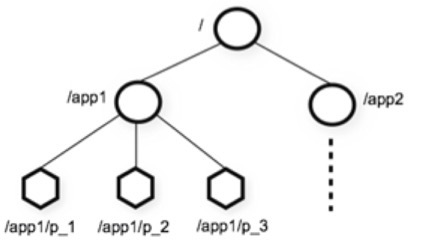
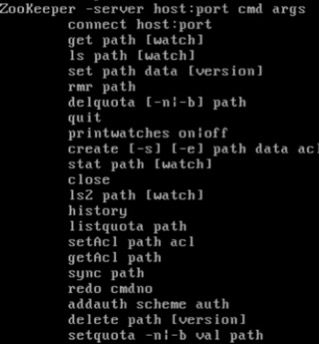
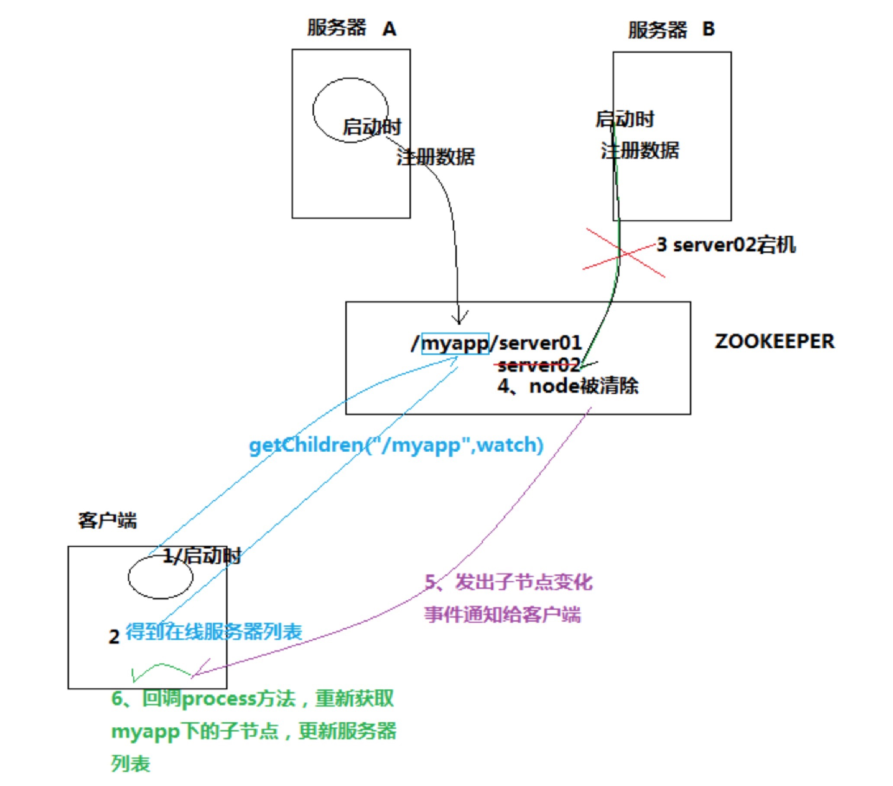

## 1 概念简介

- Zookeeper是一个分布式协调服务；就是为用户的分布式应用程序提供协调服务
- zookeeper是为别的分布式程序服务的
- Zookeeper本身就是一个分布式程序（只要有半数以上节点存活，zk就能正常服务）
- Zookeeper所提供的服务涵盖：主从协调、服务器节点动态上下线、统一配置管理、分布式共享锁、统一名称服务……
- 虽然说可以提供各种服务，但是zookeeper在底层其实只提供了两个功能：
    - 管理(存储，读取)用户程序提交的数据；
    - 并为用户程序提供数据节点监听服务；

Zookeeper集群的角色：  Leader 和  follower  （Observer）
只要集群中有半数以上节点存活，集群就能提供服务

<!--more-->

## 2 安装、配置

**安装**
- wget --no-check-certificate https://mirrors.tuna.tsinghua.edu.cn/apache/zookeeper/stable/zookeeper-3.4.5.tar.gz
- tar -zxvf zookeeper-3.4.5.tar.gz

**配置**

### 修改ZooKeeper配置文件

```
cd zookeeper/conf
cp zoo_sample.cfg zoo.cfg
```

添加和修改以下内容 `vim zoo.cfg`

```
dataDir=/opt/data/zookeeper
dataLogDir=/opt/data/zookeeper/log
server.1=hadoop1:2888:3888 (主机名, 心跳端口、数据端口)
server.2=hadoop1:2888:3888
server.3=hadoop1:2888:3888
```

创建数据存储文件夹

```
mkdir -m 755 /opt/data/zookeeper
mkdir -m 755 /opt/data/zookeeper/log
cd /opt/data/zookeeper
echo 1 > myid  # 其他两台机器设置为2，3
```

环境变量配置

`vim /etc/profile`
```
export ZOOKEEPER_HOME=/home/hadoop/zookeeper
export PATH=$PATH:$ZOOKEEPER_HOME/bin
```

**启动**

分别启动三个节点
`zkServer.sh start` 

查看节点状态 `zkServer.sh status`

## 3 ZooKeeper结构和命令

### 3.1 ZK特性

1. Zookeeper：一个leader，多个follower组成的集群
2. 全局数据一致：每个server保存一份相同的数据副本，client无论连接到哪个server，数据都是一致的
3. 分布式读写，更新请求转发，由leader实施
4. 更新请求顺序进行，来自同一个client的更新请求按其发送顺序依次执行
5. 数据更新原子性，一次数据更新要么成功，要么失败
6. 实时性，在一定时间范围内，client能读到最新数据

### 3.2 ZK数据结构

1. 层次化的目录结构，命名符合常规文件系统规范(见下图)
2. 每个节点在zookeeper中叫做znode,并且其有一个唯一的路径标识
3. 节点Znode可以包含数据和子节点（但是EPHEMERAL类型的节点不能有子节点，下一页详细讲解）
4. 客户端应用可以在节点上设置监视器（后续详细讲解）	



### 3.3 节点类型

1. Znode有两种类型：
- 短暂（ephemeral）（断开连接自己删除）
- 持久（persistent）（断开连接不删除）
2. Znode有四种形式的目录节点（默认是persistent ）
- PERSISTENT
- PERSISTENT_SEQUENTIAL（持久序列/test0000000019 ）
- EPHEMERAL
- EPHEMERAL_SEQUENTIAL
3. 创建znode时设置顺序标识，znode名称后会附加一个值，顺序号是一个单调递增的计数器，由父节点维护
4. 在分布式系统中，顺序号可以被用于为所有的事件进行全局排序，这样客户端可以通过顺序号推断事件的顺序

### 3.4 ZK命令行操作



1. `ls /` 使用 ls 命令来查看当前 ZooKeeper 中所包含的内容
2. `create /zk "myData“` 创建一个新的 znode ，使用 create /zk myData 。这个命令创建了一个新的 znode 节点“ zk ”以及与它关联的字符串：
3. `get /zk` 我们运行 get 命令来确认 znode 是否包含我们所创建的字符串
- `get /zk watch` 监听这个节点的变化,当另外一个客户端改变/zk时,它会打出下面的
```
WATCHER::
WatchedEvent state:SyncConnected type:NodeDataChanged path:/zk
```
4. `set /zk "zsl“` 通过 set 命令来对 zk 所关联的字符串进行设置：
5. `delete /zk` 将刚才创建的 znode 删除：
6. `rmr /zk` 删除节点


## 4 ZK-API 应用

### 4.1 ZooKeeper API 描述

| 功能 | 描述 |
| --- | --- |
|create| 在本地目录树中创建一个节点 |
|delete| 删除一个节点 |
|exists| 测试本地是否存在目标节点 |
|get/set data| 从目标节点上读取 / 写数据 |
|get/set ACL| 获取 / 设置目标节点访问控制列表信息 |
|get children| 检索一个子节点上的列表 |
|sync| 等待要被传送的数据 |


### 4.2 Demo CRUD
```java
/**
 * ZooKeeper Java客户端API
 * @author NikoBelic
 * @create 2017/3/29 10:53
 */
public class SimpleZkClient
{
    private static final String connString = "hadoop1:2181,hadoop2:2181,hadoop3:2181";
    private static final int sessionTimeout = 2000;
    ZooKeeper zkClient = null;


    /**
     * 创建连接、监听回调函数
     * @Author SeawayLee
     * @Date 2017/03/29 13:52
     */
    @Before
    public void init() throws IOException
    {
        zkClient = new ZooKeeper(connString, sessionTimeout, (watchedEvent) ->
        {
            // 收到时间通知后的回调函数（事件处理逻辑）
            System.out.println(watchedEvent.getType() + "===" + watchedEvent.getPath());
            try
            {
                zkClient.getChildren("/", true);
            } catch (Exception e)
            {
                e.printStackTrace();
            }
        });
    }

    /**
     * 创建节点
     * @Author SeawayLee
     * @Date 2017/03/29 13:52
     */
    @Test
    public void testCreate() throws KeeperException, InterruptedException
    {
        // Params(创建节点的路径，节点数据，节点访问权限，节点类型)
        String nodeCreated = zkClient.create("/java_test2", "HelloWorld".getBytes(), ZooDefs.Ids.OPEN_ACL_UNSAFE, CreateMode.PERSISTENT);
    }

    /**获取所有节点
     *
     * @Author SeawayLee
     * @Date 2017/03/29 13:52
     */
    @Test
    public void getChildren() throws KeeperException, InterruptedException
    {
        List<String> children = zkClient.getChildren("/", true);
        for (String child : children)
        {
            System.out.println(child);
        }
        TimeUnit.SECONDS.sleep(Long.MAX_VALUE);
    }

    /**
     * 判断节点是否存在
     * @Author SeawayLee
     * @Date 2017/03/29 13:51
     */
    @Test
    public void testExist() throws KeeperException, InterruptedException
    {
        Stat exists = zkClient.exists("/java_test2", false);
        System.out.println(exists == null ? "节点不存在" : "节点存在");
    }

    /**
     * 获取节点
     * @Author SeawayLee
     * @Date 2017/03/29 13:51
     */
    @Test
    public void getData() throws KeeperException, InterruptedException
    {
        byte[] data = zkClient.getData("/java_test2", false, null);
        System.out.println(new String(data));
    }

    /**
     * 删除节点
     * @Author SeawayLee
     * @Date 2017/03/29 13:51
     */
    @Test
    public void deleteZnode() throws KeeperException, InterruptedException
    {
        // 参数2：指定要删除的版本，-1表示删除所有版本
        zkClient.delete("/java_test2", -1);
    }

    /**
     * 更新节点
     * @Author SeawayLee
     * @Date 2017/03/29 13:51
     */
    @Test
    public void updateZnode() throws KeeperException, InterruptedException
    {
        zkClient.setData("/test", "update test".getBytes(), -1);
        System.out.println(new String(zkClient.getData("/test", false, null)));
    }
}


```

### 4.3 监听器的工作机制

>监听器是一个接口，我们的代码中可以实现Wather这个接口，实现其中的process方法，方法中即我们自己的业务逻辑 
 监听器的注册是在获取数据的操作中实现： 
 getData(path,watch?)监听的事件是：节点数据变化事件
 getChildren(path,watch?)监听的事件是：节点下的子节点增减变化事件

## 5 实现分布式应用的（主节点HA）客户端动态更新主节点状态

### 5.1 需求
>某分布式系统中，主节点可以有多台，可以动态上下线
 任意一台客户端都能实时感知到主节点服务器的上下线




### 5.2 代码实现

**服务端**

```java
/**
 * 分布式应用服务端主节点注册
 *
 * @author NikoBelic
 * @create 2017/3/30 17:21
 */
public class DistributedServer
{
    private static final String connStr = "hadoop1:8571,hadoop2:8572,hadoop3:8573";
    private static final String parentNode = "/servers";

    private ZooKeeper zkClient = null;

    private void connectToZk() throws IOException
    {
        zkClient = new ZooKeeper(connStr, 5000, (watchedEvent) ->
        {
            try
            {
                zkClient.getChildren(parentNode, false, null);
            } catch (KeeperException e)
            {
                e.printStackTrace();
            } catch (InterruptedException e)
            {
                e.printStackTrace();
            }
        });
    }

    private void registServer(String serverName) throws KeeperException, InterruptedException
    {
        String created = zkClient.create(parentNode + "/" + serverName, serverName.getBytes(), ZooDefs.Ids.OPEN_ACL_UNSAFE, CreateMode.EPHEMERAL_SEQUENTIAL);
        System.out.println(serverName + " is online.." + created);
    }

    private void handleBussiness(String serverName) throws InterruptedException
    {
        System.out.println(serverName + "start working...");
        TimeUnit.SECONDS.sleep(Integer.MAX_VALUE);
    }

    public static void main(String[] args) throws IOException, KeeperException, InterruptedException
    {
        // 获取zk连接
        DistributedServer distributedServer = new DistributedServer();
        String serverName = "server03";
        distributedServer.connectToZk();
        // 当一台服务器连接，则创建一个临时节点
        distributedServer.registServer(serverName );
        // 服务端开始处理业务
        distributedServer.handleBussiness(serverName );
    }
}

```


**客户端**

```java
public class DistributedClient
{
    private static final String connStr = "hadoop1:8571,hadoop2:8572,hadoop3:8573";
    private static final String parentNode = "/servers";
    private volatile List<String> servers;
    private ZooKeeper zkClient = null;


    private void connectToZk() throws IOException
    {
        zkClient = new ZooKeeper(connStr, 5000, (watchedEvent) ->
        {
            try
            {
                // 当接收到节点变化事件，重新获取服务器列表，并再次建立监听
                getServerList();
            } catch (KeeperException e)
            {
                e.printStackTrace();
            } catch (InterruptedException e)
            {
                e.printStackTrace();
            }
        });
    }

    /**
     * 获取服务器子节点信息，并对父节点进行监听
     *
     * @Author SeawayLee
     * @Date 2017/03/30 20:09
     */
    private void getServerList() throws KeeperException, InterruptedException
    {
        List<String> children = zkClient.getChildren(parentNode, true);
        if (servers == null)
            servers = new ArrayList<>();
        servers.clear();

        for (String child : children)
        {
            byte[] data = zkClient.getData(parentNode + "/" + child, false, null);
            servers.add(new String(data));
        }

        // 打印服务器列表
        System.out.println(servers.toString());
    }

    private void handleBussiness() throws InterruptedException
    {
        System.out.println("Client start working...");
        TimeUnit.SECONDS.sleep(Integer.MAX_VALUE);
    }

    public static void main(String[] args) throws IOException, KeeperException, InterruptedException
    {
        DistributedClient distributedClient = new DistributedClient();
        distributedClient.connectToZk();

        distributedClient.getServerList();

        distributedClient.handleBussiness();
    }
}

```

## 6 分布式锁的实现

```java
public class DistributeLock
{
    // 超时时间
    private static final int SESSION_TIMEOUT = 5000;
    // zookeeper server列表
    private String hosts = "hadoop1:8571,hadoop2:8572,hadoop3:8573";
    private String groupNode = "locks";
    private String subNode = "sub";

    private ZooKeeper zk;
    // 当前client创建的子节点
    private String thisPath;
    // 当前client等待的子节点
    private String waitPath;

    private CountDownLatch latch = new CountDownLatch(1);

    /**
     * 连接zookeeper
     */
    public void connectZookeeper() throws Exception {
        zk = new ZooKeeper(hosts, SESSION_TIMEOUT, event ->
        {
            try
            {
                // 连接建立时, 打开latch, 唤醒wait在该latch上的线程
                if (event.getState() == Watcher.Event.KeeperState.SyncConnected)
                {
                    latch.countDown();
                }

                // 发生了waitPath的删除事件
                if (event.getType() == Watcher.Event.EventType.NodeDeleted && event.getPath().equals(waitPath))
                {
                    doSomething();
                }
            } catch (Exception e)
            {
                e.printStackTrace();
            }
        });

        // 等待连接建立
        latch.await();

        // 创建子节点
        thisPath = zk.create("/" + groupNode + "/" + subNode, null, ZooDefs.Ids.OPEN_ACL_UNSAFE,
                CreateMode.EPHEMERAL_SEQUENTIAL);

        // wait一小会, 让结果更清晰一些
        Thread.sleep(10);

        // 注意, 没有必要监听"/locks"的子节点的变化情况
        List<String> childrenNodes = zk.getChildren("/" + groupNode, false);

        // 列表中只有一个子节点, 那肯定就是thisPath, 说明client获得锁
        if (childrenNodes.size() == 1)
        {
            doSomething();
        } else
        {
            String thisNode = thisPath.substring(("/" + groupNode + "/").length());
            // 排序
            Collections.sort(childrenNodes);
            int index = childrenNodes.indexOf(thisNode);
            if (index == -1)
            {
                // never happened
            } else if (index == 0)
            {
                // inddx == 0, 说明thisNode在列表中最小, 当前client获得锁
                doSomething();
            } else
            {
                // 获得排名比thisPath前1位的节点
                this.waitPath = "/" + groupNode + "/" + childrenNodes.get(index - 1);
                // 在waitPath上注册监听器, 当waitPath被删除时, zookeeper会回调监听器的process方法
                zk.getData(waitPath, true, new Stat());
            }
        }
    }

    private void doSomething() throws Exception {
        try
        {
            System.out.println("gain lock: " + thisPath);
            Thread.sleep(2000);
            // do something
        } finally
        {
            System.out.println("finished: " + thisPath);
            // 将thisPath删除, 监听thisPath的client将获得通知
            // 相当于释放锁
            zk.delete(this.thisPath, -1);
        }
    }

    public static void main(String[] args) throws Exception {
        for (int i = 0; i < 2; i++)
        {
            Thread t = new Thread(() ->
            {
                try
                {
                    DistributeLock dl = new DistributeLock();
                    dl.connectZookeeper();
                } catch (Exception e)
                {
                    e.printStackTrace();
                }
            });
            t.start();
        }

        Thread.sleep(Long.MAX_VALUE);
    }

}

```

### 7 ZooKeeper原理

>Zookeeper虽然在配置文件中并没有指定master和slave
 但是，zookeeper工作时，是有一个节点为leader，其他则为follower
 Leader是通过内部的选举机制临时产生的

### 7.1 ZooKeeper的选举机制（全新集群paxos）

以一个简单的例子来说明整个选举的过程.
假设有五台服务器组成的zookeeper集群,它们的id从1-5,同时它们都是最新启动的,也就是没有历史数据,在存放数据量这一点上,都是一样的.假设这些服务器依序启动,来看看会发生什么.
- 1) 服务器1启动,此时只有它一台服务器启动了,它发出去的报没有任何响应,所以它的选举状态一直是LOOKING状态
- 2) 服务器2启动,它与最开始启动的服务器1进行通信,互相交换自己的选举结果,由于两者都没有历史数据,所以id值较大的服务器2胜出,但是由于没有达到超过半数以上的服务器都同意选举它(这个例子中的半数以上是3),所以服务器1,2还是继续保持LOOKING状态.
- 3) 服务器3启动,根据前面的理论分析,服务器3成为服务器1,2,3中的老大,而与上面不同的是,此时有三台服务器选举了它,所以它成为了这次选举的leader.
- 4) 服务器4启动,根据前面的分析,理论上服务器4应该是服务器1,2,3,4中最大的,但是由于前面已经有半数以上的服务器选举了服务器3,所以它只能接收当小弟的命了.
- 5) 服务器5启动,同4一样,当小弟.
 
### 7.2 非全新集群的选举机制(数据恢复)

那么，初始化的时候，是按照上述的说明进行选举的，但是当zookeeper运行了一段时间之后，有机器down掉，重新选举时，选举过程就相对复杂了。
需要加入数据id、leader id和逻辑时钟。
数据id：数据新的id就大，数据每次更新都会更新id。
Leader id：就是我们配置的myid中的值，每个机器一个。
逻辑时钟：这个值从0开始递增,每次选举对应一个值,也就是说:  如果在同一次选举中,那么这个值应该是一致的 ;  逻辑时钟值越大,说明这一次选举leader的进程更新.
选举的标准就变成：
- 1、逻辑时钟小的选举结果被忽略，重新投票
- 2、统一逻辑时钟后，数据id大的胜出
- 3、数据id相同的情况下，leader id大的胜出
根据这个规则选出leader。
