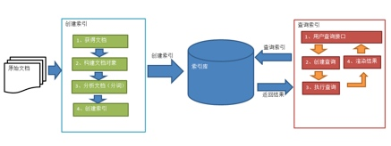
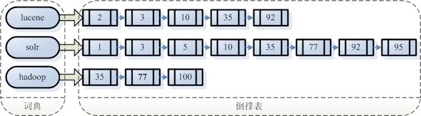
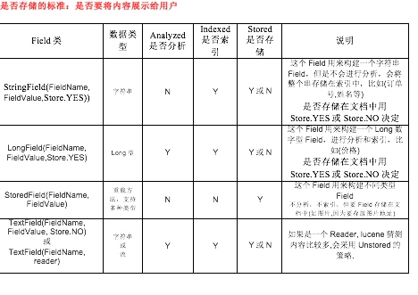
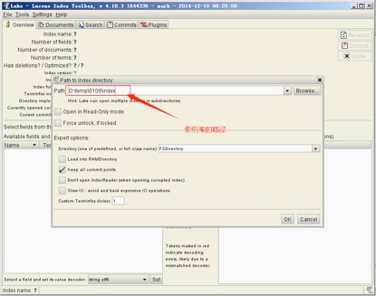

## 1 全文检索 和 索引
### 1.1 索引
将非结构化数据中的一部分信息 取出来，重新组织，使其变得有一定结构，然后对此有 一定结构的数据进行搜索，从而达到搜索相对较快的目的。这部分从非结构化数据中 取出的然 后重新组织的信息，我们称之索引。

例如:字典。字典的拼音表和部首检字表就相当于字典的索引，对每一个字的解释是非结 构化的，如果字典没有音节表和部首检字表，在茫茫辞海中找一个字只能顺序扫 。然而字的某 些信息可以 取出来进行结构化处理，比如读音，就比较结构化，分声母和韵母，分别只有几种 可以一一列举，于是将读音拿出来按一定的顺序排列，每一项读音都指向此字的详细解释的页数。 我们搜索时按结构化的拼音搜到读音，然后按其指向的页数，便可找到我们的非结构化数据—— 也即对字的解释。

### 1.2 全文检索

**这种先建立索引，再对索引进行搜索的过程就叫全文检索(Full-text Search)。**    


<!--more-->

## 2 Lucene实现全文检索的流程

### 2.1 索引和搜索流程图


### 2.2 创建索引

将用户需要搜索的文档内容进行索引，索引存储在索引库中。索引库位于本地磁盘中。

#### 2.2.1 获得原始文档
可以使用网络爬虫采集一定量的文本数据，比如新闻信息。采集后将数据从数据库中转移到本地磁盘中。

#### 2.2.2 创建文档对象
获取原始内容的目的是为了索引，在索引前需要将原始内容创建成文档（Document），文档包括多个域Field和域中存储的内容。
我们可以将磁盘中的一个文件当成一个document，document中包含field和对应的value。

#### 2.2.3 分析文档
分析的过程是经过对原始文档的提取单词、字母大小写转换、去除标点符号、去除停用词等过程成圣最终的与会单词。比如下面的文档的分析过程如下：

原文：Hello,welcome to the java world!
分析结果：Hello、welcome、java、world

每一个单词是一个term，不同的域中拆分出来的相同单词是不同的term。term中包含field和value。
分析过程中会涉及到分析器，用来根据语义进行分词，中文的较为复杂。

#### 2.2.4 创建索引

对所有文档分析得到的单词进行索引，索引的目的是为了搜索，最终要实现只搜索被索引的单词而找到Document。
传统的搜索方式是**顺序扫描法**，在Lucene中所使用的索引方法是**倒排索引法**。即根据索引值去查找文档，而不是去遍历文档来扫描关键字。





## 3 程序实现

### 3.1 准备工作

- 创建原始文档：在本地磁盘中创建一个目录，将原始文本存储于其中。
- 创建索引库：在本地磁盘中创建一个空目录，用于存储索引。

### 3.2 引入相关jar包（POM）


```xml
 <dependencies>
        <dependency>
            <groupId>org.apache.lucene</groupId>
            <artifactId>lucene-core</artifactId>
            <version>4.10.3</version>
        </dependency>

        <!-- https://mvnrepository.com/artifact/org.apache.lucene/lucene-queryparser -->
        <dependency>
            <groupId>org.apache.lucene</groupId>
            <artifactId>lucene-queryparser</artifactId>
            <version>4.10.3</version>
        </dependency>

        <!-- https://mvnrepository.com/artifact/org.apache.lucene/lucene-analyzers-common -->
        <dependency>
            <groupId>org.apache.lucene</groupId>
            <artifactId>lucene-analyzers-common</artifactId>
            <version>4.10.3</version>
        </dependency>

        <!-- https://mvnrepository.com/artifact/commons-io/commons-io -->
        <dependency>
            <groupId>commons-io</groupId>
            <artifactId>commons-io</artifactId>
            <version>2.4</version>
        </dependency>


        <!-- https://mvnrepository.com/artifact/junit/junit -->
        <dependency>
            <groupId>junit</groupId>
            <artifactId>junit</artifactId>
            <version>4.12</version>
        </dependency>


    </dependencies>
```
### 3.3 了解相关Field



### 3.4 测试代码


```java
public class LuceneTest
{
    /**
     * 创建索引
     *
     * @Author NikoBelic
     * @Date 07/03/2017 19:01
     */
    @Test
    public void testIndexCreate() throws IOException
    {
        // 指定文档和索引的存储目录
        Directory indexDir = FSDirectory.open(new File("/Users/lixiwei-mac/Documents/DataSet/lucene/index"));

        // 标准分词器(英文效果好,中文单字分词)
        Analyzer analyzer = new IKAnalyzer();
        IndexWriterConfig config = new IndexWriterConfig(Version.LATEST, analyzer);
        IndexWriter indexWriter = new IndexWriter(indexDir, config);

        // 采集文档中的数据放入Lucene中
        File sourceDir = new File("/Users/lixiwei-mac/Documents/DataSet/lucene/searchsource");
        for (File f : sourceDir.listFiles())
        {
            String fileName = f.getName();
            String fileContent = FileUtils.readFileToString(f);
            String filePath = f.getPath();
            long fileSize = FileUtils.sizeOf(f);

            // (field_name,field_value,need_stored?)
            Field fileNameField = new TextField("filename", fileName, Field.Store.YES);
            Field fileContentField = new TextField("content", fileContent, Field.Store.NO);
            Field filepPthField = new StoredField("path", filePath);
            Field fileSizeField = new LongField("size", fileSize, Field.Store.YES);
            Document document = new Document();

            document.add(fileNameField);
            document.add(fileContentField);
            document.add(filepPthField);
            document.add(fileSizeField);

            // 这里会自动创建索引
            indexWriter.addDocument(document);
        }
        indexWriter.close();
    }

    /**
     * 使用索引搜索
     *
     * @Author NikoBelic
     * @Date 07/03/2017 19:01
     */
    @Test
    public void testIndexSearch() throws IOException, ParseException
    {
        // 指定索引库存放路径
        Directory indexDir = FSDirectory.open(new File("/Users/lixiwei-mac/Documents/DataSet/lucene/index"));
        // 创建索引Reader、Searcher对象
        IndexReader indexReader = DirectoryReader.open(indexDir);
        IndexSearcher indexSearcher = new IndexSearcher(indexReader);
        // 创建查询
        // 方法1
        Query query = new TermQuery(new Term("content", "java"));
        // 执行查询,(查询对象,查询结果返回最大值)


        // 方法2
        // 创建分词器(必须和创建索引所用分词器一致)
        Analyzer analyzer = new IKAnalyzer();
        // 默认搜索域作用:如果搜索语法中没有指定域名,则使用默认域名搜索
        QueryParser queryParser = new QueryParser("filename", analyzer);
        // 查询语法:域名:搜索关键字
        Query query2 = queryParser.parse("apache");


        TopDocs topDocs = indexSearcher.search(query2, 5);
        System.out.println("查询结果的总条数:" + topDocs.totalHits);

        // 遍历查询结果
        for (ScoreDoc scoreDoc : topDocs.scoreDocs)
        {
            // scoreDoc.doc = 自动生成的文档ID
            Document document = indexSearcher.doc(scoreDoc.doc);
            System.out.println(document.get("filename"));
            System.out.println(scoreDoc.toString());
            System.out.println("======================================================");
        }
        indexReader.close();
    }

    @Test
    public void testDelIndex() throws IOException
    {
        Analyzer analyzer = new IKAnalyzer();
        Directory indexDir = FSDirectory.open(new File("/Users/lixiwei-mac/Documents/DataSet/lucene/index"));
        IndexWriterConfig config = new IndexWriterConfig(Version.LATEST, analyzer);
        IndexWriter indexWriter = new IndexWriter(indexDir, config);

        // 删除所有
        //indexWriter.deleteAll();
        // Term 词源,(域名,删除含有这些关键词的数据)
        indexWriter.deleteDocuments(new Term("filename", "apache"));
        indexWriter.commit();
        indexWriter.close();
    }

    /**
     * 更新就是按照传入的Term进行搜索,如果找到结果那么删除,将更新的内容重新生成一个Document对象
     * 如果没有搜索到结果,那么将更新的内容直接添加一个新的Document对象
     *
     * @Author NikoBelic
     * @Date 07/03/2017 20:57
     */
    @Test
    public void testUpdateIndex() throws IOException
    {
        Analyzer analyzer = new IKAnalyzer();
        Directory indexDir = FSDirectory.open(new File("/Users/lixiwei-mac/Documents/DataSet/lucene/index"));
        IndexWriterConfig config = new IndexWriterConfig(Version.LATEST, analyzer);
        IndexWriter indexWriter = new IndexWriter(indexDir, config);

        Document doc = new Document();
        doc.add(new TextField("filename", "更新检索测试.txt", Field.Store.YES));
        doc.add(new TextField("content", "文件内容测试", Field.Store.NO));
        doc.add(new LongField("size", 100L, Field.Store.YES));


        indexWriter.updateDocument(new Term("filename", "检索"), doc);

        indexWriter.commit();
        indexWriter.close();
    }

    /**
     * 根据索引查询,多种查询
     * @Author NikoBelic
     * @Date 08/03/2017 13:02
     */
    @Test
    public void testSearch() throws IOException, ParseException
    {
        Directory indexDir = FSDirectory.open(new File("/Users/lixiwei-mac/Documents/DataSet/lucene/index"));
        IndexReader indexReader = DirectoryReader.open(indexDir);
        IndexSearcher indexSearcher = new IndexSearcher(indexReader);

        // 根据文本查询
        Query termQuery = new TermQuery(new Term("filename", "apache"));
        // 根据数字范围查询
        Query numQuery = NumericRangeQuery.newLongRange("size", 100L, 800L, true, true);
        // Bool查询
        BooleanQuery boolQuery = new BooleanQuery();
        boolQuery.add(termQuery, BooleanClause.Occur.MUST); // 独自使用MUST_NOT没有任何意义
        boolQuery.add(numQuery, BooleanClause.Occur.MUST);

        // 查询所有文档
        MatchAllDocsQuery matchAllDocsQuery = new MatchAllDocsQuery();

        // 多个域的查询,或 关系
        String[] fields = {"filename", "content"};
        MultiFieldQueryParser multiFieldQueryParser = new MultiFieldQueryParser(fields, new IKAnalyzer());
        Query multiFieldQuery = multiFieldQueryParser.parse("apache");


        //TopDocs topDocs = indexSearcher.search(boolQuery, 10);
        //TopDocs topDocs = indexSearcher.search(matchAllDocsQuery, 10);
        TopDocs topDocs = indexSearcher.search(multiFieldQuery, 10);
        System.out.println("符合条件的文档数:" + topDocs.totalHits);
        for (ScoreDoc scoreDoc : topDocs.scoreDocs)
        {
            Document document = indexSearcher.doc(scoreDoc.doc);
            System.out.println(document.get("filename"));
            System.out.println(document.get("size"));
            System.out.println("======================================================================");
        }

    }


}

```

### 3.5 使用Luke工具查看索引库




