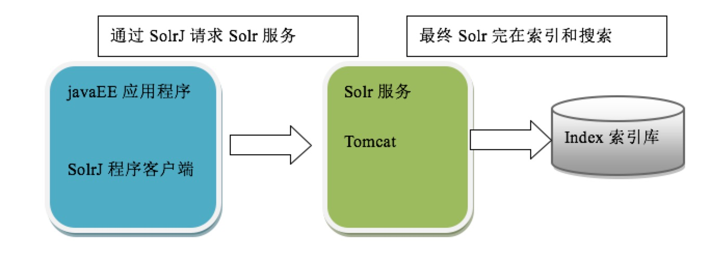
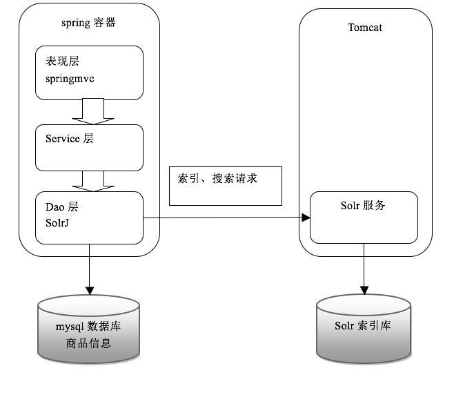

## 1 Solr基本概念

### 1.1 什么是Solr

- Solr是基于Lucene的全文检索服务器
- Solr需要部署在Web容器中
- 使用POST方法向Solr服务器发送一个描述Field及其内容的XML文档，Solr根据xml文档添加、删除、更新索引。

<!--more-->

### 1.2 Solr与Lucene的区别

Lucene是一个开元全文检索引擎工具包，并不是一个全文检索引擎。
Solr的目的是打造一款企业级引擎系统，他是一个搜索引擎服务，可以独立运行，通过Solr可以非常快速的构建企业的搜索引擎。


## 2 Solr配置

### 2.1 Solr目录结构

- bin: solr运行脚本
- contrib: solr的一些贡献软件，用于增强solar的功能
- dist: war、jar、相关依赖文件
- docs: API文档
- example: solr工程例子目录:
    - solr: 包含了默认配置信息的Solr和Core目录
    - multicore: 包含了在Solr的multicore中设置的多个Core目录
    - webapps: 包括一个solr.war,该war可作为solr的运行实例工程

### 2.2 Solr整合Tomcat

#### 2.2.1 SolrHome与SolrCore

创建一个SolrHome目录，SolrHome是Solr运行的主目录，目录中包括了运行Solr实例所有的配置文件和数据文件,Solr实例就是SolrCore，一个SolrHome可以包括多个SolrCore（Solr实例），每个SolrCore提供单独的搜索和索引服务。
example/solr是一个标准的SolrHome目录，其中example/solr/collection1是一个SolrCore目录
一个SolrCore对外单独提供索引和搜索接口。

#### 2.2。2 整合步骤

- 安装tomcat。D:\temp\apache-tomcat-7.0.53
- 把solr的war包复制到tomcat 的webapp目录下。把\solr-4.10.3\dist\solr-4.10.3.war复制到D:\temp\apache-tomcat-7.0.53\webapps下。改名为solr.war
- solr.war解压。使用压缩工具解压或者启动tomcat自动解压。解压之后删除solr.war
- 把\solr-4.10.3\example\lib\ext目录下的所有的jar包添加到solr工程中
- 配置solrHome和solrCore。
    - 创建一个solrhome（存放solr所有配置文件的一个文件夹）。\solr-4.10.3\example\solr目录就是一个标准的solrhome。
    - 把\solr-4.10.3\example\solr文件夹复制到D:\temp\0108路径下，改名为solrhome，改名不是必须的，是为了便于理解。
    - 在solrhome下有一个文件夹叫做collection1这就是一个solrcore。就是一个solr的实例。一个solrcore相当于mysql中一个数据库。Solrcore之间是相互隔离。
        - 在solrcore中有一个文件夹叫做conf，包含了索引solr实例的配置信息。
        - 在conf文件夹下有一个solrconfig.xml。配置实例的相关信息。如果使用默认配置可以不用做任何修改。
        Xml的配置信息：
        Lib：solr服务依赖的扩展包，默认的路径是collection1\lib文件夹，如果没有就创建一个
        dataDir：配置了索引库的存放路径。默认路径是collection1\data文件夹，如果data文件夹，会自动创建。
- 告诉solr服务器配置文件也就是solrHome的位置。修改web.xml使用jndi的方式告诉solr服务器。
  Solr/home名称必须是固定的。(apache下solr项目的web.xml)
```xml
<env-entry>
   <env-entry-name>solr/home</env-entry-name>
   <env-entry-value>/Users/lixiwei-mac/app/solr-4.10.3/solrhome</env-entry-value>
   <env-entry-type>java.lang.String</env-entry-type>
</env-entry>
```

- 启动tomcat，访问http://localhost:8080/solr

## 3 使用SolrJ管理索引库

### 3.1 什么是SolrJ

solrj是访问Solr服务的java客户端，提供索引和搜索的请求方法，SolrJ通常在嵌入在业务系统中，通过SolrJ的API接口操作Solr服务，如下图：


### 3.2 依赖

```xml
 <!-- Solr -->
        <dependency>
            <groupId>org.apache.solr</groupId>
            <artifactId>solr-solrj</artifactId>
            <version>4.10.3</version>
            <exclusions>
                <exclusion>
                    <artifactId>commons-io</artifactId>
                    <groupId>commons-io</groupId>
                </exclusion>
            </exclusions>
        </dependency>


        <dependency>
            <groupId>org.apache.httpcomponents</groupId>
            <artifactId>httpclient</artifactId>
            <version>4.3.1</version>
        </dependency>

        <dependency>
            <groupId>org.apache.httpcomponents</groupId>
            <artifactId>httpcore</artifactId>
            <version>4.3</version>
        </dependency>

        <dependency>
            <groupId>org.apache.httpcomponents</groupId>
            <artifactId>httpmime</artifactId>
            <version>4.3.1</version>
        </dependency>

        <dependency>
            <groupId>org.noggit</groupId>
            <artifactId>noggit</artifactId>
            <version>0.5</version>
        </dependency>

        <dependency>
            <groupId>org.slf4j</groupId>
            <artifactId>slf4j-api</artifactId>
            <version>1.7.6</version>

        </dependency>

        <dependency>
            <groupId>org.codehaus.woodstox</groupId>
            <artifactId>wstx-asl</artifactId>
            <version>3.2.7</version>
        </dependency>

        <dependency>
            <groupId>org.apache.zookeeper</groupId>
            <artifactId>zookeeper</artifactId>
            <version>3.4.6</version>
            <exclusions>
                <exclusion>
                    <artifactId>slf4j-api</artifactId>
                    <groupId>org.slf4j</groupId>
                </exclusion>
                <exclusion>
                    <artifactId>junit</artifactId>
                    <groupId>junit</groupId>
                </exclusion>
                <exclusion>
                    <artifactId>log4j</artifactId>
                    <groupId>log4j</groupId>
                </exclusion>
                <exclusion>
                    <artifactId>slf4j-log4j12</artifactId>
                    <groupId>org.slf4j</groupId>
                </exclusion>
            </exclusions>
        </dependency>


        <!--Solr Ext-->


        <dependency>
            <groupId>log4j</groupId>
            <artifactId>log4j</artifactId>
            <version>1.2.17</version>
        </dependency>


        <dependency>
            <groupId>org.slf4j</groupId>
            <artifactId>jul-to-slf4j</artifactId>
            <version>1.7.6</version>
        </dependency>


        <dependency>
            <groupId>org.slf4j</groupId>
            <artifactId>slf4j-log4j12</artifactId>
            <version>1.7.6</version>
        </dependency>

```

### 3.3 代码实现

```java
package lucene;


import org.apache.commons.io.FileUtils;
import org.apache.lucene.analysis.Analyzer;
import org.apache.lucene.document.*;
import org.apache.lucene.index.*;
import org.apache.lucene.queryparser.classic.MultiFieldQueryParser;
import org.apache.lucene.queryparser.classic.ParseException;
import org.apache.lucene.queryparser.classic.QueryParser;
import org.apache.lucene.search.*;
import org.apache.lucene.store.Directory;
import org.apache.lucene.store.FSDirectory;
import org.apache.lucene.util.Version;
import org.junit.Test;
import org.wltea.analyzer.lucene.IKAnalyzer;

import java.io.File;
import java.io.IOException;

/**
 * @author NikoBelic
 * @create 07/03/2017 13:05
 */
public class LuceneTest
{
    /**
     * 创建索引
     *
     * @Author NikoBelic
     * @Date 07/03/2017 19:01
     */
    @Test
    public void testIndexCreate() throws IOException
    {
        // 指定文档和索引的存储目录
        Directory indexDir = FSDirectory.open(new File("/Users/lixiwei-mac/Documents/DataSet/lucene/index"));

        // 标准分词器(英文效果好,中文单字分词)
        Analyzer analyzer = new IKAnalyzer();
        IndexWriterConfig config = new IndexWriterConfig(Version.LATEST, analyzer);
        IndexWriter indexWriter = new IndexWriter(indexDir, config);

        // 采集文档中的数据放入Lucene中
        File sourceDir = new File("/Users/lixiwei-mac/Documents/DataSet/lucene/searchsource");
        for (File f : sourceDir.listFiles())
        {
            String fileName = f.getName();
            String fileContent = FileUtils.readFileToString(f);
            String filePath = f.getPath();
            long fileSize = FileUtils.sizeOf(f);

            // (field_name,field_value,need_stored?)
            Field fileNameField = new TextField("filename", fileName, Field.Store.YES);
            Field fileContentField = new TextField("content", fileContent, Field.Store.NO);
            Field filepPthField = new StoredField("path", filePath);
            Field fileSizeField = new LongField("size", fileSize, Field.Store.YES);
            Document document = new Document();

            document.add(fileNameField);
            document.add(fileContentField);
            document.add(filepPthField);
            document.add(fileSizeField);

            // 这里会自动创建索引
            indexWriter.addDocument(document);
        }
        indexWriter.close();
    }

    /**
     * 使用索引搜索
     *
     * @Author NikoBelic
     * @Date 07/03/2017 19:01
     */
    @Test
    public void testIndexSearch() throws IOException, ParseException
    {
        // 指定索引库存放路径
        Directory indexDir = FSDirectory.open(new File("/Users/lixiwei-mac/Documents/DataSet/lucene/index"));
        // 创建索引Reader、Searcher对象
        IndexReader indexReader = DirectoryReader.open(indexDir);
        IndexSearcher indexSearcher = new IndexSearcher(indexReader);
        // 创建查询
        // 方法1
        Query query = new TermQuery(new Term("content", "java"));
        // 执行查询,(查询对象,查询结果返回最大值)


        // 方法2
        // 创建分词器(必须和创建索引所用分词器一致)
        Analyzer analyzer = new IKAnalyzer();
        // 默认搜索域作用:如果搜索语法中没有指定域名,则使用默认域名搜索
        QueryParser queryParser = new QueryParser("filename", analyzer);
        // 查询语法:域名:搜索关键字
        Query query2 = queryParser.parse("apache");


        TopDocs topDocs = indexSearcher.search(query2, 5);
        System.out.println("查询结果的总条数:" + topDocs.totalHits);

        // 遍历查询结果
        for (ScoreDoc scoreDoc : topDocs.scoreDocs)
        {
            // scoreDoc.doc = 自动生成的文档ID
            Document document = indexSearcher.doc(scoreDoc.doc);
            System.out.println(document.get("filename"));
            System.out.println(scoreDoc.toString());
            System.out.println("======================================================");
        }
        indexReader.close();
    }

    @Test
    public void testDelIndex() throws IOException
    {
        Analyzer analyzer = new IKAnalyzer();
        Directory indexDir = FSDirectory.open(new File("/Users/lixiwei-mac/Documents/DataSet/lucene/index"));
        IndexWriterConfig config = new IndexWriterConfig(Version.LATEST, analyzer);
        IndexWriter indexWriter = new IndexWriter(indexDir, config);

        // 删除所有
        //indexWriter.deleteAll();
        // Term 词源,(域名,删除含有这些关键词的数据)
        indexWriter.deleteDocuments(new Term("filename", "apache"));
        indexWriter.commit();
        indexWriter.close();
    }

    /**
     * 更新就是按照传入的Term进行搜索,如果找到结果那么删除,将更新的内容重新生成一个Document对象
     * 如果没有搜索到结果,那么将更新的内容直接添加一个新的Document对象
     *
     * @Author NikoBelic
     * @Date 07/03/2017 20:57
     */
    @Test
    public void testUpdateIndex() throws IOException
    {
        Analyzer analyzer = new IKAnalyzer();
        Directory indexDir = FSDirectory.open(new File("/Users/lixiwei-mac/Documents/DataSet/lucene/index"));
        IndexWriterConfig config = new IndexWriterConfig(Version.LATEST, analyzer);
        IndexWriter indexWriter = new IndexWriter(indexDir, config);

        Document doc = new Document();
        doc.add(new TextField("filename", "更新检索测试.txt", Field.Store.YES));
        doc.add(new TextField("content", "文件内容测试", Field.Store.NO));
        doc.add(new LongField("size", 100L, Field.Store.YES));


        indexWriter.updateDocument(new Term("filename", "检索"), doc);

        indexWriter.commit();
        indexWriter.close();
    }

    /**
     * 根据索引查询,多种查询
     * @Author NikoBelic
     * @Date 08/03/2017 13:02
     */
    @Test
    public void testSearch() throws IOException, ParseException
    {
        Directory indexDir = FSDirectory.open(new File("/Users/lixiwei-mac/Documents/DataSet/lucene/index"));
        IndexReader indexReader = DirectoryReader.open(indexDir);
        IndexSearcher indexSearcher = new IndexSearcher(indexReader);

        // 根据文本查询
        Query termQuery = new TermQuery(new Term("filename", "apache"));
        // 根据数字范围查询
        Query numQuery = NumericRangeQuery.newLongRange("size", 100L, 800L, true, true);
        // Bool查询
        BooleanQuery boolQuery = new BooleanQuery();
        boolQuery.add(termQuery, BooleanClause.Occur.MUST); // 独自使用MUST_NOT没有任何意义
        boolQuery.add(numQuery, BooleanClause.Occur.MUST);

        // 查询所有文档
        MatchAllDocsQuery matchAllDocsQuery = new MatchAllDocsQuery();

        // 多个域的查询,或 关系
        String[] fields = {"filename", "content"};
        MultiFieldQueryParser multiFieldQueryParser = new MultiFieldQueryParser(fields, new IKAnalyzer());
        Query multiFieldQuery = multiFieldQueryParser.parse("apache");


        //TopDocs topDocs = indexSearcher.search(boolQuery, 10);
        //TopDocs topDocs = indexSearcher.search(matchAllDocsQuery, 10);
        TopDocs topDocs = indexSearcher.search(multiFieldQuery, 10);
        System.out.println("符合条件的文档数:" + topDocs.totalHits);
        for (ScoreDoc scoreDoc : topDocs.scoreDocs)
        {
            Document document = indexSearcher.doc(scoreDoc.doc);
            System.out.println(document.get("filename"));
            System.out.println(document.get("size"));
            System.out.println("======================================================================");
        }

    }
}


```

### 3.4 应用系统架构
