## 1 前言
前些天看到了@Brian Way 同学做了一个知乎的用户信息爬虫，想到了自己很久以前也做过类似的知乎爬虫，在今年后半年写了一个豆瓣读书论坛爬虫，爬了很多数据，各种加起来大概有1亿1000万左右。@路人甲 等大牛经常发布一些Python爬虫，也让我学习了不少，就此篇文章向各位大神致敬。

因为最近在写小论文，相关的算法需要预先将数据转换才能用，所以代码中可能有些东西与爬虫无关。如果大家有需要（请用赞告诉我！哈哈哈哈），我后续会将 朴素贝叶斯分类器 对数据的处理，和基于Spark的协同过滤推荐系统 相关介绍和代码整理后公布出来，并详细介绍自己的研究思路。

<!--more-->

## 2 思路

- 通过 <a href="https://link.zhihu.com/?target=https%3A//book.douban.com/tag/%3Fview%3Dcloud">豆瓣图书标签</a> 获取所有标签的地址，将所有标签记录
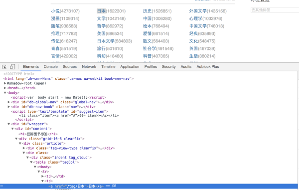

- 通过将标签拼接到图书列表的url地址，获取某个标签下的图书信息，通过这个页面可以获得当前页的图书基本信息。

<a href="https://link.zhihu.com/?target=https%3A//book.douban.com/tag/%25E5%25B0%258F%25E8%25AF%25B4"/>豆瓣图书标签: 小说</a>

- 进入到某个图书详情页面，爬取更详细的图书信息（如果有需求的话）

<a href="https://link.zhihu.com/?target=https%3A//book.douban.com/subject/25862578/"/>解忧杂货店 (豆瓣)</a>

- 通过获取到的所有图书的bookno可以爬取所有图书的短评、书评等信息。

<a href="https://link.zhihu.com/?target=https%3A//book.douban.com/subject/25862578/comments/"/>解忧杂货店 短评</a>

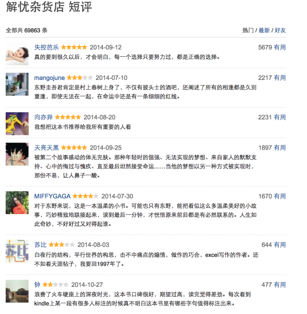

- 通过这个评论列表我们可以进入到每个用户的个人主页，爬取他们的个人信息

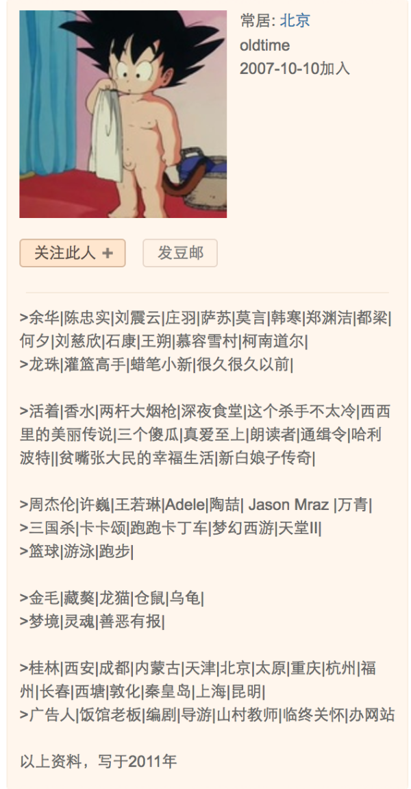

- 通过这个页面我还获取到了用户 想读、在读、读过的 UserNo - BookNo 对应关系，以后做推荐系统有大用处！

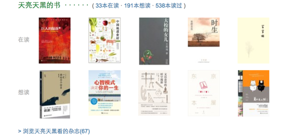

3 爬虫架构

爬虫架构采用国产开源Java爬虫框架WebMagic，为了能够分布式爬取，项目中还使用了Redis作为统一URL队列管理器，使用Mysql持久化数据，Velocity + Echarts做的数据可视化，整体项目架构是Spring+SpringMVC+Mybatis。

4 数据分析

- 热门标签下的图书数量 Top10

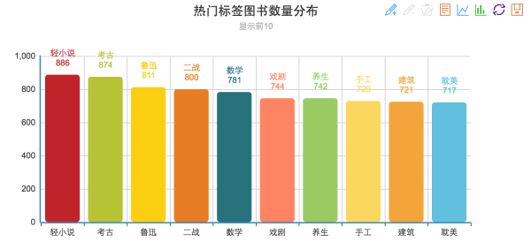

- 发表评论最多的用户Top10

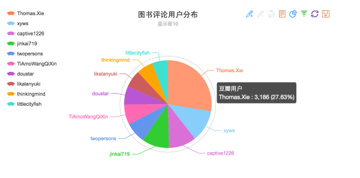

大家看看有没有自己认识的人啊哈哈哈，第一名评论了3000本书，真牛逼。

- 用户发表的评分值分布

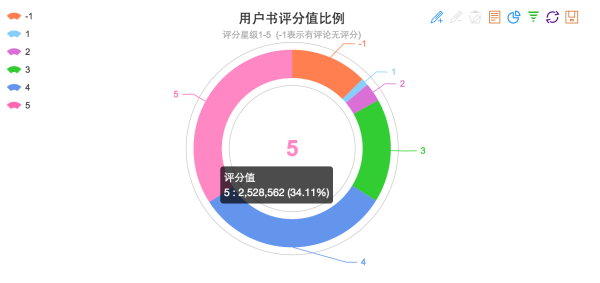

其中-1分表示没有给出评价星级，但是做了评论。看来还是好评比较多啊有250万5星！

- 用户地域分布，看来北上广相信读书啊！

其中有28W左右用户在个人信息中没有写长居地址，所以没放进来展示。

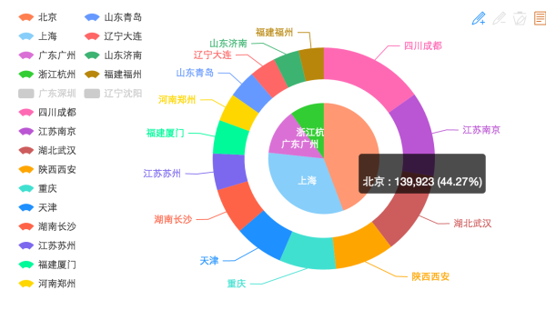

- 每年书评数量分布

1970乱入什么鬼。。2016年大概是半年多一点的数据，其实肯定要比2015高的。

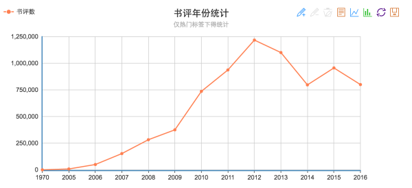

- 最后看一下评论数大于5W的评分值Top50的图书吧 大家是不是都读过

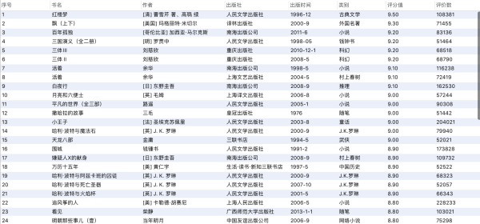
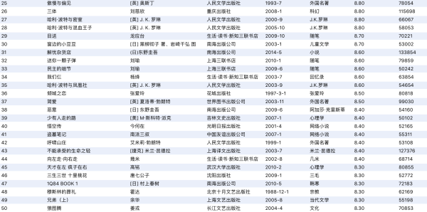
5 总结

爬一些数据做分析挺有意思的，虽然我做的这些分析都非常辣鸡吧（我TM也想做牛逼的分析啊，我不会啊）。最后的数据图书短评大概有不到800W，用户信息130W，图书信息4W5，用户想读、在读、读过 这类的用户-图书关系大概有9000W+（大数据推荐系统用，所以爬了好多）。豆瓣反爬虫机制几乎没有，所以我爬的也很爽。。。。

国际惯例，附上源码

项目地址

<a href="https://link.zhihu.com/?target=https%3A//github.com/seawaylee/doubanWebSpider">Github - doubanWebSpider</a>

代码写的不规范，非常乱，还请各位见谅。

后续如果大家需要（赞我赞我赞我），我会将基于朴素贝叶斯分类器的中文文本情感分析相关程序和基于Spark的分布式协同过滤推荐算法相关程序陆续发布出来（起这么长的名字是不是听起来很傻b...可是做论文评审的人可不这么觉得...）。其实如果大家懂机器学习和Spark就能知道，我这俩东西很low的，纯粹为了骗论文。。。。

2016-12-23 更新，数据可视化地址和查询图书功能

图书查询功能是模糊查询，结果会按照评分由高到低显示结果。
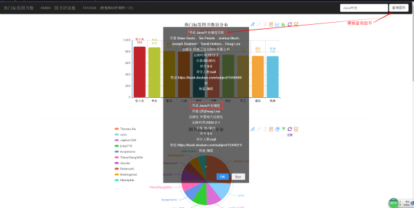

地址

<a href="http://119.90.53.137:8099/douban">豆瓣超级无敌爬虫^.^</a>
