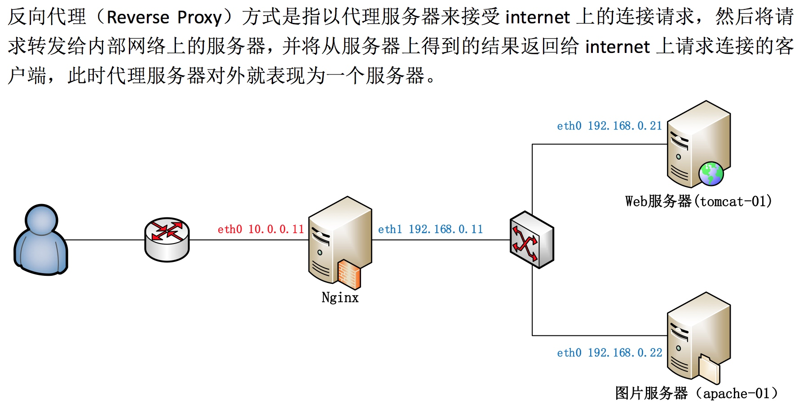
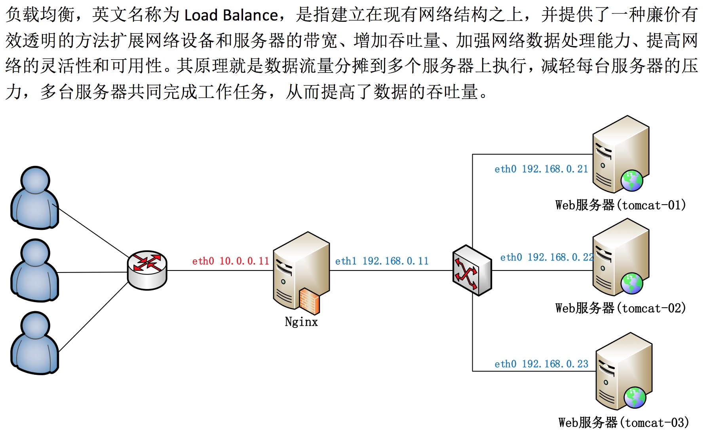
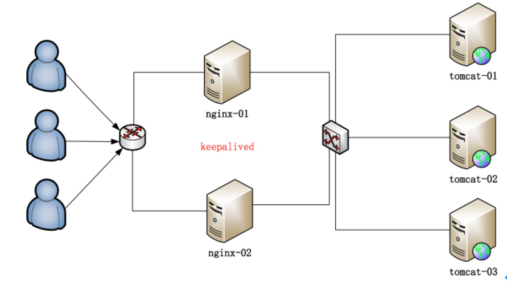

## 1 什么是Nginx
Nginx ("engine x") 是一个高性能的HTTP和反向代理服务器，也是一个IMAP/POP3/SMTP服务器。其特点是占有内存少，并发能力强，事实上nginx的并发能力确实在同类型的网页服务器中表现较好，中国大陆使用nginx网站用户有：百度、京东、新浪、网易、腾讯、淘宝等。

<!--more-->

## 2 特点
### 2.1 反向代理
我们经常使用正向代理，即用户手动设置代理服务器的ip和端口号，通过代理服务器去请求目标服务器，目标服务器会认为请求者为代理服务器，VPN就是这个意思。
反向代理是用来代理服务器的，用户不需要设置，用户认为访问的就是目标服务器。
 



### 2.2 负载均衡
原理就是数据流量分摊到多个服务器上执行，减轻每台服务器的压力，多台服务器共同完成工作任务，从而提高了数据吞吐量。



## 3 安装Nginx
1. 官网下载nginx源码包
2. 解压缩 tar -zxvf nginx.zip 
3. 编译、安装 ./configue && make && make install
4. 启动 ./usr/local/bin/nginx
5. 访问localhost看到欢迎界面

## 4 Nginx命令
- 启动 nginx
- 强制关闭 nginx -s stop
- 正常关闭 nginx -s quit
- 动态加载配置文件 nginx -s reload

## 5 Nginx配置
proxy_pass 配置代理
upstream 配置集群

```
worker_processes  1;

events {
    worker_connections  1024;
}


http {
    include       mime.types;
    default_type  application/octet-stream;

    sendfile        on;

    keepalive_timeout  65;

    upstream server_tomcat{
    	server 127.0.0.1:8080 weight=1;#weight表示多少个
    	server 127.0.0.1:8081 weight=1;
    	#ip_hash;
    }


    server {
        listen       80;
        server_name  localhost;

        location / {   # / 表示拦截所有请求
            root   html;
            index  index.html index.htm;
            proxy_pass http://server_tomcat;
        }

        error_page   500 502 503 504  /50x.html;
        location = /50x.html {
            root   html;
        }
    }

}

```
当访问localhost时，由于没有指定负载均衡算法，所以默认为轮询，浏览器每次请求都会被轮流转发到8080和8081两个端口。


可能出现 防火墙问题,开放80端口
/sbin/iptables -I INPUT -p tcp --dport 80 -j ACCEPT
/etc/rc.d/init.d/iptables save

### 5.1 动静分离

动态资源
```
location ~ .*\.(jsp|do|action)$ {
    proxy_pass http://tomcat-01.itcast.cn:8080;
}
```
静态资源
```
location ~ .*\.(html|js|css|gif|jpg|jpeg|png)$ {
    expires 3d;
}
```

### 5.2 KeepAlived高可用

#### 5.2.1 HA概念

HA(High Available), 高可用性集群，是保证业务连续性的有效解决方案，一般有两个或两个以上的节点，且分为活动节点及备用节点。


#### 5.2.2 KeepAlived

keepalive是一款可以实现高可靠的软件，通常部署在2台服务器上，分为一主一备。Keepalived可以对本机上的进程进行检测，一旦Master检测出某个进程出现问题，将自己切换成Backup状态，然后通知另外一个节点切换成Master状态。

#### 5.2.3 安装

-  wget http://www.keepalived.org/software/keepalived-1.2.19.tar.gz
- ./configure --prefix=/usr/local/keepalived && make && make install
- 将软件添加到系统服务中，便于启动
    - cp /usr/local/keepalived/sbin/keepalived /usr/sbin/ 拷贝执行文件
    - cp /usr/local/keepalived/etc/rc.d/init.d/keepalived /etc/init.d/keepalived  将init.d文件拷贝到etc下,加入开机启动项
    - cp /usr/local/keepalived/etc/sysconfig/keepalived /etc/sysconfig/  将keepalived文件拷贝到etc下
    - mkdir -p /etc/keepalived  创建keepalived文件夹 
    - cp /usr/local/keepalived/etc/keepalived/keepalived.conf /etc/keepalived/keepalived.conf  将keepalived配置文件拷贝到etc下
    - chmod +x /etc/init.d/keepalived   添加可执行权限
    
快捷操作
```commandline
cp /usr/local/keepalived/sbin/keepalived /usr/sbin/
cp /usr/local/keepalived/etc/rc.d/init.d/keepalived /etc/init.d/keepalived
cp /usr/local/keepalived/etc/sysconfig/keepalived /etc/sysconfig/ 
mkdir -p /etc/keepalived
cp /usr/local/keepalived/etc/keepalived/keepalived.conf /etc/keepalived/keepalived.conf
chmod +x /etc/init.d/keepalived
chkconfig --add keepalived	
chkconfig keepalived on
```
    
    
#### 5.2.4 配置虚拟IP

修改配置文件： /etc/keepalived/keepalived.conf

**MASTER节点**

```
global_defs {
}
vrrp_instance VI_1 {
    state MASTER   #指定A节点为主节点 备用节点上设置为BACKUP即可
    interface eth0    #绑定虚拟IP的网络接口
    virtual_router_id 51   #VRRP组名，两个节点的设置必须一样，以指明各个节点属于同一VRRP组
    priority 100   #主节点的优先级（1-254之间），备用节点必须比主节点优先级低
    advert_int 1  #组播信息发送间隔，两个节点设置必须一样
    authentication {    #设置验证信息，两个节点必须一致
        auth_type PASS
        auth_pass 1111
    }
    virtual_ipaddress {    #指定虚拟IP, 两个节点设置必须一样
        192.168.33.60/24    #如果两个nginx的ip分别是192.168.33.61,,...62，则此处的虚拟ip跟它俩同一个网段即可
    }
}

```


**BACKUP节点**
```
global_defs {
}
vrrp_instance VI_1 {
    state BACKUP
    interface eth0
    virtual_router_id 51
    priority 99
    advert_int 1
    authentication {
        auth_type PASS
        auth_pass 1111
    }
    virtual_ipaddress {
        192.168.33.60/24
    }
}
```
>分别启动两台机器上的keepalived
 service keepalived start
 测试：
 杀掉master上的keepalived进程，你会发现，在slave机器上的eth0网卡多了一个ip地址
 查看ip地址的命令：  ip addr 


#### 5.2.5 配置keepalived心跳检查

>Keepalived并不跟nginx耦合，它俩完全不是一家人
 但是keepalived提供一个机制：让用户自定义一个shell脚本去检测用户自己的程序，返回状态给keepalived就可以了

**MASTER**

```
global_defs {
}

vrrp_script chk_health {
    script "[[ `ps -ef | grep nginx | grep -v grep | wc -l` -ge 2 ]] && exit 0 || exit 1"
    interval 1    #每隔1秒执行上述的脚本，去检查用户的程序ngnix
    weight -2
}

vrrp_instance VI_1 {
    state MASTER
    interface eth0
    virtual_router_id 1
    priority 100
    advert_int 2
    authentication {
        auth_type PASS
        auth_pass 1111
    }

    track_script {
        chk_health
    }

    virtual_ipaddress {
        10.0.0.10/24
    }

    notify_master "/usr/local/keepalived/sbin/notify.sh master"
    notify_backup "/usr/local/keepalived/sbin/notify.sh backup"
    notify_fault "/usr/local/keepalived/sbin/notify.sh fault"
}
```

**切换通知脚本**
`vi /usr/local/keepalived/sbin/notify.sh`

```
#!/bin/bash

case "$1" in
    master)
        /usr/local/nginx/sbin/nginx
        exit 0
    ;;
backup)
        /usr/local/nginx/sbin/nginx -s stop
        /usr/local/nginx/sbin/nginx
        exit 0
    ;;
    fault)
        /usr/local/nginx/sbin/nginx -s stop
        exit 0
    ;;
    *)
        echo 'Usage: notify.sh {master|backup|fault}'
        exit 1
    ;;
esac
```
添加执行权限'chmod +x /usr/local/keepalived/sbin/notify.sh'

在第二台机器上添加notify.sh脚本、将同样的心跳检测部分配置添加到BACKUP机器上
分别在两台机器上启动keepalived
service keepalived start 
chkconfig keepalived on

测试：
> 主动停止Master-ngxin，立即用浏览器访问虚地址（1秒内），发现请求到了备机的nginx上，一秒后再刷新，发现又请求到了主机nginx上（KeepAlived自动恢复了nginx）

## 6 Session共享问题
使用Nginx反向代理集群会引出Session共享问题，有两种解决方案。

方案一：(只在windows下有效)

- web服务器解决（广播机制）
- 注意：tomcat下性能低
- 修改两个地方
    - 修改tomcat的server.xml支持共享。
    将引擎标签下的
   ` <Cluster className="org.apache.catalina.ha.tcp.SimpleTcpCluster"/>`
    注释去掉.
    - 修改项目的配置文件 web.xml中添加一个节点`<distributable/>`
    

    
方案二：
    
- 可以将session的id放入redis中

方案三：

- 保证一个ip永远访问的是同一台服务器，就不存在session共享问题了。
- 在nginx配置文件中添加 ip_hash;

